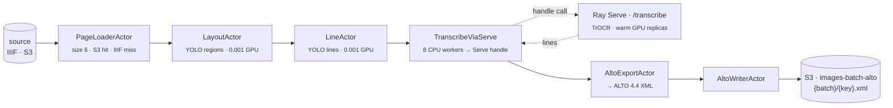
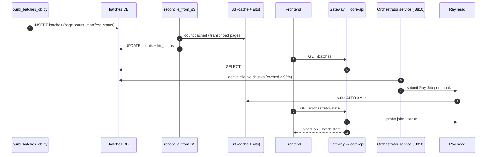
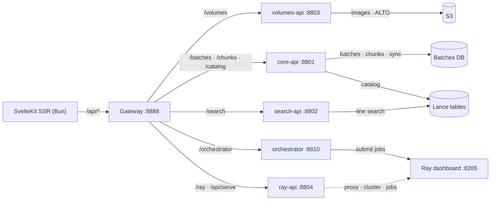

# Data Flow

!!! warning "P7a (2026-07-27): the batches/orchestrator plane described below is DELETED"
    The compute-plane cutover (`lance-ns-merge.md` P7a) removed the orchestrator loop + entrypoint
    (`:8810`), the `batches` table + Alembic lineage, S3-sync, chunk submission, and the prefetch lane.
    Ingestion is now the medallion producer's `POST /ingest-iiif` (IIIF → raw page-image Lance dataset,
    ONE raw-write OpenLineage event) and HTR runs as event-driven cascade compute on the unified Ray
    cluster. Sections referring to batches/chunks/orchestrator are kept as historical context until the
    P8 doc re-draw.

How an image becomes searchable ALTO XML, and how the SvelteKit (SSR) frontend reads it back.

## Image → ALTO XML (the `htr` pipeline)

The runner submits one Ray Data pipeline per chunk. The GPU-heavy transcription
step is decoupled onto Ray Serve so model weights stay warm across jobs.

**Pool sizing** uses `ActorPoolStrategy(size=N)` with the autoscaler off —
empirically `concurrency=(N, N)` biased work to whichever actor warmed first and
left GPUs idle. Each `TranscribeViaServe` task **shards its line crops three
ways** and fires three Serve calls at once, so all GPU replicas run concurrently
even though Ray Data keeps only one task in flight.

**Alternate shapes:** `htrflow` and `htr_http` collapse layout/line/transcribe/
ALTO into a single Serve deployment (`/htrflow`, `/htr`), used when actor
fan-out isn't worth a given batch shape — `htr_http` in particular is a
boto3-only HTTP driver that runs on clusters without the runner's heavy deps.

!!! info "Per-row resilience"
    `PageLoaderActor`, `LayoutActor`, and `LineActor` catch per-page exceptions
    and **drop the row** rather than failing the whole chunk; skipped pages
    surface as the gap between manifest counts and transcribed pages.

## Batch lifecycle

A batch becomes a queued, then submitted, then transcribed unit. The DB is
SQLite in dev or Postgres in prod — the ORM is the same either way.

The orchestrator's `derive_state` excludes chunks already in flight or in a
failure cooldown, marks a chunk HTR-ready once **≥ 95%** of its pages are cached,
and only then submits — so ticks are idempotent.

## Frontend ↔ Backend ↔ Storage

All API routes flow through the gateway on `:8888` which longest-prefix-routes
to per-domain services. The Ray dashboard proxy is served by `ray-api` under
`/api/serve/*` and `/api/ray/*`.

