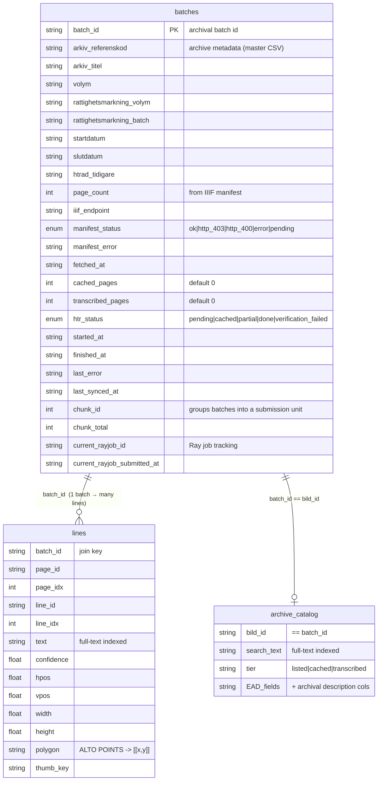
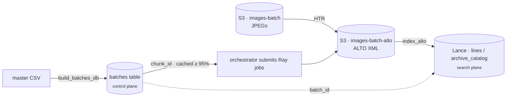

# Data Model

!!! warning "P7a (2026-07-27): the batches/orchestrator plane described below is DELETED"
    The compute-plane cutover (`lance-ns-merge.md` P7a) removed the orchestrator loop + entrypoint
    (`:8810`), the `batches` table + Alembic lineage, S3-sync, chunk submission, and the prefetch lane.
    Ingestion is now the medallion producer's `POST /ingest-iiif` (IIIF → raw page-image Lance dataset,
    ONE raw-write OpenLineage event) and HTR runs as event-driven cascade compute on the unified Ray
    cluster. Sections referring to batches/chunks/orchestrator are kept as historical context until the
    P8 doc re-draw.

rask keeps two distinct data stores. The **relational `batches` table** is the
control plane — what to process and how far it's got. The **Lance tables** on S3
are the search/read plane — the transcribed content you query. They are linked
logically by `batch_id`.

!!! note "Lance tables are not relational"
    `lines` and `archive_catalog` are **LanceDB** datasets in
    `s3://images-batch-search`, not SQL tables — their links to `batches` are
    logical (by `batch_id`), not enforced foreign keys.

## The relational DB — a single `batches` table

A backend-agnostic ORM (SQLModel + SQLAlchemy async): **SQLite in dev**
(`.cache/batches.db`), **Postgres in prod** (via `DATABASE_URL`), schema managed
by **Alembic**. There is exactly one table, `batches`, keyed by `batch_id`. There
are **no foreign keys and no separate `chunks` table** — a "chunk" is just a set
of rows sharing a `chunk_id`.

The columns fall into five groups:

| Group | Columns | Maintained by |
|---|---|---|
| Identity & archival metadata | `batch_id` (PK), `arkiv_referenskod`, `arkiv_titel`, `volym`, `rattighetsmarkning_volym/batch`, `startdatum`, `slutdatum`, `htrad_tidigare` | `build_batches_db.py` (master CSV) |
| IIIF / manifest | `page_count`, `iiif_endpoint`, `manifest_status`, `manifest_error`, `fetched_at` | manifest fetch |
| HTR progress | `cached_pages`, `transcribed_pages`, `htr_status`, `started_at`, `finished_at`, `last_error`, `last_synced_at` | `reconcile_from_s3` + pipeline |
| Chunking | `chunk_id`, `chunk_total` | chunk assignment |
| Ray job tracking | `current_rayjob_id`, `current_rayjob_submitted_at` | `submit_chunk` |

Two enums are stored as lowercase strings via `SAEnum(values_callable=…)`, so
they round-trip against both Postgres native ENUMs and SQLite VARCHAR:

- **`ManifestStatus`** — `ok`, `http_403`, `http_400`, `error`, `pending`
- **`HtrStatus`** — `pending`, `cached`, `partial`, `done`, `verification_failed`

!!! info "Constraint naming"
    `SQLModel.metadata.naming_convention` is pinned **before** the model class is
    defined, so Alembic autogenerates stable constraint names (anonymous names
    break rollbacks).

## The Lance tables — search/read plane

LanceDB datasets in `s3://images-batch-search`, queried by full-text search:

- **`lines`** — one row per transcribed text line (the line search index, ~2.76M
  rows). `text` is the FTS column; `polygon` is the ALTO `POINTS` string, coerced
  to `[[x, y], …]` by the API's `LineRow` validator.
- **`archive_catalog`** — EAD archival catalog descriptions; `search_text` is the
  FTS column, browsable by `tier`.

## How the planes connect

The `batches` table tracks *what to process and how far it's got*; the Lance
tables hold *the transcribed content you search*; S3 holds the actual images and
ALTO output. This separation is why an empty `batches.db` breaks the batch and
orchestrator endpoints but **not** search — search reads the Lance plane.
