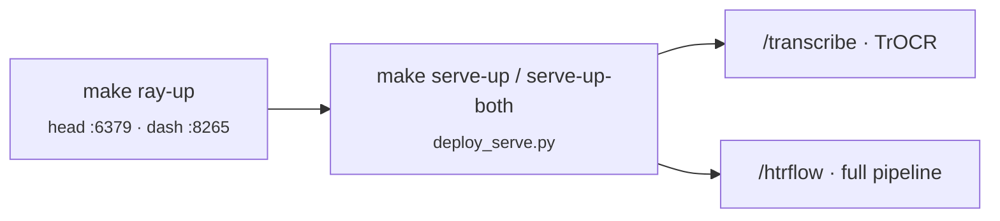

# Deployment

rask uses a **Helm chart at `chart/`** as the single deploy artifact for both
local k3s and production Kubernetes. The chart supports in-cluster
CloudNativePG (Postgres), RustFS (object store), and KubeRay via
`cnpg.enabled` / `rustfs.enabled` / `ray.enabled` toggles — each toggle gates
both the operator subchart and the custom resource it manages. Set all three to
`true` for local k3s; leave them `false` for production (external deps supplied
via `existingSecret`).

## Local deploy (k3s)

```bash
make k3s-install      # one-time: k3s + helm + NVIDIA device-plugin + KubeRay (sudo)
make k3s-build        # build fleet + frontend + ray images as :dev
make k3s-import       # side-load images into k3s
make k3s-up           # helm upgrade --install rask ./chart --wait
# UI: http://rask.local/   API: http://rask.local/api/health
# (add "127.0.0.1 rask.local" to /etc/hosts)
make e2e              # verify MFE hydration + API round-trip end-to-end (run after k3s-up)
make k3s-down         # uninstall   |   make k3s-purge  # + delete PVCs
```

`k3s-build` builds the full fleet (gateway, core-api, search-api, volumes-api,
ray-api, orchestrator) plus all 7 frontend images and the ray image as `:dev` tags.
`k3s-import` side-loads them into k3s containerd via `docker save | ctr images
import`, so no registry is needed.

## Container images (`.docker/`)

Production-shaped image definitions live at `.docker/`, built with `docker buildx`
(repo root as context). Current:

| Image | Base | Notes |
|---|---|---|
| `rask-runner` | `nvidia/cuda:12.4.0-runtime-ubuntu22.04` | GPU. uv-managed Python + venv; `CMD ["runner"]`. Needs `--shm-size`, `--ulimit nofile=65535`, GPU via nvidia-container-toolkit. |
| `frontend` / `<domain>-frontend` (7 images) | build + serve on `oven/bun:1-debian` | All built from **one parametrized** `.docker/frontend.dockerfile` via `--build-arg APP=<dir>`. **SSR via `svelte-adapter-bun`** (no longer an nginx SPA). `APP=frontend` is the catch-all (viewer-frontend, owns `/`); the six `<domain>-frontend` apps (overview/compute/discover/storage/train/studio) each pin base `/default/<domain>` and are probed there. Pre-builds `@rask/ui`, then `bun build`; the final stage ships the Bun runtime + `node_modules` and runs `bun build/index.js` on `:3000`. tini as PID 1, non-root UID 10001. |
| backend services (per-workload) | uv-managed Python | One dockerfile each: `gateway`, `core-api`, `orchestrator`, `volumes-api`, `search-api`, `ray-api` (plus `ray.dockerfile` for the Serve image). |

The one frontend dockerfile encodes a non-obvious build contract (documented in its
header): `svelte-adapter-bun` externalizes `@sveltejs/kit`, so the final
image must ship `node_modules` — `build/` is not standalone. And bun 1.3's **isolated
linker** keeps real packages in `node_modules/.bun/` with per-member symlinks, so the
final stage copies both the root store **and** the app dir (with its symlinks) and
runs from the app dir. The build `COPY`s the full JS workspace (all of
`components/apps` wholesale + `packages/{api,ui}`) so `bun install` resolves — siblings
are build-stage only, never shipped.

!!! note "Frontend images aren't built by `.dagger`"
    The Dagger module covers Python CI only (`migrate-up`, `test-pg` — see
    [CI](#ci) below); it does **not** build or publish the `.docker/*.dockerfile`
    images. Those are built directly with `docker buildx`. Wiring the frontend (and
    service) image builds into Dagger or a GitHub Actions matrix is a
    deployment-cycle follow-up.

The dissolved `viewer` monolith no longer has a dockerfile; its per-service
entrypoints each ship their own (`gateway`, `core-api`, `orchestrator`,
`volumes-api`, `search-api`, `ray-api`).

The frontend topology those images serve — the Turborepo vertical-microfrontend
proxy, the shared `@rask/ui` shell, and per-app `kit.paths.base` — is documented in
[Frontend microfrontends](frontend-microfrontends.md).

## Ray cluster & Serve (local)



- `make ray-up` / `ray-down` / `ray-status` — local Ray head.
- `make ray-up-htr` — a **2-GPU pool pinned to GPUs 0,1** (`CUDA_VISIBLE_DEVICES=0,1
  --num-gpus=2`); exports `RAY_ENABLE_UV_RUN_RUNTIME_ENV=0` and uses
  `uv run --no-sync` (the documented Ray/uv gotcha).
- `make serve-up` / `serve-down` / `serve-status` — deploy the Serve apps via
  `components/scripts/deploy_serve.py`.
- `make serve-up-both` — deploy `transcribe` + `htrflow` with fractional GPU
  reservations (`RASK_SERVE_REPLICAS=2`, `RASK_SERVE_GPU_FRAC=0.49` → ≈1.96 GPU
  on the 2-GPU pool).
- `make qwen-serve` — an external vLLM LLM backend on GPU 2 (isolated venv,
  OpenAI-compatible API on `:8001`), separate from the HTR workspace.

## Remote KubeRay

The runner accepts `--address ray://…:10001`; the orchestrator submits jobs to
the Ray dashboard REST API at `RAY_DASHBOARD_URL`. With `ray.enabled=true` the
chart provisions an in-cluster KubeRay RayService; with `ray.enabled=false` the
orchestrator points at an external cluster via `config.RAY_DASHBOARD_URL`.

## Helm chart (`chart/`)

`make k3s-up` runs `helm upgrade --install rask ./chart --wait`. The chart deploys:

- **gateway** — reverse proxy on `:8888` (path-routes `/api/*` to per-domain services).
- **core-api** — batches + chunks + catalog endpoints on `:8801`.
- **orchestrator** — the reconcile loop on `:8810` (`replicas: 1`, `Recreate`).
- **volumes-api** — S3/IIIF image + ALTO proxy on `:8803`.
- **search-api** — Lance FTS + S3 thumbnails on `:8802`.
- **ray-api** — Ray dashboard proxy + `/api/serve/*` on `:8804`.
- **frontend** — SvelteKit SSR app on `:3000`.
- **migration** — pre-install/pre-upgrade hook Job running `alembic upgrade head`.
- **Ingress** (Traefik) — `/api` → gateway:8888, `/` → frontend:3000.
- **In-cluster deps** (gated by values toggles — each gate covers both the operator subchart and its CR):
  - `cnpg.enabled` — CloudNativePG operator + `Cluster` named `rask-postgres`; app connects to `rask-postgres-rw:5432`. Values under `cnpg.*` (instances, storage, imageName, user, database).
  - `rustfs.enabled` — RustFS operator (vendored at `third_party/rustfs-operator/`, refreshed via `scripts/vendor-rustfs-operator.sh`) + `Tenant` named `rask-rustfs`; S3 at `rask-rustfs-io:9000`, console at `rask-rustfs-console:9001`. Standalone mode: 1 pod / 4 PVCs (erasure-coding minimum). Buckets provisioned natively via `spec.buckets` — no init Job. Values under `rustfs.*`.
  - `ray.enabled` — KubeRay `RayService` (head + worker with GPU limits).
  - `observability.enabled` — three optional subcharts (see below).

### Observability stack (`observability.enabled`)

The `observability.enabled` toggle gates three subcharts and all OTLP wiring in the
fleet and Ray deployments.

| Component | Version | Service | Role |
|---|---|---|---|
| **Vector** | 0.56.0 | `rask-vector` (Agent DaemonSet) | Collects k8s pod logs; ships to GreptimeDB `:4000` via `greptimedb_logs` sink (table `rask_logs`) |
| **GreptimeDB** | `greptimedb-standalone` 0.4.5 (app 1.1.1) | `rask-greptimedb-standalone` | Unified metrics/logs/traces store; `:4000` HTTP (OTLP, Prometheus query/write, SQL), `:4001` gRPC (OTLP) |
| **Perses** | 0.22.0 | `rask-perses:8080` | Dashboard UI; a GreptimeDB Prometheus `GlobalDatasource` (`http://rask-greptimedb-standalone:4000/v1/prometheus`) is pre-configured |

**Storage:** GreptimeDB writes to the in-cluster RustFS S3 at `rask-rustfs-io:9000`,
bucket `rask-observability`. The bucket is auto-provisioned by the RustFS Tenant's
`spec.buckets` — no init Job or manual bucket creation is required (greenfield installs
get it automatically).

**App instrumentation:** `service_kit.setup_otel` (called from `make_service_app`)
instruments the FastAPI fleet; the Ray Serve htrflow app is similarly instrumented.
Both export OTLP/gRPC **directly to GreptimeDB `:4001`** — the chart injects
`OTEL_EXPORTER_OTLP_ENDPOINT` and `RASK_OTEL_ENABLED` when `observability.enabled=true`.
When the toggle is off the env vars are absent and instrumentation is a no-op.
Standard OTLP/gRPC is used throughout; OTel-Arrow is not used (the Python SDK and
Vector both lack OTAP support).

Greenfield local cutover (drops old PVCs): `make k3s-purge && make k3s-up`.

Sensitive config comes from an operator-created Secret (`existingSecret`, default
`rask-app`); non-sensitive config from `values.yaml` → ConfigMap. See
`chart/README.md`.

## CI

- **GitHub Actions** runs only `.github/workflows/docs.yml`: builds this Zensical
  site (`zensical build --clean`, with mkdocstrings API reference), builds
  Storybook, and deploys both to GitHub Pages on push to `main`/`master`.
- **Tests & migrations** run through **Dagger**, not GitHub Actions:
  `dagger call migrate-up` (alembic against an ephemeral Postgres — proof of a
  clean from-zero migration) and `dagger call test-pg` (migrate + core pytest).

## State stores

- **Postgres** (prod) via `DATABASE_URL=postgresql+asyncpg://…`; **SQLite** (dev)
  at `.cache/batches.db`. Schema changes go through **Alembic** — never
  `create_all` at startup. Local Postgres: `make pg-up` / `pg-migrate`.
- **S3** (backend-agnostic: MinIO / rustfs / AWS; HCP only as a legacy env-alias
  bridge) two-bucket setup (`images-batch` input, `images-batch-alto` output) plus
  the `images-batch-search` Lance tables.
