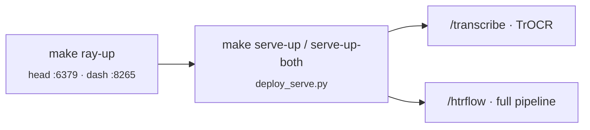

# Deployment

rask deliberately has **no Helm chart, no Kubernetes manifests, no
docker-compose** in this repo. The `Makefile` is the runbook for local/dev
operation; container images and a remote KubeRay cluster carry production.

## Container images (`.docker/`)

Three multi-stage, digest-pinned, non-root images. (`.docker/` is excluded from
the build context by `.dockerignore`; images are built from templates.)

| Image | Base | Notes |
|---|---|---|
| `rask-runner` | `nvidia/cuda:12.4.0-runtime-ubuntu22.04` | GPU. uv-managed Python + venv; `CMD ["runner"]`. Needs `--shm-size`, `--ulimit nofile=65535`, GPU via nvidia-container-toolkit. |
| `rask-viewer` | `python:3.13-slim-bookworm` | `EXPOSE 8888`; runs `uvicorn viewer.app:app --proxy-headers --forwarded-allow-ips 127.0.0.1`. Set `--forwarded-allow-ips` to the nginx CIDR in prod, never `*`. |
| `rask-frontend` | build on `oven/bun`, serve on `nginxinc/nginx-unprivileged:1.27-alpine` | Builds `component-lib` then the SvelteKit SPA (adapter-static), serves on `:8080` with SPA fallback + immutable asset caching. |

## Ray cluster & Serve (local)

- `make ray-up` / `ray-down` / `ray-status` — local Ray head.
- `make ray-up-htr` — a **2-GPU pool pinned to GPUs 0,1** (`CUDA_VISIBLE_DEVICES=0,1
  --num-gpus=2`); exports `RAY_ENABLE_UV_RUN_RUNTIME_ENV=0` and uses
  `uv run --no-sync` (the documented Ray/uv gotcha).
- `make serve-up` / `serve-down` / `serve-status` — deploy the Serve apps via
  `components/scripts/deploy_serve.py`.
- `make serve-up-both` — deploy `transcribe` + `htrflow` with fractional GPU
  reservations (`RASK_SERVE_REPLICAS=2`, `RASK_SERVE_GPU_FRAC=0.49` → ≈1.96 GPU
  on the 2-GPU pool).
- `make qwen-serve` — an external vLLM LLM backend on GPU 2 (isolated venv,
  OpenAI-compatible API on `:8001`), separate from the HTR workspace.

## Remote KubeRay

The runner accepts `--address ray://…:10001` and passes it to `ray.init`; it
forwards `AWS_*` / `HCP_*` / `IIIF_*` / `RASK_*` to workers as a `runtime_env`.
**No KubeRay manifests live in this repo** — the remote cluster is managed
elsewhere (Argo/Helm). The `chart/` directory is an empty placeholder.

## CI

- **GitHub Actions** runs only `.github/workflows/docs.yml`: builds this Zensical
  site (`zensical build --clean`, with mkdocstrings API reference), builds
  Storybook, and deploys both to GitHub Pages on push to `main`/`master`.
- **Tests & migrations** run through **Dagger**, not GitHub Actions:
  `dagger call migrate-up` (alembic against an ephemeral Postgres — proof of a
  clean from-zero migration) and `dagger call test-pg` (migrate + viewer pytest).

!!! warning "Known docs CI issue"
    `docs.yml` builds Storybook from `packages/oxen_componets`, but the real
    directory is `packages/component-lib`. That step fails until the path is
    corrected.

## State stores

- **Postgres** (prod) via `DATABASE_URL=postgresql+asyncpg://…`; **SQLite** (dev)
  at `.cache/batches.db`. Schema changes go through **Alembic** — never
  `create_all` at startup. Local Postgres: `make pg-up` / `pg-migrate`.
- **S3 / HCP** two-bucket setup (`images-batch` input, `images-batch-alto`
  output) plus the `images-batch-search` Lance tables.
