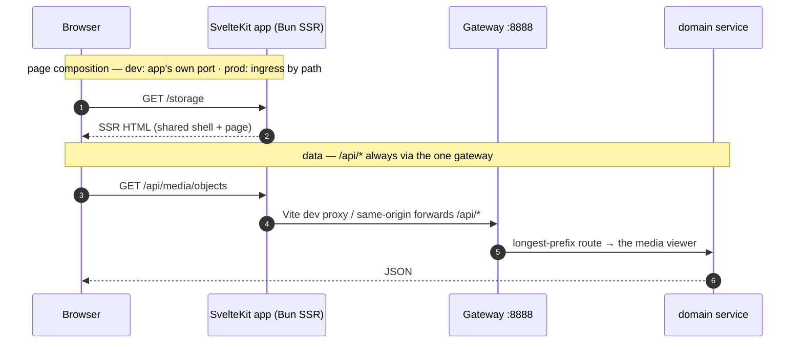

# Frontend Microfrontends

!!! warning "Historical — this describes the PRE-MERGE zone set (2026-07-28)"

    The *reasoning* is why this page is kept: why rask splits the frontend at all, why each zone owns
    a static base, and why dev composition and prod composition are separate layers that share only
    that base path. All of that still holds.

    **The inventory does not.** Every zone table and routing example below is superseded:

    | Below | Actually |
    |---|---|
    | zones `overview`, `storage`, `discover` | **retired** — `/storage` and `/catalog` are routes inside `lakehouse` |
    | base `/default/<domain>` | a bare `/<zone>`; `/default/lakehouse` is asserted *not* to be a zone path |
    | `/<project>/<domain>` | the project comes from the request **host** (`demo.localhost` → `demo`) |
    | 7 zones, 3 packages | 7 zones, **8** packages — `@rask/dockview`, `@rask/engine`, `@rask/labeling`, `@rask/media-api`, `@rask/config` all arrived with the merge |

    For the current zone list, ports, data dialects, dock workbenches and gates, read
    **`.claude/skills/rask-frontend`** — it is checked against the code and updated with it.

This page explains **what we are building** for the rask frontend, **how it works**,
and **where each piece lives** — so you can read a URL and know which app served it.

!!! abstract "One sentence"

    The rask frontend is a set of **independent SvelteKit SSR apps** (one per
    domain), each its own deployable, all sharing **one design system + one sidebar**, and
    **composed by a single proxy** so they feel like one site. The IA is **project-first**:
    `/` is a project picker (no sidebar); inside a project you're at `/<project>/<domain>`
    behind the shared shell.

## The mental model: _vertical_ microfrontends

There are two ways to do microfrontends. We use the **vertical** (route-based) model —
**not** the horizontal (Module Federation) one. This is the single most important thing
to internalise, because it explains everything else.

=== "Vertical (what rask uses) ✅"

    Each app is a **complete web page**. A proxy/gateway routes by **URL path**: hitting
    `/storage` loads the *entire* storage app — its own `<html>`, its own sidebar, its own
    content. Apps are independent and deploy separately. The shared chrome (sidebar) is a
    **library** every app imports.

    ``` mermaid
    graph LR
      U[Browser] -->|/compute| P{Proxy / Gateway}
      U -->|/storage| P
      P -->|/*| M[frontend app<br/>full page + sidebar]
      P -->|/storage| S[storage app<br/>full page + sidebar]
      M -.imports.-> L[(@rask/ui<br/>shared shell)]
      S -.imports.-> L
    ```

=== "Horizontal (Module Federation) ❌ not us"

    One **host shell app** stays loaded and pulls *fragments* of other apps into a
    persistent layout at runtime (the sidebar never reloads). Powerful, but runtime-coupled
    and complex. rask does **not** do this.

    ``` mermaid
    graph LR
      U[Browser] --> H[Shell host app]
      H -.loads fragment.-> A[storage fragment]
      H -.loads fragment.-> B[search fragment]
    ```

!!! question "Then why does every app _import_ `AppShell` — isn't that reverse?"

    No. Because each vertical app renders the **whole page itself**, it must draw its **own**
    sidebar. So it imports `AppShell` from the shared library — exactly like importing a
    `<Layout>` component. The shell is **shared code**, not a host process. Direction is
    `app → uses → shell-library`. (The "shell hosts the apps" picture is the *horizontal*
    model above.)

## Where everything lives

The whole JS/TS plane lives under **`frontend/`** — its own Bun + Turborepo
workspace root — so there is **no top-level `apps/`** (that's the turborepo
`with-svelte` example). Runnable apps live under **`frontend/microfrontends/`**;
shared libraries under **`frontend/packages/`**.

```mermaid
graph TD
  subgraph ca["frontend/microfrontends"]
    F[home<br/><sub>catch-all — / home picker</sub>]
    OF[overview<br/><sub>MFE: /default/overview</sub>]
    SF[storage<br/><sub>MFE: /default/storage</sub>]
    CF[compute<br/><sub>MFE: /default/compute</sub>]
    DF[discover<br/><sub>MFE: /default/discover</sub>]
    TF[train · studio<br/><sub>MFE: /default/{train,studio}</sub>]
  end
  subgraph pk["frontend/packages"]
    UI[ui — @rask/ui<br/><sub>sidebar/shell + styled components</sub>]
    API[api — @rask/api<br/><sub>API client + types</sub>]
  end
  F -->|workspace:*| UI
  OF -->|workspace:*| UI
  SF -->|workspace:*| UI
  CF -->|workspace:*| UI
  DF -->|workspace:*| UI
  TF -->|workspace:*| UI
  OF --> API
  CF --> API
  DF --> API
```

There are **7** SvelteKit apps: the catch-all plus **six** domain MFEs.

| Path                                | What it is                                                                                                                                                                                                                  |
| ----------------------------------- | --------------------------------------------------------------------------------------------------------------------------------------------------------------------------------------------------------------------------- |
| `frontend/microfrontends/home`          | **The catch-all app** (the proxy default). Owns `/` (the home / project picker, no sidebar) + the `/<project>` entry redirect. Package name `home`; no data layer.                                               |
| `frontend/microfrontends/overview` | A carved-out microfrontend — owns `/<project>/overview` (the batch view); base `/default/overview`.                                                                                                                         |
| `frontend/microfrontends/storage`  | A carved-out microfrontend — owns `/<project>/storage` (the S3 browser); base `/default/storage`.                                                                                                                           |
| `frontend/microfrontends/compute`  | A carved-out microfrontend — owns `/<project>/compute` (the Ray/cluster UI: overview, cluster, jobs, actors, serve, logviewer, api-docs); base `/default/compute`.                                                          |
| `frontend/microfrontends/discover` | A carved-out microfrontend — owns `/<project>/discover` (search, browse, viewer); base `/default/discover`.                                                                                                                 |
| `frontend/microfrontends/{train,studio}` | Carved-out microfrontends — `/<project>/train` (model training, dummy) and `/<project>/studio` (mini-applications, dummy); bases `/default/train` · `/default/studio`.                                                  |
| `frontend/packages/ui` (`@rask/ui`)          | The **shared design system**: styled components (`button`, `badge`, `card`, `dialog`, `sort-header`, `sidebar`, …) **plus the shell** (`@rask/ui/shell` → `AppShell`, `AppSidebar`, `nav-config`).                          |
| `frontend/packages/api` (`@rask/api`)        | The **shared API client + types** — every app imports it (`@rask/api`) instead of copying `api.ts`. JIT package (exports `./src/index.ts` source, no build), split into `ray`/`batches`/`search`/`volumes`/`types` modules. |

## How a request flows (frontend → services)

There are **two distinct layers** — keep them separate:

1. **Page composition** — which _app_ serves a URL path (`/storage` → storage).
2. **Data** — how an app reaches the _backend_. The frontend **never** talks to a domain
   service directly; it always hits the **gateway** (`:8888`), which path-routes `/api/*`
   longest-prefix-first (`ray` :8804, controlplane :8820, and the lance
   lakehouse/media planes — `/api/catalog`, `/api/lineage`, `/api/media/*`).



!!! info "Two fetch paths, one gateway"

    - **Client-side** code uses the relative `/api/*` — the **Vite dev proxy** forwards it to
      `VIEWER_BACKEND` (`:8888`) in dev; same-origin in prod.
    - **Server-side** code (SSR `load`, remote functions) fetches the **same relative `/api/*`**,
      but the three data apps (`overview`/`compute`/`discover`) ship a `src/hooks.server.ts`
      (`makeGatewayHandleFetch` from `@rask/api`) that rewrites it to the **in-cluster gateway**
      (`RASK_GATEWAY_URL`) during SSR — a server has no origin, so a relative URL would otherwise
      hairpin out through the external ingress. (`storage` instead builds an **absolute**
      `GATEWAY_URL` directly in its remote functions; the catch-all has no data layer.) Both end at
      the **one gateway** — see the [services fleet](system-overview.md) for how it routes onward.

## The shared shell (one sidebar, zero drift)

`@rask/ui/shell` exports an `AppShell` that wraps every app's routes:

```svelte title="every app's src/routes/+layout.svelte"
<script lang="ts">
	import { page } from '$app/state';
	import { AppShell } from '@rask/ui/shell';
	let { children } = $props();
</script>

<AppShell pathname={page.url.pathname}>
	{@render children()}
</AppShell>
```

`AppSidebar` is **pure**: it takes `pathname` as a prop and renders plain `<a href>` links
(no `$app/*`), which is what makes it shareable across independently-deployed apps. Its
**cross-zone** links (a link whose domain differs from the current one) carry
`data-sveltekit-reload`, so they hard-navigate into the target zone (the full page load the
proxy routes) instead of a no-op client-router attempt; same-domain sub-route links stay
soft. See the cross-zone rule in [frontend-conventions.md](frontend-conventions.md) §6.

!!! tip "Styled components live in the library, not the apps"

    The **look** (Tailwind classes, variants) lives in `@rask/ui`. Each app only supplies the
    **theme token values** in its `app.css` (`--primary`, `--sidebar`, …) plus an
    `@source '../../../packages/ui/dist'` so Tailwind generates the lib's classes. Same
    button, same sidebar, everywhere. You'd only style *in* an app for something unique to it.

## Project-first IA + current state

The information architecture is **project-first**: `/` is the **home / project picker**,
rendered **without** the sidebar (it's the pre-project landing — pick/create a project, manage
members/RBAC later). The moment you're inside a project you're at **`/<project>/<domain>`** with
the shared sidebar. There is **no "Home" item** in the sidebar — you leave a project via the
**project switcher** (header dropdown) or the breadcrumb.

There is one implicit project (`default`) today, so each domain MFE carries it in a **static
base** (`/default/<domain>`). That's the key trick: a static base gives each app a per-app asset
prefix the dev proxy needs (so `/@vite`, `/_app`, built chunks route to the right app) **and**
yields project-first URLs. Multi-project (a dynamic base) is deliberately deferred.

| Domain app                        | Routes it owns                                                       | `kit.paths.base`    | Status         |
| --------------------------------- | -------------------------------------------------------------------- | ------------------- | -------------- |
| `home` (catch-all)                | `/` home picker · `/<project>` entry redirect                        | _(none — default)_  | **done ✅**    |
| `overview`               | overview (the batch view)                                            | `/default/overview` | **done ✅**    |
| `compute` (the "ray" UI) | compute: overview, cluster, jobs, actors, serve, logviewer, api-docs | `/default/compute`  | **done ✅**    |
| `storage`                | storage (the S3 browser)                                             | `/default/storage`  | **done ✅**    |
| `discover`               | search, browse, viewer                                               | `/default/discover` | **done ✅**    |
| `train`                  | model training (dummy)                                               | `/default/train`    | **done ✅**    |
| `studio`                 | mini-applications (dummy)                                            | `/default/studio`   | **done ✅**    |

Each was carved with the **same recipe** (scaffold app under `frontend/microfrontends/` → move its
routes in → wire `@rask/ui` + `@rask/api` → static base `/default/<domain>` → register in
`microfrontends.json`; the bun workspace glob picks the directory up on its own),
so adding the next domain is not a new hard problem.

## Running the frontends locally

Start them with Turborepo — no backend required to see the **chrome**:

```bash
make dev-frontends     # all 7 apps + @rask/ui watcher + the :3024 proxy (turbo run dev)
make home   # just the catch-all,  :5273  (serves / and the /<project> redirect)
make frontend-storage  # just storage,        :5174/default/storage
make frontend-compute  # just compute,        :5175/default/compute
```

!!! warning "Browse the **proxy** (`:3024`), not the per-app ports"

    Each app only owns its own paths. Hitting an app port directly for *another* domain 404s
    (e.g. `:5273/default/compute` → 404 — compute lives in the compute app). Always browse
    **`http://localhost:3024`** for the composed site. (`strictPort` makes a port clash fail
    loudly instead of drifting to the next free port and breaking the proxy's routing.)

`make dev-frontends` (= `turbo run dev`) also brings up Turborepo's **built-in microfrontends
proxy** on **`http://localhost:3024`** — the single origin you browse so that a `<a href="/storage">`
from the compute app actually loads the storage app. Individual `make frontend-*` targets only
start that one app's port.

!!! success "Verified: the shared shell renders with **no backend running**"

    Each app SSR-renders the `@rask/ui` shell + grouped sidebar on its own — e.g.
    `GET :5175/default/compute` → `200`, title `Overview — RASK`, full **Overview / Compute /
    Discover / Storage / Train / Studio** nav — with nothing on `:8888`. You only need a backend
    for live `/api` **data** (some routes, e.g. the overview app's batch view, error without it).
    Start one with `make dev-micro` (real fleet) or `make viewer` (monolith) — or mock it (below).

!!! success "Single-origin composition proxy — `:3024` (built into Turborepo)"

    `frontend/microfrontends/home/microfrontends.json` **declares** the path routing
    (`/storage`, `/compute`), and **Turborepo 2.9 reads it and auto-starts its own native
    microfrontends proxy** on **`http://localhost:3024`** whenever `turbo run dev` includes
    these apps — **no `@vercel/microfrontends` package is required** (that dep is only for
    Vercel's _hosted_ custom proxy; absent it, turbo uses its built-in Rust proxy). So
    `:3024/compute`, `:3024/storage`, and the catch-all `:3024/*` all serve from one origin,
    which is what makes cross-app `<a href>` navigation work. You _can_ still hit each app on
    its own port (catch-all `:5273`, then `:5174`/`:5175`/… per `microfrontends.json`) directly.

    The app **without** a `routing` block (`home`) is the proxy's **default /
    catch-all**. Override the proxy port with `localProxyPort` in `microfrontends.json` if
    `:3024` is taken.

## Developing without the full backend

You should **not** need the whole fleet (gateway + 5 services + Postgres + Ray) just to see
a populated page. Because every frontend hits the **one gateway**, you mock **one thing**:

<div class="grid cards" markdown>

- :lucide-flask-conical: **Mock gateway (recommended)**

  ***

  One small Bun server answering `/api/*` with canned JSON. Point `RASK_GATEWAY_URL` / the
  Vite proxy at it. **One mock feeds every microfrontend.**

- :lucide-toggle-left: **`RASK_MOCK` flag**

  ***

  `api.ts` / `*.remote.ts` return canned data when `RASK_MOCK=1`. No extra process. The
  `/s3` remote function is already shaped for this.

- :lucide-file-json: **Prism (from OpenAPI)**

  ***

  Auto-generate a schema-valid mock from a service's `openapi.json`. Most "real", but needs
  the OpenAPI-codegen workflow first.

</div>

## Deployment

Each app is **one Bun-server Docker image** (`svelte-adapter-bun`) built from a single
parametrized `.docker/frontend.dockerfile` via `--build-arg APP=<app>` (see
[Deployment](deployment.md)). In k3s each is a Deployment+Service from the chart's
`frontend.apps` list, with the ingress routing `/default/<domain>` to its app and `/`
to the catch-all:

- **Dev** — each app runs its own Vite dev server on its own port (`:5173`/`:5174`/`:5175`),
  and Turborepo's **built-in** microfrontends proxy (auto-started from `microfrontends.json`,
  no package needed) composes them on a **single origin at `http://localhost:3024`** — that's
  the URL you actually browse for cross-app nav.
- **Prod** — the **gateway / K8s ingress** path-routes `/default/<domain>` (`/default/overview`,
  `/default/compute`, `/default/discover`, `/default/storage`, `/default/train`, `/default/studio`)
  to each app's Bun server, with `/` to the catch-all (the same pattern as the per-domain
  _backend_ services).

!!! note "Toolchain — loyal to rask, not the with-svelte example"

    **Bun** workspaces (no pnpm), **svelte-adapter-bun** (SSR, not adapter-static), **valibot**
    (not zod), **oxlint + oxfmt** (not eslint + prettier), workspace membership by glob over a
    **language-pure** `frontend/` tree, `kit.paths.base` per app (not raw
    vite `base`). See `docs/components/progress.md` for the live build log.
