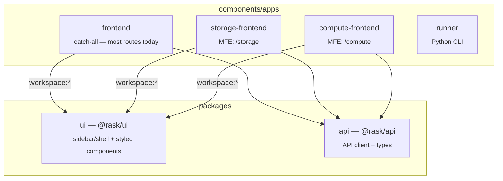
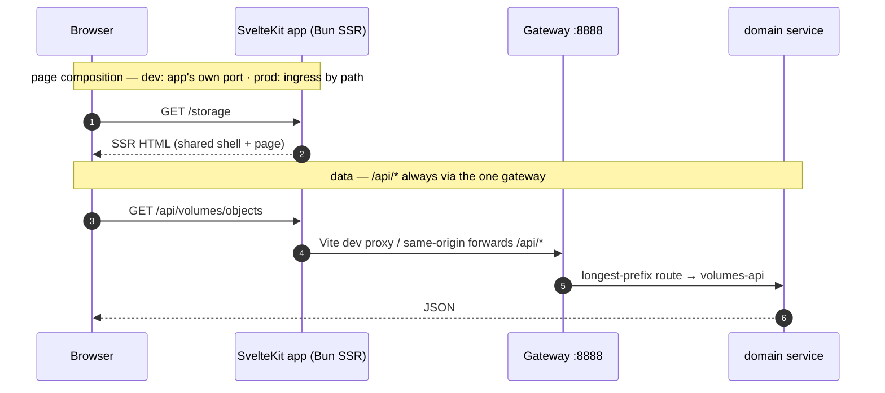
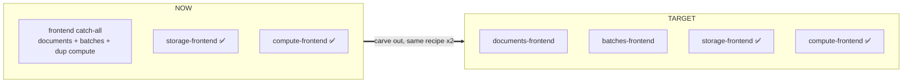

# Frontend Microfrontends

This page explains **what we are building** for the rask frontend, **how it works**,
and **where each piece lives** — so you can read a URL and know which app served it.

!!! abstract "One sentence"

    The rask frontend is becoming a set of **independent SvelteKit SSR apps** (one per
    domain), each its own deployable, all sharing **one design system + one sidebar**, and
    **composed by a single proxy** so they feel like one site.

## The mental model: _vertical_ microfrontends

There are two ways to do microfrontends. We use the **vertical** (route-based) model —
**not** the horizontal (Module Federation) one. This is the single most important thing
to internalise, because it explains everything else.

=== "Vertical (what rask uses) ✅"

    Each app is a **complete web page**. A proxy/gateway routes by **URL path**: hitting
    `/storage` loads the *entire* storage app — its own `<html>`, its own sidebar, its own
    content. Apps are independent and deploy separately. The shared chrome (sidebar) is a
    **library** every app imports.

    ``` mermaid
    graph LR
      U[Browser] -->|/batches| P{Proxy / Gateway}
      U -->|/storage| P
      P -->|/*| M[frontend app<br/>full page + sidebar]
      P -->|/storage| S[storage app<br/>full page + sidebar]
      M -.imports.-> L[(@rask/ui<br/>shared shell)]
      S -.imports.-> L
    ```

=== "Horizontal (Module Federation) ❌ not us"

    One **host shell app** stays loaded and pulls *fragments* of other apps into a
    persistent layout at runtime (the sidebar never reloads). Powerful, but runtime-coupled
    and complex. rask does **not** do this.

    ``` mermaid
    graph LR
      U[Browser] --> H[Shell host app]
      H -.loads fragment.-> A[storage fragment]
      H -.loads fragment.-> B[search fragment]
    ```

!!! question "Then why does every app _import_ `AppShell` — isn't that reverse?"

    No. Because each vertical app renders the **whole page itself**, it must draw its **own**
    sidebar. So it imports `AppShell` from the shared library — exactly like importing a
    `<Layout>` component. The shell is **shared code**, not a host process. Direction is
    `app → uses → shell-library`. (The "shell hosts the apps" picture is the *horizontal*
    model above.)

## Where everything lives

rask is **Polylith**, so there is **no top-level `apps/`** (that's the turborepo
`with-svelte` example). Runnable apps live under **`components/apps/`**; shared libraries
under **`packages/`**.



| Path                               | What it is                                                                                                                                                                                         |
| ---------------------------------- | -------------------------------------------------------------------------------------------------------------------------------------------------------------------------------------------------- |
| `components/apps/frontend`         | **The catch-all app.** Still owns the not-yet-carved routes (search, browse, viewer, batches) and the compute routes it shares with `compute-frontend` until those are retired. Package name `viewer-frontend`. |
| `components/apps/storage-frontend` | The **first carved-out microfrontend** — owns `/storage` (the S3 browser).                                                                                                                         |
| `components/apps/compute-frontend` | The **second carved-out microfrontend** — owns `/compute` (the Ray/cluster UI: overview, cluster, jobs, actors, serve, logviewer, api-docs).                                                       |
| `packages/ui` (`@rask/ui`)         | The **shared design system**: styled components (`button`, `badge`, `card`, `dialog`, `sort-header`, `sidebar`, …) **plus the shell** (`@rask/ui/shell` → `AppShell`, `AppSidebar`, `nav-config`). |
| `packages/api` (`@rask/api`)       | The **shared API client + types** — every app imports it (`@rask/api`) instead of copying `api.ts`. JIT package (exports `./src/index.ts` source, no build), split into `ray`/`batches`/`search`/`volumes`/`types` modules. |

## How a request flows (frontend → services)

There are **two distinct layers** — keep them separate:

1. **Page composition** — which *app* serves a URL path (`/storage` → storage-frontend).
2. **Data** — how an app reaches the *backend*. The frontend **never** talks to a domain
   service directly; it always hits the **gateway** (`:8888`), which path-routes `/api/*`
   to the per-domain services (`core-api` :8801, `search-api` :8802, `volumes-api` :8803,
   `ray-api` :8804, `orchestrator` :8810) longest-prefix-first.



!!! info "Two fetch paths, one gateway"

    - **Client-side** code uses the relative `/api/*` — the **Vite dev proxy** forwards it to
      `VIEWER_BACKEND` (`:8888`) in dev; same-origin in prod.
    - **Server-side** code (SSR `load`, remote functions) uses an **absolute** `RASK_GATEWAY_URL`
      because a server has no origin. Both end at the **one gateway** — see the
      [services fleet](system-overview.md) for how it routes onward.

## The shared shell (one sidebar, zero drift)

`@rask/ui/shell` exports an `AppShell` that wraps every app's routes:

```svelte title="every app's src/routes/+layout.svelte"
<script lang="ts">
	import { page } from '$app/state';
	import { AppShell } from '@rask/ui/shell';
	let { children } = $props();
</script>

<AppShell pathname={page.url.pathname}>
	{@render children()}
</AppShell>
```

`AppSidebar` is **pure**: it takes `pathname` as a prop and renders plain `<a href>` links
(no `$app/*`), which is what makes it shareable across independently-deployed apps — and
plain anchors are also _correct_ for cross-app navigation (a full page load the proxy routes).

!!! tip "Styled components live in the library, not the apps"

    The **look** (Tailwind classes, variants) lives in `@rask/ui`. Each app only supplies the
    **theme token values** in its `app.css` (`--primary`, `--sidebar`, …) plus an
    `@source '../../../../packages/ui/dist'` so Tailwind generates the lib's classes. Same
    button, same sidebar, everywhere. You'd only style *in* an app for something unique to it.

## Current state vs. target

!!! warning "The split is **started, not finished** — 2 of 4 domain apps"

    `storage` and `compute` are carved out. The catch-all `frontend` still owns the
    documents + batches routes (and still duplicates the compute routes until they're
    retired).



| Domain app                        | Routes it owns                                              | `kit.paths.base` | Status      |
| --------------------------------- | ----------------------------------------------------------- | ---------------- | ----------- |
| `compute-frontend` (the "ray" UI) | overview, cluster, jobs, actors, serve, logviewer, api-docs | `/compute`       | **done ✅** |
| `storage-frontend`                | s3                                                          | `/storage`       | **done ✅** |
| `documents-frontend`              | search, browse, viewer                                      | `/documents`     | planned     |
| `batches-frontend`                | batches (+ chunks/orchestrator controls)                    | `/batches`       | planned     |

Carving each remaining one is the **same recipe** as `storage`/`compute` (scaffold app →
move its routes in → wire `@rask/ui` + `@rask/api`), not a new hard problem.

## Running the frontends locally

Start them with Turborepo — no backend required to see the **chrome**:

```bash
make dev-frontends     # all apps + the @rask/ui watcher (turbo run dev)
make viewer-frontend   # just the catch-all,  :5173
make frontend-storage  # just storage,        :5174/storage
make frontend-compute  # just compute,        :5175/compute
```

!!! success "Verified: the shared shell renders with **no backend running**"

    Each app SSR-renders the `@rask/ui` shell + grouped sidebar on its own — e.g.
    `GET :5175/compute` → `200`, title `Overview — RASK`, full **Compute / Documents /
    Storage** nav — with nothing on `:8888`. You only need a backend for live `/api` **data**
    (some routes, e.g. the catch-all's `/batches`, error without it). Start one with
    `make dev-micro` (real fleet) or `make viewer` (monolith) — or mock it (below).

!!! warning "No composition proxy yet — apps run on separate ports in dev"

    `components/apps/frontend/microfrontends.json` **declares** the path routing
    (`/storage`, `/compute`), but the Turborepo/Vercel **microfrontends proxy package is not
    installed**, so there is no single-origin `:3024` dev URL yet. Today you visit each app on
    its own port. Wiring the proxy is the remaining composition step.

## Developing without the full backend

You should **not** need the whole fleet (gateway + 5 services + Postgres + Ray) just to see
a populated page. Because every frontend hits the **one gateway**, you mock **one thing**:

<div class="grid cards" markdown>

- :lucide-flask-conical: **Mock gateway (recommended)**

  ***

  One small Bun server answering `/api/*` with canned JSON. Point `RASK_GATEWAY_URL` / the
  Vite proxy at it. **One mock feeds every microfrontend.**

- :lucide-toggle-left: **`RASK_MOCK` flag**

  ***

  `api.ts` / `*.remote.ts` return canned data when `RASK_MOCK=1`. No extra process. The
  `/s3` remote function is already shaped for this.

- :lucide-file-json: **Prism (from OpenAPI)**

  ***

  Auto-generate a schema-valid mock from a service's `openapi.json`. Most "real", but needs
  the OpenAPI-codegen workflow first.

</div>

## Deployment

Each app is **one Bun-server Docker image** (`svelte-adapter-bun`) — `.docker/frontend.dockerfile`,
`.docker/storage-frontend.dockerfile`, `.docker/compute-frontend.dockerfile` (see
[Deployment](deployment.md)):

- **Dev** — each app runs its own Vite dev server on its own port (`:5173`/`:5174`/`:5175`).
  A single-origin composition proxy is **declared** in `microfrontends.json` but **not yet
  wired** (no proxy package installed), so there is no `:3024` URL today.
- **Prod** — the **gateway / K8s ingress** path-routes `/compute`, `/documents`, `/batches`,
  `/storage` to each app's Bun server (the same pattern as the per-domain _backend_ services).

!!! note "Toolchain — loyal to rask, not the with-svelte example"

    **Bun** workspaces (no pnpm), **svelte-adapter-bun** (SSR, not adapter-static), **valibot**
    (not zod), **explicit** workspace membership (no globs), `kit.paths.base` per app (not raw
    vite `base`). See `docs/components/progress.md` for the live build log.
