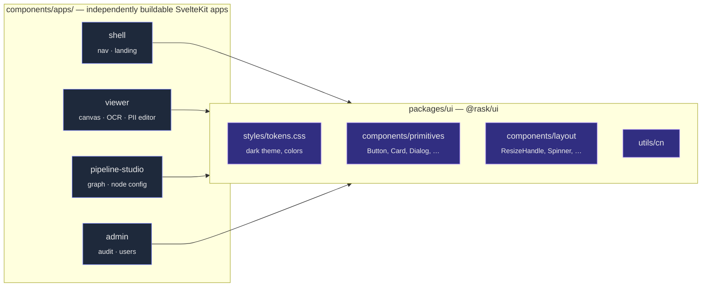
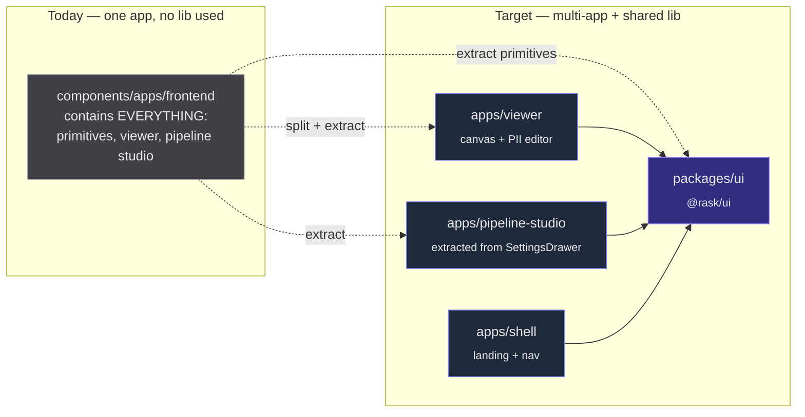
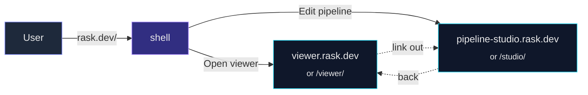

# Frontend monorepo: multi-app + shared lib

How the SvelteKit side of `rask` is intended to scale beyond a single viewer.

## TL;DR

- Every user-facing surface (viewer, pipeline studio, admin, …) is its **own
  SvelteKit app** that builds and deploys independently.
- A single **`@rask/ui` package** (lives in `packages/ui/`) holds
  every design token, primitive (`Button`, `Card`, `Dialog`, …), and
  domain-free layout helper (`ResizeHandle`, `CollapsibleSection`, …).
- Apps consume the lib at **build time** via bun workspaces. There is no
  runtime federation, no shared CDN bundle. Design unity is a _compile-time_
  guarantee.

## Picture



Each app is a leaf consumer. The lib has zero knowledge of any app.

## What lives where — the litmus test

> Does the thing know about a _domain type_ (`PiiSpan`, `OcrLine`,
> `PipelineConfig`)? → it goes in an **app**.
> Does it only know about props, slots, classes, ARIA, design tokens? → it
> goes in the **lib**.

|                                                    | Lib | App |
| -------------------------------------------------- | --- | --- |
| `Button.svelte` (variants, sizes, asChild)         | ✅  |     |
| `Canvas.svelte` (draws boxes, reads `EditorBox[]`) |     | ✅  |
| `ResizeHandle.svelte` (drag + size)                | ✅  |     |
| `Sidebar.svelte` (renders PII categories)          |     | ✅  |
| `tokens.css` (CSS custom properties)               | ✅  |     |
| `PipelineSketch.svelte` (Svelte Flow nodes)        |     | ✅  |
| `cn()` utility                                     | ✅  |     |
| `state.svelte.ts` (per-app store)                  |     | ✅  |

## Anatomy of one app

```mermaid
flowchart TB
    routes["src/routes/<br/>+page.svelte · +layout.svelte"]
    components["src/lib/components/<br/><sub>domain UI only</sub>"]
    state["src/lib/state.svelte.ts<br/><sub>app-local store</sub>"]
    types["src/lib/types.ts<br/><sub>domain types</sub>"]
    engine["src/lib/engine/<br/><sub>app-specific logic</sub>"]
    @rask/ui["@rask/ui<br/><sub>imported, not vendored</sub>"]

    routes --> components
    components --> state
    components --> types
    components --> @rask/ui
    state --> engine
```

Each app keeps a tight, app-shaped `$lib/`. The lib only enters at the import
boundary — never copied, never patched in-app.

## Today → target



## How a user moves through it



The "shell" can be:

- a thin SvelteKit app that just renders a nav + landing page, OR
- nothing more than nginx / Vercel rewrites mapping `rask.dev/viewer/*` to the
  viewer app's static build.

Either way, each app is **independently buildable and deployable**.

## Folder shape, end-state

```
rask/
├── packages/
│   └── component-lib/                    # @rask/ui
│       └── src/lib/
│           ├── styles/tokens.css         # design tokens — single source
│           ├── utils/cn.ts
│           └── components/
│               ├── primitives/           # Button, Card, Badge, Dialog, …
│               └── layout/               # ResizeHandle, Spinner, …
└── components/apps/
    ├── shell/                            # thin landing app
    ├── viewer/                           # current frontend, slimmed
    │   └── src/lib/
    │       ├── components/               # Canvas, Sidebar, TextSidebar, …
    │       ├── engine/
    │       ├── state.svelte.ts
    │       └── types.ts                  # PiiSpan, OcrLine, …
    └── pipeline-studio/                  # extracted from SettingsDrawer
        └── src/lib/
            ├── components/               # PipelineSketch, GlinerNode, …
            └── state.svelte.ts
```

## What this buys

- **Design drift is impossible.** All apps import the same `Button`.
- **Independent dev cycles.** Working on the viewer doesn't touch the studio.
- **Cheap to spin up app #4.** `cp -r` the shell skeleton, add the lib dep,
  start writing routes.
- **First-class HMR within each app**; `bun --cwd packages/ui run
dev` keeps the lib watch-compiling for cross-app HMR.

## What this costs

- **Multiple dev servers** when you work on >1 app at once.
- **Lib watch task** must run alongside app dev to get cross-app HMR.
- **Coordinated upgrades** when bumping `svelte` or `bits-ui` — workspace
  hoisting helps but doesn't eliminate the need to keep app `tsconfig.json`
  in step with the lib's.

## Migration order (when we actually do it)

1. Promote `cn`, `tokens.css`, and the existing primitives (Button, Card,
   Dialog) in `packages/ui/` to be the _single_ source. Delete the
   frontend duplicates. Frontend imports from `@rask/ui`.
2. Move the remaining primitives (Badge, Separator, Progress, Tooltip) from
   `frontend/src/lib/components/ui/` into the lib. Frontend re-imports.
3. Move the layout helpers (`ResizeHandle`, `CollapsibleSection`, `Spinner`,
   `ShortcutHelp`) into the lib.
4. Rename `components/apps/frontend/` → `components/apps/viewer/`.
5. (Later) extract pipeline UI from `SettingsDrawer` + `PipelineSketch` into
   `components/apps/pipeline-studio/`.
6. (Later) add `components/apps/shell/` for navigation.

Steps 1–4 are mechanical and unlock everything else. Steps 5–6 happen when
there's a second consumer that actually needs the studio independently.

## Running one app in isolation (source mode vs built mode)

A core requirement: `bun --cwd components/apps/viewer run dev` must boot the
viewer without first building the lib, and without bringing the studio or
admin into scope. Bun workspaces support this, but the lib's `package.json`
`exports` decides _how_.

### Mode A — source mode (recommended for dev)

The lib's `exports` point at **source files** (`.ts`, `.svelte`):

```jsonc
// packages/ui/package.json
"exports": {
  ".":              "./src/lib/index.ts",
  "./button":       "./src/lib/components/primitives/button/index.ts",
  "./styles/tokens.css": "./src/lib/styles/tokens.css"
}
```

- **No build step needed** — Vite reads the lib's source through the
  workspace symlink.
- **HMR across the boundary** — edit `packages/ui/.../button.svelte`,
  the viewer hot-reloads instantly.
- Boot: `bun --cwd components/apps/viewer run dev` (~1–2 s), nothing else
  required.
- What ships to prod: Vite still bundles the lib's source into the viewer's
  static build. Same output as Mode B.

### Mode B — built mode (recommended for prod parity / publishing)

`exports` point at compiled `dist/`:

```jsonc
"exports": {
  ".": {
    "types":  "./dist/index.d.ts",
    "svelte": "./dist/index.js"
  }
}
```

- Lib must be **built first** (`bun --cwd packages/ui run build`)
  or run in **watch mode** (`run dev` → `svelte-package -w`) for HMR.
- This is how an external consumer of `@rask/ui` would experience it —
  useful when you want CI to verify the published artefact actually works.
- Boot: `bun --cwd packages/ui run dev &` then `bun --cwd
components/apps/viewer run dev`.

### Pick one

For rask, use **Mode A**. Reasons:

- Single-org monorepo — no external consumers of `@rask/ui` yet.
- HMR latency for component edits drops from "rebuild + reload" to "instant".
- One less long-running process during dev.

Switch to Mode B (or run both side-by-side via different `exports`
conditions) only when the lib starts being published outside this repo.

### What "isolation" actually means

| Run | Loads | Doesn't load |
| --- | --- | --- |
| `bun --cwd components/apps/viewer run dev` | viewer routes + `@rask/ui` source the viewer imports | studio, admin, shell — entire other apps stay dormant |
| `bun --cwd components/apps/pipeline-studio run dev` | studio routes + `@rask/ui` | viewer, admin, shell |
| `bun --cwd packages/ui run storybook` | the lib + Storybook | no app at all |

Each app's `vite.config.ts` only crawls its own `src/` graph. The shared
`node_modules/` is hoisted at root, so deps are fetched once and reused
across all apps without duplication.
