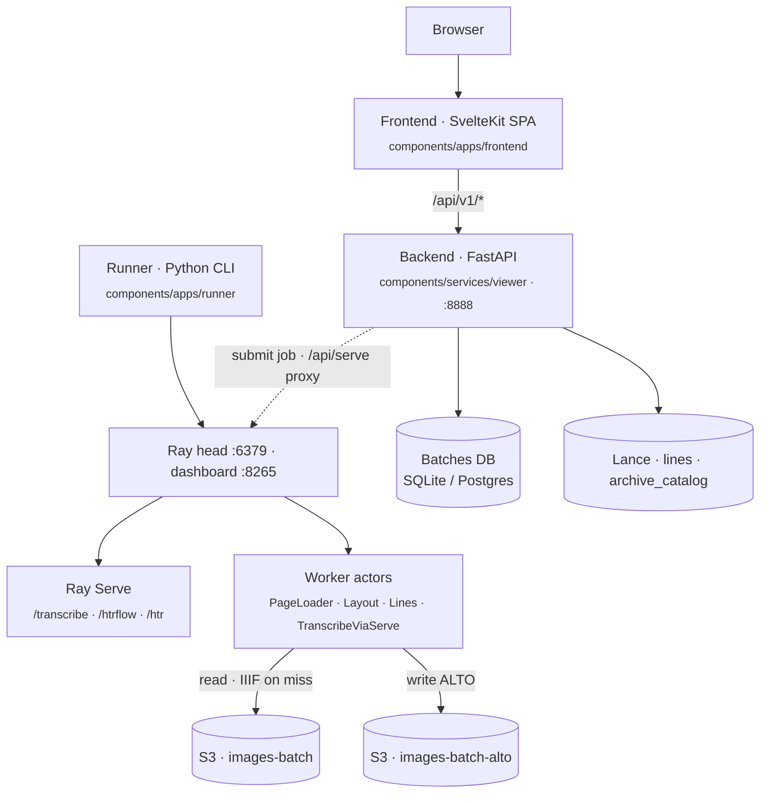

# Architecture Overview

rask is a distributed image-to-ALTO-XML pipeline with a viewer/search front end.
This section describes the system as it runs today.

## One-paragraph summary

A Python CLI **runner** submits one **Ray Data** job per invocation and blocks on
materialization; it fans HTR work across a Ray cluster with model weights kept
resident in **Ray Serve** (TrOCR on `/transcribe`, the full HTRflow pipeline on
`/htrflow`, and an HTTP variant on `/htr`). Images come from **IIIF** or
pre-staged **S3** buckets; ALTO XML output lands back in S3. A **FastAPI viewer**
exposes versioned endpoints under `/api/v1/*` (port 8888) that a **SvelteKit**
SPA consumes for inspection, the batch dashboard, search, and chunk submission.
Batch-tracking state lives in a relational DB behind a backend-agnostic ORM —
SQLite for dev, Postgres for prod. Full-text search over transcribed lines plus
an archival catalog index live in **Lance** tables on S3.

## Component map

## Key facts

- **The runner is the engine.** Each CLI invocation builds one `ray.data.Dataset`
  pipeline, triggers execution, prints `Done — ok=N, skipped=M`, and exits. It is
  not a long-lived service; the viewer's orchestrator submits it as a Ray Job,
  one job per chunk.
- **Ray Serve persists across jobs.** TrOCR weights stay warm in `/transcribe`.
  The pipeline's transcribe step is a CPU-only actor that calls Serve over a
  handle — and shards each task three ways so all GPU replicas run concurrently.
- **Two pipeline shapes** — *actor-per-stage* (`htr`) and *single Serve
  deployment* (`htrflow` / `htr_http`).
- **The viewer has no auth.** Only optional CORS plus request-id/timing headers;
  it assumes a trusted/localhost network. The SPA hits `/api/v1/*`; the Ray
  dashboard proxy is mounted at the root under `/api/serve/*`.
- **The orchestrator runs inside the viewer** as a lifespan-managed `asyncio`
  task — reconcile S3, then submit the next eligible prefetch and HTR chunks.
- **State** is a relational DB (SQLModel + SQLAlchemy async) plus two S3 buckets
  and optional Lance tables. No Redis, no queue, no event bus, no Helm — the
  `Makefile` is the only runbook.

## In this section

- **[Monorepo Layout](layout.md)** — the three brick layers and what lives where.
- **[Data Flow](data-flow.md)** — image → ALTO XML, the batch lifecycle, and the SPA ↔ API ↔ storage map.
- **[Deployment](deployment.md)** — clusters, container images, CI, and how it ships.

## Deep-dive notes (in-repo)

Longer design documents under `docs/architecture/` go beyond this summary:
[`system-overview.md`](system-overview.md),
[`viewer-backend.md`](viewer-backend.md),
[`viewer-design.md`](viewer-design.md),
[`frontend-monorepo.md`](frontend-monorepo.md).
