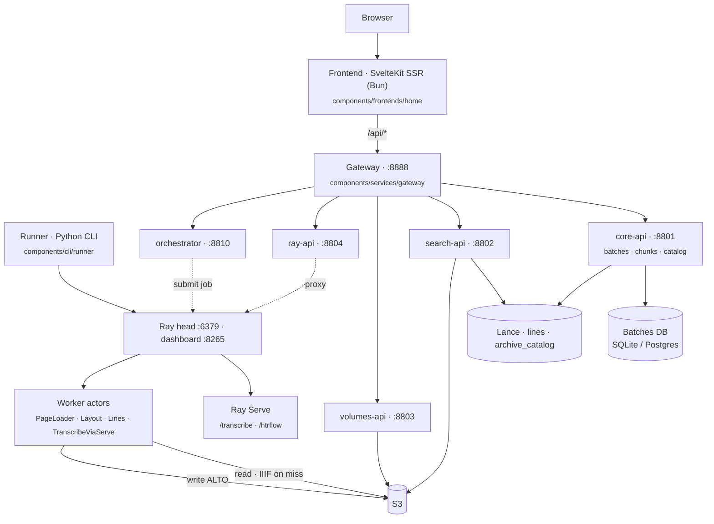

# Architecture Overview

rask is a distributed image-to-ALTO-XML pipeline with a viewer/search front end.
This section describes the system as it runs today.

## One-paragraph summary

A Python CLI **runner** submits one **Ray Data** job per invocation and blocks on
materialization; it fans HTR work across a Ray cluster with model weights kept
resident in **Ray Serve** (TrOCR on `/transcribe` and the full HTRflow pipeline
on `/htrflow`). Images come from **IIIF** or
pre-staged **S3** buckets; ALTO XML output lands back in S3. The HTTP backend is
a fleet of FastAPI services behind a **gateway** on port 8888: a **core-api**
for batch/chunk/catalog state, an **orchestrator** service running the submission
loop, plus stateless **volumes-api**, **search-api**, and **ray-api** services.
A set of **SvelteKit 2 + Svelte 5 SSR** apps (svelte-adapter-bun, served behind the
gateway) composed as routing-based microfrontend zones — a catch-all `frontend`
owning `/` plus per-domain apps (overview/compute/discover/storage/train/studio) —
consumes all of these via the
gateway for inspection, the batch dashboard, search, and chunk submission. Batch-tracking state lives in a
relational DB behind a backend-agnostic ORM — SQLite for dev, Postgres for prod.
Full-text search over transcribed lines plus an archival catalog index live in
**Lance** tables on S3.

## Component map

## Key facts

- **The runner is the engine.** Each CLI invocation builds one `ray.data.Dataset`
  pipeline, triggers execution, prints `Done — ok=N, skipped=M`, and exits. It is
  not a long-lived service; the orchestrator service submits it as a Ray Job,
  one job per chunk.
- **Ray Serve persists across jobs.** TrOCR weights stay warm in `/transcribe`.
  The pipeline's transcribe step is a CPU-only actor that calls Serve over a
  handle — and shards each task three ways so all GPU replicas run concurrently.
- **Two pipeline shapes** — *actor-per-stage* (`htr`) and *single Serve
  deployment* (`htrflow`).
- **No auth anywhere.** Only optional CORS plus request-id/timing headers; the
  fleet assumes a trusted/localhost network. The frontend hits `/api/*` on the
  gateway (SSR `load` uses the absolute gateway URL server-side);
  `/api/serve/*` is proxied by ray-api.
- **The orchestrator runs as its own service** (`components/services/orchestrator`,
  `:8810`) — a lifespan-managed `asyncio` task that reconciles S3, then submits
  the next eligible prefetch and HTR chunks. `core-api` and `orchestrator` share
  the same `core` package and the same `batches` table transactionally.
- **State** is a relational DB (SQLModel + SQLAlchemy async) plus two S3 buckets
  and optional Lance tables. No Redis, no queue, no event bus; a Helm chart in
  `chart/` deploys app services to Kubernetes, while the `Makefile` is the
  local/dev runbook.

## In this section

- **[Monorepo Layout](layout.md)** — the two workspace layers and what lives where.
- **[Data Flow](data-flow.md)** — image → ALTO XML, the batch lifecycle, and the frontend ↔ API ↔ storage map.
- **[Deployment](deployment.md)** — clusters, container images, CI, and how it ships.
- **[Microservices](microservices.md)** — the service decomposition (implemented June 2026): gateway, core-api, orchestrator, volumes-api, search-api, ray-api.

## Deep-dive notes (in-repo)

Longer design documents under `docs/architecture/` go beyond this summary:
[`system-overview.md`](system-overview.md),
[`viewer-backend.md`](viewer-backend.md) *(superseded — history/rationale for the dissolved viewer)*,
[`viewer-design.md`](viewer-design.md) *(superseded — history/rationale for the dissolved viewer)*,
[`frontend-microfrontends.md`](frontend-microfrontends.md),
[`frontend-monorepo.md`](frontend-monorepo.md).
