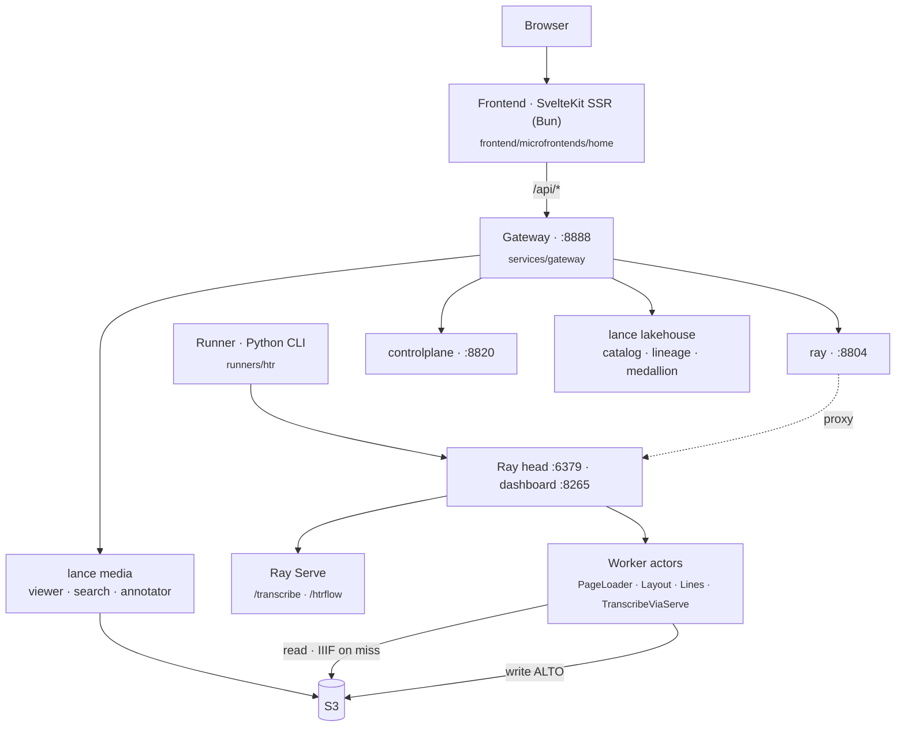

# Architecture Overview

rask is a distributed image-to-ALTO-XML pipeline with a viewer/search front end.
This section describes the system as it runs today.

## One-paragraph summary

A Python CLI **runner** submits one **Ray Data** job per invocation and blocks on
materialization; it fans HTR work across a Ray cluster with model weights kept
resident in **Ray Serve** (TrOCR on `/transcribe` and the full HTRflow pipeline
on `/htrflow`). Images come from **IIIF** or
pre-staged **S3** buckets; ALTO XML output lands back in S3. The HTTP backend is
a fleet of FastAPI services behind a **gateway** on port 8888: the **ray**
service (dashboard introspection + Serve proxy), the **controlplane**, and the
lance lakehouse/media planes (`/api/catalog`, `/api/lineage`, `/api/explorer/*`).
A set of **SvelteKit 2 + Svelte 5 SSR** apps (svelte-adapter-bun, served behind the
gateway) composed as routing-based microfrontend zones — a catch-all `home`
owning `/` plus per-domain apps (lakehouse/media/annotator/compute/studio/train) —
consumes all of these via the gateway. State lives in the governed Lance
lakehouse on S3; the batches DB died at P7a and the lines/EAD Lance tables
re-land catalog-governed behind `/api/explorer/search` (R6).

## Component map

## Key facts

- **The runner is the engine.** Each CLI invocation builds one `ray.data.Dataset`
  pipeline, triggers execution, prints `Done — ok=N, skipped=M`, and exits. It is
  not a long-lived service; the orchestrator service submits it as a Ray Job,
  one job per chunk.
- **Ray Serve persists across jobs.** TrOCR weights stay warm in `/transcribe`.
  The pipeline's transcribe step is a CPU-only actor that calls Serve over a
  handle — and shards each task three ways so all GPU replicas run concurrently.
- **Two pipeline shapes** — *actor-per-stage* (`htr`) and *single Serve
  deployment* (`htrflow`).
- **No auth anywhere.** Only optional CORS plus request-id/timing headers; the
  fleet assumes a trusted/localhost network. The frontend hits `/api/*` on the
  gateway (SSR `load` uses the absolute gateway URL server-side);
  `/api/serve/*` is proxied by the compute service.
- **State** lives in the governed Lance lakehouse on S3 (the batches DB and the
  orchestrator died at P7a; core-api/search-api/volumes-api died in the R6/R20
  wave). A Helm chart in `chart/` deploys everything to Kubernetes, while the
  `Makefile` is the local/dev runbook.

## In this section

- **[Monorepo Layout](layout.md)** — the two language-pure workspace planes and what lives where.
- **[Data Flow](data-flow.md)** — image → ALTO XML, the batch lifecycle, and the frontend ↔ API ↔ storage map.
- **[Deployment](deployment.md)** — clusters, container images, CI, and how it ships.
- **[Microservices](microservices.md)** — the service decomposition history (June 2026) and its R6/R20 retirement down to gateway + ray + controlplane.

## Deep-dive notes (in-repo)

Longer design documents under `docs/architecture/` go beyond this summary:
[`system-overview.md`](system-overview.md),
[`viewer-backend.md`](viewer-backend.md) *(superseded — history/rationale for the dissolved viewer)*,
[`viewer-design.md`](viewer-design.md) *(superseded — history/rationale for the dissolved viewer)*,
[`frontend-microfrontends.md`](frontend-microfrontends.md),
[`frontend-monorepo.md`](frontend-monorepo.md).
