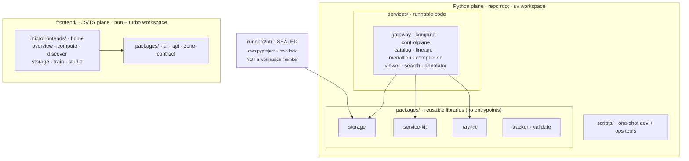

# Monorepo Layout

rask is a monorepo with two **language-pure planes** — Python at the repo root,
JS/TS under `frontend/`. Each plane is its own workspace root (uv for Python, Bun
+ Turborepo for JS/TS), and inside each plane the library/runnable boundary is
deliberate — don't blur it. (Two earlier layers are gone: a Polylith-inspired
`projects/` layer of per-deployable composition pyprojects, removed July 2026 —
deployables now build straight from the root uv workspace, one
`.docker/<name>.dockerfile` per deployable running `uv sync --frozen --package
<name>` against the root `uv.lock` — and the mixed `components/` tree, dissolved
into `services/`, `frontend/`, and `scripts/`.)

## `packages/` — reusable libraries, no entrypoints

There are **two** `packages/` directories, one per plane: the root one is
Python-only, `frontend/packages/` is TS-only. Each is unambiguous from inside its
plane, and language purity is what lets both workspaces glob their members.

| Package | Language | Purpose |
|---|---|---|
| [`packages/storage`](../packages/storage.md) | Python | `FSSource/Sink`, `S3Source/Sink`, `IIIFCachedSource`, `s3_client`, `iter_keys`, HCP credential derivation. |
| `packages/service-kit` | Python | Platform library: `make_service_app` app factory, `Settings`/config, exceptions, middleware, `get_settings`, injectable lifespan. Dependency-light (no lancedb/ray/sqlmodel). |
| `packages/ray-kit` | Python | Ray Job SDK + dashboard wrapper (schemas, `build_client`, `RAY_TRANSIENT_ERRORS`, dashboard service). Used by the `compute` service. |
| `packages/tracker` | Python | Run/metric tracking helpers (`tracker`; optional `tracker[postgres]` extra). |
| `packages/validate` | Python | Validation helpers (`validate`). |
| `frontend/packages/ui` | TS / Svelte | Svelte 5 + Bits UI + Tailwind 4 component library with Storybook (package `@rask/ui`); `@rask/ui/shell` exports the shared `AppShell`/`AppSidebar`/`nav-config` every app imports. |
| `frontend/packages/api` | TS | Shared API client (package `@rask/api`, valibot fetch client), split into `ray`/`ingest`/`projects` modules (+ the BFF/OIDC subpaths). |
| `frontend/packages/zone-contract` | TS | `@rask/zone-contract` — the cross-zone link guard (a cross-zone `<a>` must carry `data-sveltekit-reload`), enforced as a **vitest test** over every zone's `.svelte` files rather than a lint rule. |

!!! note "`packages/control` was absorbed into `core`"
    An earlier `packages/control` (S3 sync + chunk submission) no longer exists
    as a standalone package — its logic lives in the `core` package's service layer
    (`core/services/sync.py`, `core/services/submission.py`).

## `services/` · `frontend/microfrontends/` · `scripts/` — runnable code

| Path | Type | Purpose |
|---|---|---|
| `frontend/microfrontends/home` | SvelteKit 2 + Svelte 5 (SSR) | Catch-all app (package `home`, `:5273`) on `svelte-adapter-bun` — owns `/` (the platform home) behind the gateway ([UI Components](../components/ui.md), [Frontend microfrontends](frontend-microfrontends.md)). |
| `frontend/microfrontends/{overview,compute,discover,storage,train,studio}` | SvelteKit 2 + Svelte 5 (SSR) | The six domain microfrontend zones (`svelte-adapter-bun`), each pinned to base `/default/<domain>` on its own dev port (`:5174`–`:5179`) and rendering the shared `@rask/ui/shell` sidebar. Composed by the Turborepo microfrontends proxy in dev / the k3s Ingress in prod. |
| `services/gateway` | FastAPI | Reverse proxy on `:8888` — path-routes `/api/*` to per-domain services (longest-prefix-first, no catch-all). |
| `services/compute` | FastAPI | The `compute` service: Ray dashboard introspection + `/api/serve/*` proxy on `:8804`; no DB. Deps: `service-kit` + `ray-kit` + httpx. (`compute` on every surface — R22; public paths stay `/api/ray` + `/api/serve`.) |
| `services/controlplane` | FastAPI | Project provisioning on `:8820` (`/api/projects`). |
| `services/{catalog,lineage,medallion,compaction}` | FastAPI | The lance lakehouse plane (governed REST catalog, OpenLineage → AGE, the medallion movers, compaction). |
| `services/{viewer,search,annotator}` | FastAPI | The lance media plane (`:8101`–`:8103`, public `/api/media/*`). The viewer also serves the S3 object browser ported from the retired volumes-api. |
| `scripts/` | Python + shell | Every dev/ops one-shot tool in one place: `harvest_ead`, `deploy_serve`, `dev-micro.sh`, `k3s-install.sh`, the e2e stack drivers, … No production-state-changing CLIs — mutations run through the HTTP services. |

## `runners/` — sealed model environments, deliberately NOT workspace members

`runners/htr` is the HTR engine: the Ray Data pipeline (`src/runner`) **and** the model
actors (`src/htr`), together in one project with **its own `pyproject.toml` and its own
`uv.lock`**. It is matched by no glob in `[tool.uv.workspace] members`, so its dependency
stack — torch, htrflow, ultralytics, transformers, opencv — never enters the fleet's
resolution. That is the whole point: sealing it took the root lock from 200 packages to
145, and the fleet's test suite from ~32 minutes to ~6 seconds.

Consequences that follow from the seal, all deliberate:

- `storage` is a **path** dependency (`{ path = "../../packages/storage" }`), not a
  workspace one.
- Its tests are invisible to the root `pytest` — `make test` runs them separately
  (`uv run --project runners/htr pytest`). Drop that line and 28 tests silently vanish.
- It carries its own copy of the ruff config; ruff resolves the *nearest* pyproject, so
  without it the runner would be linted against ruff's weaker defaults and nothing would
  say so.
- Its images (`.docker/{runner,ray}.dockerfile`) build from **its** lock, not the root one.
- The Ray job entrypoint is `uv run --project runners/htr runner` (`runner_cmd`); the
  in-cluster ray image overrides it with `RASK_RUNNER_CMD=runner`, since that image ships
  the console script on PATH with no uv and no source tree.

## Deployables — workspace members with a dockerfile

There is **no `projects/` layer**. The fleet deployables are `runner` plus
`gateway`, `compute`, and `controlplane`; each is an ordinary
workspace member built by its `.docker/<name>.dockerfile` via
`uv sync --frozen --package <name>` against the **root** `uv.lock` (one lock for
dev, tests, and every image). The lakehouse + media services build from the one
`lance-rest-catalog` image; the Ray cluster image is `.docker/ray-cluster.dockerfile`.

## Workspace membership is globbed

Both planes glob their members — `[tool.uv.workspace] members = ["packages/*",
"services/*"]` in the root `pyproject.toml`, `workspaces = ["microfrontends/*",
"packages/*"]` in `frontend/package.json`. Globs are safe here **only because the
directories are language-pure**: uv errors on a member without a `pyproject.toml`,
and bun silently skips a directory without a `package.json`, so a mixed directory
would force either an enumerated member list or an exclude list. Adding a member
is therefore just creating the directory with its manifest — no root file to edit.

## Toolchain

- **Python** via [uv](https://docs.astral.sh/uv/) (3.13), linted/formatted with
  **Ruff** (line length 160) and type-checked with **ty** (`uvx ty check`).
- **JS/TS** via **Bun** exclusively — `npm`/`npx`/`pnpm` are not on PATH.
  **oxlint** + **oxfmt** (tabs, single quotes, `printWidth: 100`) with
  `@rsvelte/fmt` for `.svelte`, plus `svelte-check`. Each is a **per-package
  turbo task** (`lint`, `fmt`, `fmt:check`, `check`) run from `frontend/`:
  `bun --cwd=frontend run lint`.
- Identifiers and env vars carry **no `ra-` prefix** — env vars are `RASK_*`.
