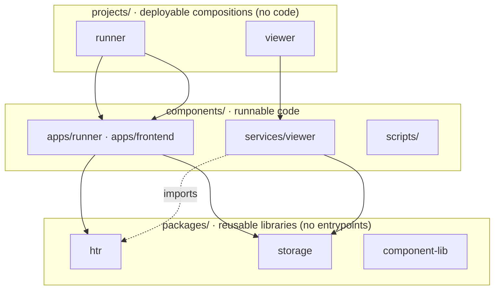

# Monorepo Layout

rask is a Polylith-inspired monorepo with three **brick layers**. The boundary
between them is deliberate — don't blur it.

## `packages/` — reusable libraries, no entrypoints

| Package | Language | Purpose |
|---|---|---|
| [`packages/htr`](../packages/htr.md) | Python | Ray actors (PageLoader, Layout, Lines, Transcribe, AltoExport) + schemas + ALTO 4.4 serializer + geometry. |
| [`packages/storage`](../packages/storage.md) | Python | `FSSource/Sink`, `S3Source/Sink`, `IIIFCachedSource`, `s3_client`, `iter_keys`, HCP credential derivation. |
| `packages/component-lib` | TS / Svelte | Svelte 5 + Bits UI + Tailwind 4 component library with Storybook (package `@your-repo/oxen`). |

!!! note "`packages/control` was absorbed"
    An earlier `packages/control` (S3 sync + chunk submission) no longer exists —
    its logic now lives in the viewer's service layer (`services/sync.py`,
    `services/submission.py`). Only stale `__pycache__` artifacts remain on disk.

## `components/` — runnable code

| Path | Type | Purpose |
|---|---|---|
| [`components/apps/runner`](../projects/runner.md) | Python CLI | Typer CLI that submits Ray Data jobs; ships the Ray Serve deployments. |
| `components/apps/frontend` | SvelteKit SPA | Browser UI ([UI Components](../components/ui.md)). |
| [`components/services/viewer`](../projects/viewer.md) | FastAPI | The only HTTP backend (`:8888`); owns `alembic/`, the `Batch` model, and the orchestrator loop. |
| `components/scripts/` | Python | One-shot tools: `build_batches_db`, `harvest_ead`, `index_alto`, `index_catalog`, `deploy_serve`, `submit_index`, `htr_chunk_job`, … No production-state-changing CLIs — sync/submit/orchestrate run through the viewer. |

## `projects/` — deployable compositions, no code

A `projects/<name>/pyproject.toml` lists the workspace members for one
deployable. Two exist:

- **`projects/runner`** — composes `runner`, `htr`, `storage` (+ `htrflow` from git).
- **`projects/viewer`** — composes `viewer`, `storage`.

!!! warning "There is no `projects/hcp`"
    "HCP" is the **Hitachi Content Platform** S3 backend, configured via `HCP_*`
    environment variables and implemented in `packages/storage` — not a
    deployable project. See [Projects → HCP](../projects/hcp.md).

## Workspace membership is explicit

Membership is never globbed. Adding a brick requires editing **both** the root
`pyproject.toml` (`[tool.uv.workspace] members`) and the root `package.json`
(`workspaces`), plus the relevant `projects/<name>/pyproject.toml` if it's
deployable.

## Toolchain

- **Python** via [uv](https://docs.astral.sh/uv/) (3.13), linted/formatted with
  **Ruff** (line length 160) and type-checked with **ty** (`uvx ty check`).
- **JS/TS** via **Bun** exclusively — `npm`/`npx`/`pnpm` are not on PATH.
  Prettier (tabs, single quotes), ESLint, `svelte-check`.
- Identifiers and env vars carry **no `ra-` prefix** — env vars are `RASK_*`.
