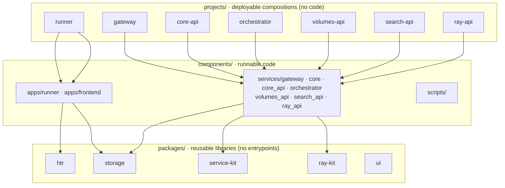

# Monorepo Layout

rask is a Polylith-inspired monorepo with three **brick layers**. The boundary
between them is deliberate — don't blur it.

## `packages/` — reusable libraries, no entrypoints

| Package | Language | Purpose |
|---|---|---|
| [`packages/htr`](../packages/htr.md) | Python | Ray actors (PageLoader, Layout, Lines, Transcribe, AltoExport) + schemas + ALTO 4.4 serializer + geometry. |
| [`packages/storage`](../packages/storage.md) | Python | `FSSource/Sink`, `S3Source/Sink`, `IIIFCachedSource`, `s3_client`, `iter_keys`, HCP credential derivation. |
| `packages/service-kit` | Python | Platform library: `make_service_app` app factory, `Settings`/config, exceptions, middleware, `get_settings`, injectable lifespan. Dependency-light (no lancedb/ray/sqlmodel). |
| `packages/ray-kit` | Python | Ray Job SDK + dashboard wrapper (schemas, `build_client`, `RAY_TRANSIENT_ERRORS`, dashboard service). Shared by ray-api and core orchestrator. |
| `packages/ui` | TS / Svelte | Svelte 5 + Bits UI + Tailwind 4 component library with Storybook (package `@rask/ui`). |

!!! note "`packages/control` was absorbed into `core`"
    An earlier `packages/control` (S3 sync + chunk submission) no longer exists
    as a standalone package — its logic lives in the `core` brick's service layer
    (`core/services/sync.py`, `core/services/submission.py`).

## `components/` — runnable code

| Path | Type | Purpose |
|---|---|---|
| [`components/apps/runner`](../projects/runner.md) | Python CLI | Typer CLI that submits Ray Data jobs; ships the Ray Serve deployments. |
| `components/apps/frontend` | SvelteKit SPA | Browser UI ([UI Components](../components/ui.md)). |
| `components/services/gateway` | FastAPI | Reverse proxy on `:8888` — path-routes `/api/*` to per-domain services (longest-prefix-first). |
| `components/services/core` | Python (brick) | The dissolved `viewer` domain code: DB engine, models, repositories, domain services (`batches`, `submission`, `sync`, orchestrator loop, catalog discovery), Alembic, and `main.py` (monolith factory for tests / `make viewer`). **Not a standalone deployable** — composed by the two entrypoints below. |
| `components/services/core_api` | FastAPI | Thin entrypoint `:8801`: health + batches + chunks + catalog over `core`; orchestrator loop **off**. |
| `components/services/orchestrator` | FastAPI | Thin entrypoint `:8810`: health + orchestrator endpoints over `core`; the lifespan orchestrator loop **on** (`RASK_ORCHESTRATOR_AUTOSTART`). |
| `components/services/volumes_api` | FastAPI | S3/IIIF image + ALTO proxy on `:8803`; stateless, no DB. Deps: `service-kit` + `storage`. |
| `components/services/search_api` | FastAPI | Lance `lines` FTS + S3 thumbnails on `:8802`; no DB. Deps: `service-kit` + `storage` + lancedb. |
| `components/services/ray_api` | FastAPI | Ray dashboard introspection + `/api/serve/*` proxy on `:8804`; no DB. Deps: `service-kit` + `ray-kit` + httpx. |
| `components/scripts/` | Python | One-shot tools: `build_batches_db`, `harvest_ead`, `index_alto`, `index_catalog`, `deploy_serve`, … No production-state-changing CLIs — sync/submit/orchestrate run through the HTTP services. |

## `projects/` — deployable compositions, no code

A `projects/<name>/pyproject.toml` lists the workspace members for one
deployable. Six deployables exist (plus `runner` and `hcp`):

- **`projects/runner`** — composes `runner`, `htr`, `storage` (+ `htrflow` from git).
- **`projects/gateway`**, **`projects/core-api`**, **`projects/orchestrator`**, **`projects/volumes-api`**, **`projects/search-api`**, **`projects/ray-api`** — each composes its thin entrypoint + `core` (if needed) + shared packages.

There is **no `projects/viewer`** — it was deleted when the monolithic viewer was dissolved (June 2026).

!!! warning "There is no `projects/hcp`"
    "HCP" is the **Hitachi Content Platform** S3 backend, configured via `HCP_*`
    environment variables and implemented in `packages/storage` — not a
    deployable project. See [Projects → HCP](../projects/hcp.md).

## Workspace membership is explicit

Membership is never globbed. Adding a brick requires editing **both** the root
`pyproject.toml` (`[tool.uv.workspace] members`) and the root `package.json`
(`workspaces`), plus the relevant `projects/<name>/pyproject.toml` if it's
deployable.

## Toolchain

- **Python** via [uv](https://docs.astral.sh/uv/) (3.13), linted/formatted with
  **Ruff** (line length 160) and type-checked with **ty** (`uvx ty check`).
- **JS/TS** via **Bun** exclusively — `npm`/`npx`/`pnpm` are not on PATH.
  Prettier (tabs, single quotes), ESLint, `svelte-check`.
- Identifiers and env vars carry **no `ra-` prefix** — env vars are `RASK_*`.
