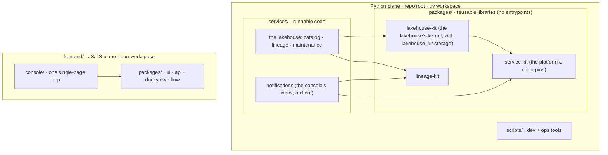

# Monorepo Layout

rask is a monorepo with two **language-pure planes** — Python at the repo root, JS/TS under `frontend/`. Each plane is
its own workspace root (uv for Python, Bun for JS/TS), and inside each plane the library/runnable boundary is
deliberate — don't blur it. Deployables build straight from the root uv workspace, one `.docker/<name>.dockerfile` per
deployable running `uv sync --frozen --package <name>` against the root `uv.lock`.

The repository holds the lakehouse and its console. Every other client left it and is recovered from git history at
`64ef118a9`, the last commit that holds every client, when it moves to its own repository.

```mermaid
flowchart TD
    subgraph py["Python plane · repo root · uv workspace"]
        subgraph services["services/ · runnable code"]
            lake["the lakehouse: catalog · lineage · maintenance"]
            inbox["notifications (the console's inbox, a client)"]
        end
        subgraph packages["packages/ · reusable libraries (no entrypoints)"]
            psk["service-kit (the platform a client pins)"]
            phk["lakehouse-kit (the lakehouse's kernel, with lakehouse_kit.storage)"]
            plk["lineage-kit"]
        end
        cx["scripts/ · dev + ops tools"]
    end
    subgraph js["frontend/ · JS/TS plane · bun workspace"]
        app["console/ · one single-page app"]
        fpk["packages/ · ui · api · dockview · flow"]
    end
    lake --> phk
    lake --> plk
    phk --> psk
    inbox --> psk
    inbox --> plk
    app --> fpk
```

## `packages/` — reusable libraries, no entrypoints

There are **two** `packages/` directories, one per plane: the root one is Python-only, `frontend/packages/` is TS-only.
Each is unambiguous from inside its plane, and language purity is what lets both workspaces glob their members.

| Package | Language | Purpose |
|---|---|---|
| `packages/service-kit` | Python | The platform package a client pins by lakehouse tag: `make_service_app` app factory, `Settings`/config, exceptions, middleware, `get_settings`, injectable lifespan, health and probes, telemetry, the auth plane (`service_kit.governed`), the naming a client needs, the input and credential guards (`service_kit.arrow_ipc`, `service_kit.storage_options`), the contract the lakehouse's events publish (`service_kit.control_events`, `service_kit.lineage_events`, `service_kit.governed.subjects`, `service_kit.signature_doors`), and its pytest plugin. Dependency-light (no lancedb/ray/sqlmodel), and imports nothing from the lakehouse's kernel. |
| `packages/lakehouse-kit` | Python | The lakehouse's kernel: the lance app factory, the catalog's records, registries and governance guards, the namespace clients, the OpenLineage, control-event and outbox seams, the store session, and [`lakehouse_kit.storage`](../packages/storage.md), the S3 client, STS and URI seam. Imported by catalog, lineage and maintenance; no client imports it. |
| `packages/lineage-kit` | Python | The OpenLineage emission kernel and the Ed25519 signing and verifying seam for lineage events, used by catalog, lineage, maintenance and notifications. |
| `frontend/packages/ui` | TS / Svelte | `@rask/ui`: Svelte 5 + Bits UI + Tailwind 4 component library with Storybook; `@rask/ui/shell` exports the console's `AppShell`. |
| `frontend/packages/api` | TS | `@rask/api`: the typed client generated from `docs/catalog-openapi.json` and `docs/lineage-openapi.json`, the inbox client and the lineage client, calling same-origin `/api/*` with the signed-in person's bearer. |
| `frontend/packages/dockview` | TS / Svelte | `@rask/dockview`: the console's workbench docks. |
| `frontend/packages/flow` | TS / Svelte | `@rask/flow`: the graph canvas the governance views use (the project hierarchy, the access graph). |

## `services/` · `frontend/console` · `scripts/` — runnable code

| Path | Type | Purpose |
|---|---|---|
| `services/{catalog,lineage,maintenance}` | FastAPI | The lakehouse: the governed Lance Namespace catalog with tier governance, OpenLineage intake, the durable `GET /events` feed and edge list (Lance tables the catalog governs) and the forwarder to a graph backend, and maintenance (expiry, purge, orphan scan, reconcile). |
| `services/notifications` | FastAPI | The targeted inbox behind the console's bell (`:8850`), a client of the lakehouse's events that reads them through service-kit's contract and imports nothing from `lakehouse_kit` (ADR 0190); released with the console (`deploy/fixtures/console`). |
| `frontend/console` | SvelteKit 2 + Svelte 5 (single-page app) | The console: static files with no backend of its own, served by its own small Bun server (`serve.ts`) with the runtime `config.json`. The browser signs in to Dex with PKCE on the public `rask-web` client, keeps its tokens in memory under a strict Content Security Policy, and calls the catalog, lineage and inbox APIs with its bearer. |
| `scripts/` | Python + shell | Every dev/ops tool in one place: `dev-micro.sh`, `k3s-install.sh`, the e2e stack drivers, the estate seed, … No production-state-changing CLIs — data enters and moves only through the catalog's namespace doors. |

## Deployables — workspace members with a dockerfile

There is **no `projects/` layer**. `notifications` builds its own `.docker/notifications.dockerfile` via
`uv sync --frozen --package notifications` against the **root** `uv.lock`; one image, `.docker/rest-catalog.dockerfile`,
serves the lakehouse's `catalog`, `lineage` and `maintenance`. The console builds from `.docker/frontend.dockerfile`
(`make console-image`).

## Workspace membership is globbed

Both planes glob their members — `[tool.uv.workspace] members = ["packages/*", "services/*"]` in the root
`pyproject.toml`, `workspaces = ["console", "packages/*"]` in `frontend/package.json`. Globs are safe here **only
because the directories are language-pure**: uv errors on a member without a `pyproject.toml`, and bun silently skips a
directory without a `package.json`, so a mixed directory would force either an enumerated member list or an exclude
list. Adding a member is therefore just creating the directory with its manifest — no root file to edit.

## Toolchain

- **Python** via [uv](https://docs.astral.sh/uv/) (3.13), linted/formatted with **Ruff** (line length 160) and
  type-checked with **ty** (`uv run ty check`).
- **JS/TS** via **Bun** exclusively — `npm`/`npx`/`pnpm` are not on PATH. **oxlint** + **oxfmt** (tabs, single quotes,
  `printWidth: 100`) with `@rsvelte/fmt` for `.svelte`, plus `svelte-check`, each a plain bun script run from
  `frontend/`: `bun --cwd=frontend run lint`.
- **Images** are built by Dagger (`scripts/dagger-image.sh`), never by docker.
- Identifiers and env vars carry **no `ra-` prefix** — env vars are `RASK_*`.
