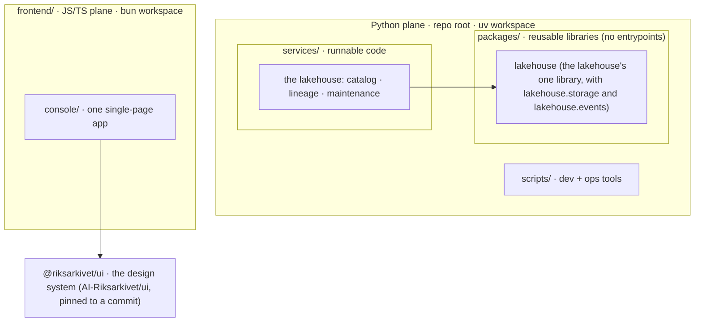

# Monorepo Layout

rask is a monorepo with two **language-pure planes** — Python at the repo root, JS/TS under `frontend/`. Each plane is
its own workspace root (uv for Python, Bun for JS/TS), and inside each plane the library/runnable boundary is
deliberate — don't blur it. Deployables build straight from the root uv workspace, one `.docker/<name>.dockerfile` per
deployable running `uv sync --frozen --package <name>` against the root `uv.lock`.

The repository holds the lakehouse and its console, the lakehouse's own UI. Every client left it and is recovered from
git history at `64ef118a9`, the last commit that holds every client, when it moves to its own repository; the
notifications inbox is retired ([ADR 0193](../adr/0193-the-inbox-is-retired-and-the-console-joins-the-product.md)).

```mermaid
flowchart TD
    subgraph py["Python plane · repo root · uv workspace"]
        subgraph services["services/ · runnable code"]
            lake["the lakehouse: catalog · lineage · maintenance"]
        end
        subgraph packages["packages/ · reusable libraries (no entrypoints)"]
            plh["lakehouse (the lakehouse's one library, with lakehouse.storage and lakehouse.events)"]
        end
        cx["scripts/ · dev + ops tools"]
    end
    subgraph js["frontend/ · JS/TS plane · bun workspace"]
        app["console/ · one single-page app"]
    end
    fpk["@riksarkivet/ui · the design system (AI-Riksarkivet/ui, pinned to a commit)"]
    lake --> plh
    app --> fpk
```

## `packages/` — reusable libraries, no entrypoints

`packages/` is the Python plane's. The JS/TS plane has one member, `frontend/console`, and takes its design system,
`@riksarkivet/ui`, from the `AI-Riksarkivet/ui` repository at a pinned commit ([ADR 0223](../adr/0223-the-console-takes-its-design-system-from-the-ui-repository.md)).

| Package | Language | Purpose |
|---|---|---|
| `packages/lakehouse` | Python | The lakehouse's one library ([ADR 0195](../adr/0195-the-three-kits-fold-into-one-lakehouse-library.md)), imported by catalog, lineage and maintenance and by no client: the lance app factory and what it installs (exceptions, the request's trace (ADR 0209), logging, the probes and the drain, the body cap), the auth plane (`lakehouse.governed`), the naming and the input and credential guards (`lakehouse.arrow_ipc`, `lakehouse.storage_options`), the catalog's records, registries and governance guards, the Lance primitives more than one service reads Lance through (`lakehouse.lancekit`), the events (`lakehouse.events`: the bus, the control and lineage lanes, `signature_doors`, the outbox, the OpenLineage models and the Ed25519 signing seam) and the address rule `lakehouse.governed.subjects`, the store session, and [`lakehouse.storage`](../packages/storage.md), the S3 client, STS and URI seam. |

## `services/` · `frontend/console` · `scripts/` — runnable code

| Path | Type | Purpose |
|---|---|---|
| `services/{catalog,lineage,maintenance}` | FastAPI | The lakehouse: the governed Lance Namespace catalog with write governance, OpenLineage intake, the durable `GET /events` feed and edge list (Lance tables the catalog governs) and the forwarder to a graph backend, and maintenance (expiry, purge, orphan scan, reconcile). |
| `frontend/console` | SvelteKit 3 + Svelte 5 (single-page app) | The console, the lakehouse's own UI, shipped by the product chart (`chart/templates/console.yaml`): static files with no backend of its own, served by its own small Bun server (`serve.ts`) with the runtime `config.json` the chart renders. The browser signs in to Dex with PKCE on the lakehouse's public `rask-console` client, keeps its tokens in memory under a strict Content Security Policy, and calls the catalog and lineage APIs with its bearer. |
| `scripts/` | Python + shell | Every dev/ops tool in one place: `k3s-install.sh`, the e2e stack drivers, the estate seed, … No production-state-changing CLIs — data enters and moves only through the catalog's namespace doors. |

## Deployables — workspace members with a dockerfile

There is **no `projects/` layer**. One image, `.docker/rest-catalog.dockerfile`, runs `uv sync --frozen` against the
**root** `uv.lock` and serves the lakehouse's `catalog`, `lineage` and `maintenance`. The console builds from `.docker/frontend.dockerfile`
(`make console-image`).

## Workspace membership

The Python plane globs its members — `[tool.uv.workspace] members = ["packages/*", "services/*"]` in the root
`pyproject.toml`. The glob is safe **only because the directories are language-pure**: uv errors on a member without a
`pyproject.toml`, so a mixed directory would force either an enumerated member list or an exclude list. Adding a
Python member is therefore just creating the directory with its manifest — no root file to edit. The JS/TS plane names
its one member, `workspaces = ["console"]` in `frontend/package.json`.

## Toolchain

- **Python** via [uv](https://docs.astral.sh/uv/) (3.13), linted/formatted with **Ruff** (line length 160) and
  type-checked with **ty** (`uv run ty check`).
- **JS/TS** via **Bun** exclusively — `npm`/`npx`/`pnpm` are not on PATH. **oxlint** + **oxfmt** (tabs, single quotes,
  `printWidth: 100`) with `@rsvelte/fmt` for `.svelte`, plus `svelte-check`, each a plain bun script run from
  `frontend/`: `bun --cwd=frontend run lint`.
- **Images** are built by Dagger (`scripts/dagger-image.sh`), never by docker.
- Identifiers and env vars carry **no `ra-` prefix** — env vars are `RASK_*`.
