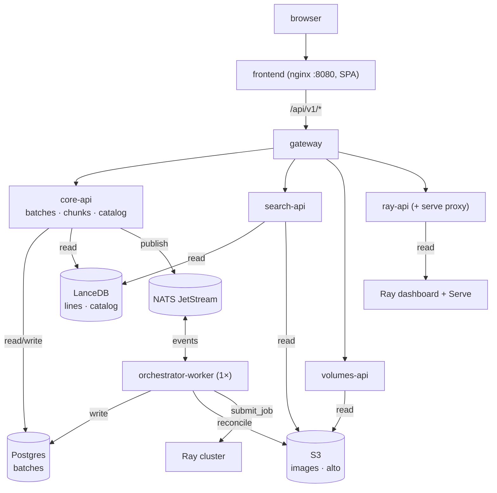

# Splitting the viewer into microservices

Status: **analysis / proposed direction** (not yet implemented). Captures the
reasoning behind a possible decomposition of the monolithic viewer, the gateway
choice, and why Dapr is deliberately *not* adopted yet.

Related: [deployment.md](deployment.md) (the Helm chart that deploys today's
services), [viewer-backend.md](viewer-backend.md), and `CLAUDE.md` (the
"orchestrator → NATS JetStream" roadmap note).

## The honest starting point

The viewer looks like a monolith but is really **one stateful core wrapped in
mostly-stateless readers**. What makes it monolithic is not the HTTP layer — it
is that **one table (`batches`) has four writers**:

- `POST /batches/sync` — S3 reconciliation
- `POST /chunks/{id}/submit` — tags `current_rayjob_id`
- `POST /chunks/{id}/stop` — clears it
- the orchestrator loop — calls submit on a timer

Everything else touches no DB at all (`volumes`, `search`, `ray`, the Ray
`serve` proxy) or only *reads* it (`catalog`, `batches GET`). So the cost of
"many backends" is dominated entirely by how that one table and the loop that
drives it are handled — not by the endpoint count.

## Natural seams (cleanest → hardest)

**Tier A — stateless readers, trivially extractable (no shared DB):**

- **`volumes`** — pure S3/IIIF image + ALTO proxy. Zero DB.
- **`search`** — LanceDB `lines` table + S3 thumbnails. Zero DB.
- **`ray` + `serve` proxy** — stateless pass-through to the Ray dashboard. Zero DB.

These could become separate services today with no data-ownership problem; they
need only shared config (bucket names, `ray_dashboard_url`) and S3/Lance creds.

**Tier B — the orchestrator (already the roadmap):** the loop is an
`asyncio.Task` on `app.state.orchestrator_task`. `CLAUDE.md` already declares it
transitional, to become a NATS JetStream consumer. Extracting it is the
**highest-value split** because it is what forces `viewer.replicas: 1` in the
Helm chart — move it out and the API tier scales horizontally.

**Tier C — the state core (`batches` + `chunks` + `catalog`), best kept
together:** these share writes/reads on one table. Splitting them into separate
services buys almost nothing and costs cross-service coordination. Keep them as
one "core API" service.

## Proposed topology



## Service catalog

| Service | Responsibility | Routes (behind gateway) | State / deps | Scaling |
|---|---|---|---|---|
| **gateway** | Single API origin: path-route to backends; host the Ray `serve` proxy; future auth/rate-limit seam | terminates `/api/v1/*`, `/api/serve/*` | none | horizontal |
| **core-api** | Batch inventory, chunk submit/stop, catalog browse/search — the state-mutating core | `/batches/*`, `/chunks/*`, `/catalog/*` | **owns** Postgres `batches`; reads LanceDB `archive_catalog`; Ray submit for chunk ops | horizontal (writes are row-scoped, idempotent) |
| **search-api** | Line-level FTS + thumbnails | `/search/*` | LanceDB `lines` + S3 thumbs; **no DB** | horizontal, independent |
| **volumes-api** | Image + ALTO serving (IIIF read-through) | `/volumes/*` | S3/IIIF; **no DB** | horizontal, independent |
| **ray-api** | Ray cluster/job introspection + serve proxy | `/ray/*`, `/api/serve/*` | Ray dashboard HTTP; **no DB** | horizontal |
| **orchestrator-worker** | reconcile → derive → submit, event/schedule driven | none (or tiny `/health`, `/state`) | writes Postgres `batches`; Ray submit; S3 reconcile; NATS consumer | **singleton** (single consumer / JetStream guarantees) |

That is 6 deployments (gateway + 4 APIs + worker), but the **minimum viable
split is `gateway + core-api + orchestrator-worker` (3)**, peeling
`search`/`volumes`/`ray` outward only when their load profiles diverge.

## Data ownership

- **Postgres `batches`** — owned solely by **core-api** and **orchestrator-worker**
  (the only writers). Single Alembic owner lives with core-api; the worker shares
  the schema via a package and never runs migrations.
- **LanceDB `lines` / `archive_catalog`** — read-only everywhere; written by the
  existing external indexer scripts (`index_alto`, `harvest_ead`).
- **S3 buckets** — read-only from APIs; the worker reads during reconcile.
- No service reaches into another's store. core-api and the worker sharing
  Postgres is deliberate: there is one table, so a shared DB beats inventing a
  write-API hop.

## Communication

- **North-south (sync):** browser → frontend → gateway → service, all HTTP,
  relative `/api/v1/*`. The **frontend needs no changes** — it already assumes
  one origin (`vite.config.ts` proxy; `api.ts` has no per-group base URL).
- **East-west (async):** only the orchestrator becomes event-driven. Instead of a
  60s in-process timer it is a **NATS JetStream** consumer (the project's
  preferred bus). JetStream's durable consumer + ack gives the singleton
  guarantee without a hard `replicas: 1`.
- **No service-to-service REST mesh.** The only shared coupling is Postgres
  (core-api ↔ worker) and the event bus, keeping the blast radius small.

## Repo layout changes (Polylith-friendly)

The dominant one-time cost is promoting in-process code into shared bricks:

```
packages/
  batchstate/        # NEW — Batch SQLModel, repositories/batch.py,
                     #       services/sync.py, services/submission.py
  storage/  htr/  control/   # already shared
components/services/
  gateway/           # NEW — thin router/proxy
  core-api/          # batches + chunks + catalog endpoints + alembic
  search-api/        # search endpoints
  volumes-api/       # volumes endpoints
  ray-api/           # ray endpoints + serve proxy
  orchestrator-worker/  # the loop, now a NATS consumer
projects/
  <one per deployable>   # composition-only pyproject.toml each
```

Each service keeps the existing clean DI pattern; it just builds its own
`app.state` subset in its own lifespan (e.g. search-api builds Lance + S3, no DB
engine).

## How the Helm chart evolves

The chart from [deployment.md](deployment.md) goes from 2 app Deployments to a
small fleet, but the shape is unchanged:

- One Deployment + Service per service (templated from a shared `_helpers.tpl`).
- The single Ingress becomes **gateway-only** (`/` → frontend, `/api` → gateway);
  the gateway owns the fan-out, so service routes leave the Ingress.
- `existingSecret` stays shared (DB, S3, HF); per-service ConfigMaps carry the
  subset each needs.
- **The `replicas: 1` + `Recreate` constraint moves off the API entirely** onto
  only `orchestrator-worker` — and even that relaxes once it is a JetStream
  durable consumer. That is the concrete payoff: the user-facing API tier becomes
  freely scalable.
- New dependency: a NATS deployment (external like Postgres, or a subchart).

## The gateway

The "gateway" question splits in two:

- **Routing only** — path-match `/api/v1/search` → search-api, etc. The Ingress
  already does this.
- **Application gateway** — auth, rate-limit, request transformation, and the Ray
  `serve` reverse proxy (already custom FastAPI code, not just routing).

### Options

| Option | What it is | Fits because | Cost |
|---|---|---|---|
| **nginx Ingress path rules** | Add `path:` entries to the chart's Ingress | Zero new components; already shipped | Routing only — no auth, no serve proxy |
| **Traefik** | Replace nginx as ingress controller | Declarative middleware (forward-auth, rate-limit); lighter than the heavyweights | New controller to operate |
| **Thin FastAPI gateway** | ~150 lines: httpx fan-out + serve proxy + auth | Same stack; serve proxy moves in verbatim; auth-as-code | Maintain a proxy + one hop |
| **Kong / Istio / Envoy Gateway / APISIX** | Full gateway / mesh platforms | — | Operationally heavy; overkill for an internal tool |

### Decision: two-phase, avoid the heavyweights

1. **Now:** keep **nginx Ingress path-routing** for the stateless splits and keep
   the Ray `serve` proxy as application code (in `ray-api` or core-api). The
   Ingress *is* the gateway; do not stand up a gateway product just to route.

2. **When auth/rate-limiting lands** (the viewer has none today): promote to
   either **Traefik** (auth/middleware declaratively, no proxy code) or a **thin
   FastAPI gateway** (auth + serve proxy in one tested Python codebase). For a
   small FastAPI-centric team on a trusted network, lean **FastAPI gateway** —
   custom SSO logic stays testable in-stack; pick Traefik only to avoid
   maintaining any proxy code.

The migration is clean: Phase 1 today, drop in the gateway later by flipping the
Ingress to a two-rule form (`/` → frontend, `/api` → gateway) — no service or
frontend rewrites.

#### Phase 1 — Ingress path rules (illustrative)

```yaml
rules:
  - host: <host>
    http:
      paths:
        - {path: /api/v1/search,  pathType: Prefix, backend: {service: {name: rask-search-api,  port: {number: 8888}}}}
        - {path: /api/v1/volumes, pathType: Prefix, backend: {service: {name: rask-volumes-api, port: {number: 8888}}}}
        - {path: /api/v1/ray,     pathType: Prefix, backend: {service: {name: rask-ray-api,     port: {number: 8888}}}}
        - {path: /api/serve,      pathType: Prefix, backend: {service: {name: rask-ray-api,     port: {number: 8888}}}}
        - {path: /api/v1,         pathType: Prefix, backend: {service: {name: rask-core-api,    port: {number: 8888}}}}  # catch-all
        - {path: /,               pathType: Prefix, backend: {service: {name: rask-frontend,    port: {number: 8080}}}}
```

Most-specific paths first; `/api/v1` as the catch-all to core-api.

#### Phase 2 — thin FastAPI gateway (illustrative)

```python
# config.py — route table is data
ROUTES = [
    ("/api/v1/search",  "search_api_url"),
    ("/api/v1/volumes", "volumes_api_url"),
    ("/api/v1/ray",     "ray_api_url"),
    ("/api/serve",      "ray_api_url"),
    ("/api/v1",         "core_api_url"),   # catch-all
]

# main.py — one streaming proxy route, auth seam in front
@app.api_route("/api/{path:path}", methods=["GET", "POST", "PUT", "DELETE", "PATCH", "HEAD"])
async def gateway(request: Request, _: None = Depends(require_auth)):
    target = pick_upstream(request.url.path, request.app.state.settings)
    if target is None:
        raise HTTPException(404)
    return await forward(request, target)   # httpx.AsyncClient stream
```

`require_auth` is a no-op while the network is trusted and becomes real
(Riksarkivet SSO / forward-auth) later — nothing downstream changes.

## Why not Dapr

Dapr is *east-west* (service invocation, pub/sub, workflow, state) via a per-pod
sidecar. It **does not solve the north-south gateway** — the browser→API edge
still needs the Ingress / FastAPI gateway above. Mapping Dapr's blocks onto rask:

| Dapr block | rask use? | Verdict |
|---|---|---|
| **Workflow** (durable multi-step) | orchestrator loop | ⚠️ weak fit — see below |
| **Pub/sub** (`pubsub.jetstream`) | core-api ↔ orchestrator events | ✅ but sugar over NATS you'd run anyway |
| **Service invocation** | API ↔ API | ➖ httpx + k8s DNS already cover it |
| **State store** | the `batches` table | ❌ Postgres + SQLModel + Alembic; Dapr state is K/V — a regression |
| **Secrets / config** | DB/S3/HF creds | ❌ `existingSecret` + pydantic-settings already |

The project conventions (`fastapi`, `python-infrastructure` skills) are explicit:
*use Dapr only for Workflow + `pubsub.jetstream`; other primitives stay native;
no service mesh, no Kafka.* So the only real question is **Dapr Workflow for the
orchestrator** — and that is a weak fit:

> Rule of thumb: if losing the message and re-running from scratch is fine →
> NATS. If you need "I was at step 3, resume at step 4" → Dapr Workflow.

The orchestrator tick is idempotent end-to-end: `reconcile_from_s3` upserts,
`derive_state` is a pure read, `submit_chunk` is guarded by derive's in-flight
check and uses a unique timestamped submission id. A crash mid-tick is safe to
re-run whole, and the heavy multi-step pipeline runs on **Ray**, not in the
orchestrator. That is textbook **NATS JetStream** — already the roadmap.

Adopting Dapr also carries real weight: a control plane (operator, injector,
placement, sentry), ~128 MiB RAM + a latency hop per sidecar'd pod, and a
workflow state store. The skills note the sidecar is justified *only* for
services that need Workflow.

**Decision: do not adopt Dapr.** Use NATS JetStream for the orchestrator; keep
the gateway as Ingress → FastAPI gateway. Revisit Dapr Workflow only if a future
per-chunk pipeline grows non-idempotent steps that are *not* delegated to Ray and
must resume exactly (a true saga). If that day comes, add the sidecar to that one
worker and consolidate its pub/sub onto `pubsub.jetstream`.

## Recommendation summary

- Do **not** fan out to 6+ services up front; one table does not justify the
  distributed-systems tax.
- High-value two-step split:
  1. **Extract the orchestrator** into its own NATS-driven worker — removes the
     `replicas: 1` constraint, matches the roadmap, makes the API tier scalable.
  2. **Peel off the stateless readers** (`search`, `volumes`, `ray`/serve) when
     they need independent scaling — cheap, no shared DB.
- Keep `batches` + `chunks` + `catalog` as one core API behind the gateway.
- End state: **Ingress → gateway → {core-api, search, volumes, ray} + NATS
  JetStream → orchestrator-worker → Ray.** Most effort is the one-time
  `packages/batchstate` extraction plus standing up NATS; the gateway and Helm
  changes are mechanical and the frontend is untouched.
