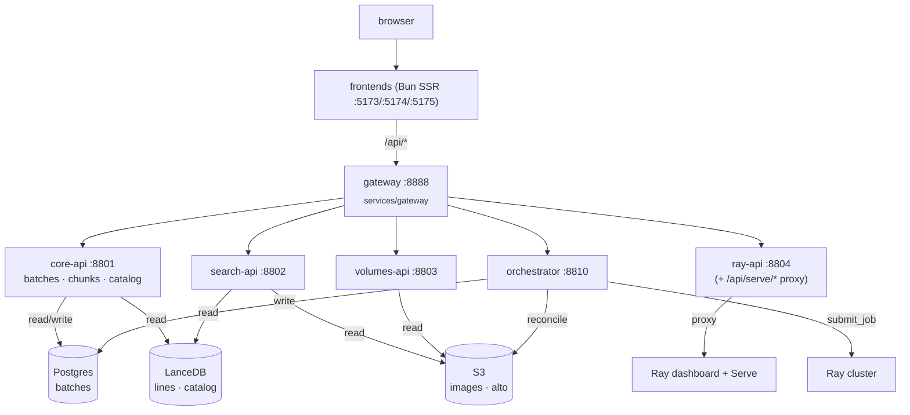

# Viewer decomposition into microservices

!!! warning "P7a (2026-07-27): the batches/orchestrator plane described below is DELETED"
    The compute-plane cutover (`lance-ns-merge.md` P7a) removed the orchestrator loop + entrypoint
    (`:8810`), the `batches` table + Alembic lineage, S3-sync, chunk submission, and the prefetch lane.
    Ingestion is now the medallion producer's `POST /ingest-iiif` (IIIF → raw page-image Lance dataset,
    ONE raw-write OpenLineage event) and HTR runs as event-driven cascade compute on the unified Ray
    cluster. Sections referring to batches/chunks/orchestrator are kept as historical context until the
    P8 doc re-draw.

Status: **IMPLEMENTED (June 2026).** The monolithic `viewer` service was
dissolved into a gateway + per-domain services over a shared `core` package. This
document retains the analysis of why the seams were cut where they were, updated
to past tense where the work is done.

Related: [deployment.md](deployment.md) (Helm chart — currently stale, pending
update to the fleet), [viewer-backend.md](viewer-backend.md) (the dissolved
viewer — history/rationale), and `CLAUDE.md` (the "orchestrator → NATS JetStream"
roadmap note).

## The honest starting point

The viewer looked like a monolith but was really **one stateful core wrapped in
mostly-stateless readers**. What made it monolithic was not the HTTP layer — it
was that **one table (`batches`) had four writers**:

- `POST /batches/sync` — S3 reconciliation
- `POST /chunks/{id}/submit` — tags `current_rayjob_id`
- `POST /chunks/{id}/stop` — clears it
- the orchestrator loop — calls submit on a timer

Everything else touched no DB at all (`volumes`, `search`, `ray`, the Ray
`serve` proxy) or only *read* it (`catalog`, `batches GET`). So the cost of
"many backends" was dominated entirely by how that one table and the loop that
drove it were handled — not by the endpoint count.

## Natural seams — how they were cut

**Tier A — stateless readers (done: extracted with no shared DB):**

- **`volumes-api`** (`services/volumes_api`, `:8803`) — pure S3/IIIF image + ALTO proxy. Zero DB.
- **`search-api`** (`services/search_api`, `:8802`) — LanceDB `lines` table + S3 thumbnails. Zero DB.
- **`ray-api`** (`services/ray_api`, `:8804`) — stateless pass-through to the Ray dashboard + `/api/serve/*` proxy. Zero DB.

**Tier B — the orchestrator (done: extracted as its own service):** the loop
was moved from an in-process `asyncio.Task` to a standalone service
(`services/orchestrator`, `:8810`). This removed the `replicas: 1`
constraint from the API tier — only the orchestrator service needs to be
singleton. The loop remains **transitional** — to become a NATS JetStream
consumer once that lands.

**Tier C — the state core (`batches` + `chunks` + `catalog`), kept together:**
these share writes/reads on one table (`batches`). The decision was to keep them
as one `core-api` service (`services/core_api`, `:8801`) rather than
splitting further. `core-api` and `orchestrator` are two thin entrypoints over
the same `core` package (`services/core`) — they share the `batches`
table transactionally, deliberately not forced into separate services.

## Current topology



## Service catalog

| Service | Responsibility | Routes (behind gateway) | State / deps | Scaling |
|---|---|---|---|---|
| **gateway** (`services/gateway`, `:8888`) | Reverse proxy; path-routes `/api/*` longest-prefix-first to backends | terminates all `/api/*` | none | horizontal |
| **core-api** (`services/core_api`, `:8801`) | Batch inventory, chunk submit/stop, catalog browse/search — the state-mutating core | `/batches/*`, `/chunks/*`, `/catalog/*`, `/health` | **owns** `batches` DB; reads LanceDB `archive_catalog` | horizontal (writes row-scoped, idempotent) |
| **orchestrator** (`services/orchestrator`, `:8810`) | Orchestrator loop (reconcile → derive → submit); orchestrator control endpoints | `/orchestrator/*`, `/health` | writes `batches` DB; Ray submit; S3 reconcile | **singleton** (loop must not run concurrently) |
| **search-api** (`services/search_api`, `:8802`) | Line-level FTS + thumbnails | `/search/*` | LanceDB `lines` + S3 thumbs; **no DB** | horizontal, independent |
| **volumes-api** (`services/volumes_api`, `:8803`) | Image + ALTO serving (IIIF read-through) | `/volumes/*` | S3/IIIF; **no DB** | horizontal, independent |
| **ray-api** (`services/ray_api`, `:8804`) | Ray cluster/job introspection + `/api/serve/*` proxy | `/ray/*`, `/api/serve/*` | Ray dashboard HTTP; **no DB** | horizontal |

Upstream env vars (all overridable): `RASK_CORE_API_URL` (:8801), `RASK_SEARCH_API_URL` (:8802), `RASK_VOLUMES_API_URL` (:8803), `RASK_RAY_API_URL` (:8804), `RASK_ORCH_API_URL` (:8810).

## Data ownership

- **`batches` DB** — owned solely by **core-api** and **orchestrator** (the only
  writers). Alembic lives in the `core` package (`services/core/alembic/`);
  both entrypoints share the schema and neither runs migrations independently.
- **LanceDB `lines` / `archive_catalog`** — read-only from all services; written
  by external indexer scripts (`index_alto`, `harvest_ead`).
- **S3 buckets** — read-only from APIs; the orchestrator also reads during reconcile.
- No service reaches into another's store. `core-api` and `orchestrator` sharing
  the DB is deliberate: there is one table, so a shared DB beats inventing a
  write-API hop.

## Communication

- **North-south (sync):** browser → frontend → gateway → service, all HTTP. The
  **frontend moved to SSR** (`svelte-adapter-bun`) and its API client was
  extracted to `packages/api`; SSR `load`/remote code reaches the gateway via an
  absolute `RASK_GATEWAY_URL` base, while browser code uses the relative `/api`
  proxy to `:8888` (`vite.config.ts`).
- **East-west (async):** the orchestrator currently uses a 60s in-process timer
  (a lifespan-managed `asyncio.Task`). The **NATS JetStream** replacement is the
  project's roadmap; JetStream's durable consumer + ack would give the singleton
  guarantee without a hard `replicas: 1`.
- **No service-to-service REST mesh.** The only shared coupling is the `batches`
  DB (core-api ↔ orchestrator), keeping the blast radius small.

## Repo layout (done)

The one-time migration promoted in-process code into the `core` package and added
new thin entrypoints + packages:

```
packages/
  service-kit/       # ADDED — make_service_app, Settings, middleware, DI lifespan
  ray-kit/           # ADDED — Ray Job SDK + dashboard wrapper
  storage/  htr/     # unchanged
services/
  gateway/           # ADDED — thin router/proxy on :8888
  core/              # ADDED — domain package (dissolved viewer logic + alembic)
  core_api/          # ADDED — thin entrypoint :8801 (health + batches + chunks + catalog)
  orchestrator/      # ADDED — thin entrypoint :8810 (health + orchestrator loop)
  search_api/        # ADDED — search endpoints :8802
  volumes_api/       # ADDED — volumes endpoints :8803
  ray_api/           # ADDED — ray endpoints + serve proxy :8804
  # viewer/ — REMOVED (dissolved)
# projects/ — REMOVED (2026-07; deployables build from the root workspace via
#              `uv sync --package <name>`, one .docker/<name>.dockerfile each)
```

Each service builds its own `app.state` subset in its own lifespan (e.g.
search-api builds Lance + S3, no DB engine).

## How the Helm chart should evolve (pending follow-up)

The Helm chart (`chart/`) currently still targets the old monolith and is a
known deployment-cycle follow-up. The target shape:

- One Deployment + Service per service (templated from a shared `_helpers.tpl`).
- The single Ingress becomes **gateway-only** (`/` → frontend, `/api` → gateway);
  the gateway owns the fan-out, so service routes leave the Ingress.
- `existingSecret` stays shared (DB, S3, HF); per-service ConfigMaps carry the
  subset each needs.
- **The `replicas: 1` + `Recreate` constraint moves off the API entirely** onto
  only `orchestrator` — and even that relaxes once it is a JetStream durable
  consumer. That is the concrete payoff: the user-facing API tier becomes freely
  scalable.
- New dependency (when NATS lands): a NATS deployment (external like Postgres,
  or a subchart).

## The gateway (built)

The gateway (`services/gateway`, `:8888`) is a **thin FastAPI
reverse proxy** — the choice that was called "Phase 2" in the original analysis.
It was the right fit because the Ray `/api/serve/*` proxy is application code
anyway, and keeping routing in the same Python codebase as the services makes it
testable.

The route table is data (longest-prefix-first):

| Prefix | Upstream |
|---|---|
| `/search` | search-api (`RASK_SEARCH_API_URL` :8802) |
| `/volumes` | volumes-api (`RASK_VOLUMES_API_URL` :8803) |
| `/ray` | ray-api (`RASK_RAY_API_URL` :8804) |
| `/api/serve` | ray-api (`RASK_RAY_API_URL` :8804) |
| `/orchestrator` | orchestrator (`RASK_ORCH_API_URL` :8810) |
| `/api/v1/*`, `/api/*` (catch-all) | core-api (`RASK_CORE_API_URL` :8801) |

All upstream URLs are env-overridable. **Auth:** none — assumes trusted network.
The `require_auth` seam exists in the design; it is a no-op until Riksarkivet
SSO lands.

## Why not Dapr

Dapr is *east-west* (service invocation, pub/sub, workflow, state) via a per-pod
sidecar. It **does not solve the north-south gateway** — the browser→API edge
still needs the Ingress / FastAPI gateway above. Mapping Dapr's blocks onto rask:

| Dapr block | rask use? | Verdict |
|---|---|---|
| **Workflow** (durable multi-step) | orchestrator loop | ⚠️ weak fit — see below |
| **Pub/sub** (`pubsub.jetstream`) | core-api ↔ orchestrator events | ✅ but sugar over NATS you'd run anyway |
| **Service invocation** | API ↔ API | ➖ httpx + k8s DNS already cover it |
| **State store** | the `batches` table | ❌ Postgres + SQLModel + Alembic; Dapr state is K/V — a regression |
| **Secrets / config** | DB/S3/HF creds | ❌ `existingSecret` + pydantic-settings already |

The project conventions (`fastapi`, `python-infrastructure` skills) are explicit:
*use Dapr only for Workflow + `pubsub.jetstream`; other primitives stay native;
no service mesh, no Kafka.* So the only real question is **Dapr Workflow for the
orchestrator** — and that is a weak fit:

> Rule of thumb: if losing the message and re-running from scratch is fine →
> NATS. If you need "I was at step 3, resume at step 4" → Dapr Workflow.

The orchestrator tick is idempotent end-to-end: `reconcile_from_s3` upserts,
`derive_state` is a pure read, `submit_chunk` is guarded by derive's in-flight
check and uses a unique timestamped submission id. A crash mid-tick is safe to
re-run whole, and the heavy multi-step pipeline runs on **Ray**, not in the
orchestrator. That is textbook **NATS JetStream** — already the roadmap.

Adopting Dapr also carries real weight: a control plane (operator, injector,
placement, sentry), ~128 MiB RAM + a latency hop per sidecar'd pod, and a
workflow state store. The skills note the sidecar is justified *only* for
services that need Workflow.

**Decision: do not adopt Dapr.** Use NATS JetStream for the orchestrator; keep
the gateway as Ingress → FastAPI gateway. Revisit Dapr Workflow only if a future
per-chunk pipeline grows non-idempotent steps that are *not* delegated to Ray and
must resume exactly (a true saga). If that day comes, add the sidecar to that one
worker and consolidate its pub/sub onto `pubsub.jetstream`.

## What shipped — summary

- **Did not** fan out to an over-split microservice graph; one `batches` table
  does not justify the distributed-systems tax.
- Two-step split delivered:
  1. **Extracted the orchestrator** into its own service (`orchestrator`, `:8810`)
     — removed the `replicas: 1` constraint from the API tier; the loop runs in
     exactly one process controlled by `RASK_ORCHESTRATOR_AUTOSTART`.
  2. **Peeled off the stateless readers** as independent services: `volumes-api`,
     `search-api`, `ray-api` — cheap, no shared DB.
- Kept `batches` + `chunks` + `catalog` as one core-api behind the gateway, with
  `core-api` and `orchestrator` as two thin entrypoints over the same `core` package.
- Current state: **gateway → {core-api, orchestrator, search-api, volumes-api,
  ray-api}**. `core-api` and `orchestrator` share the `batches` table. The
  orchestrator's NATS JetStream replacement is the next roadmap item.
- The frontend moved to SSR (`svelte-adapter-bun`) and its API client was
  extracted to `packages/api`; SSR uses an absolute `RASK_GATEWAY_URL` base while
  the browser uses the relative `/api` proxy to `:8888`.
