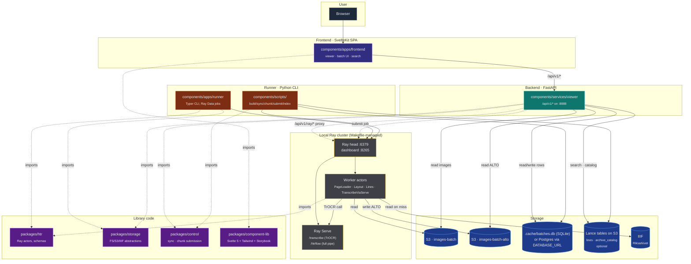
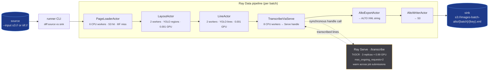
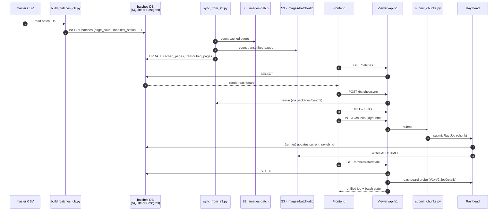
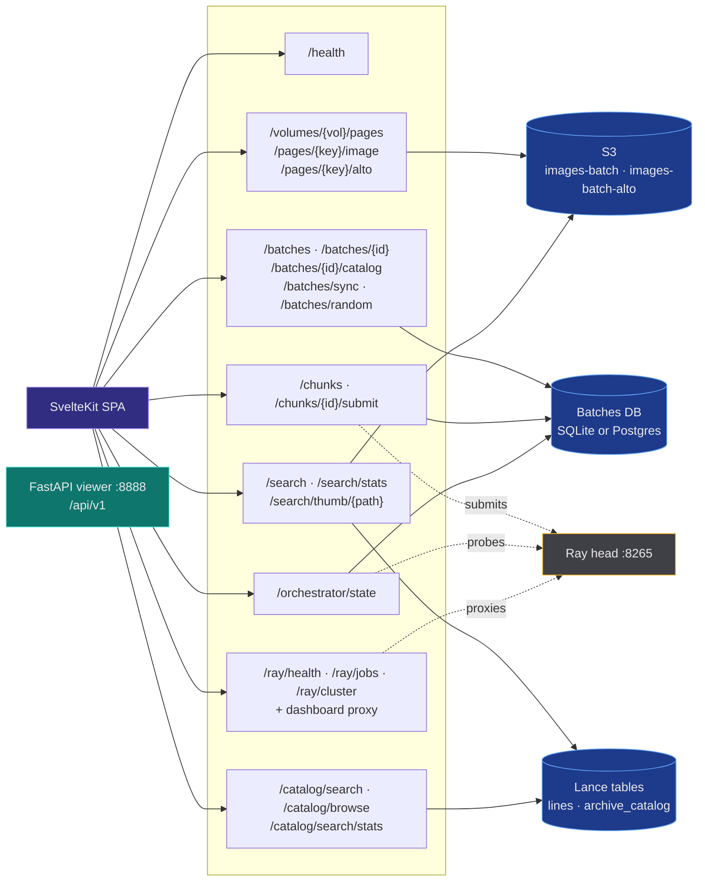
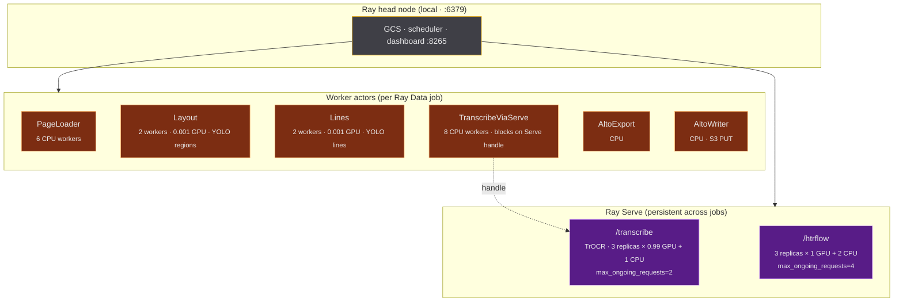

# rask — system overview (as-is)

Snapshot of the **current** architecture across runner, Ray, backend, frontend
and storage. No proposals here — see siblings (`frontend-monorepo.md`,
`viewer-backend.md`) for direction.

## One-paragraph summary

`rask` is a distributed image-to-ALTO-XML pipeline for the Swedish National
Archives. A **Python CLI runner** submits **Ray Data** jobs that fan
**handwritten-text-recognition** (HTR) work across a **local Ray cluster**
with model weights kept resident in **Ray Serve** (TrOCR on `/transcribe`,
full HTRflow pipeline on `/htrflow`). Images come from **IIIF** or
pre-staged **S3** buckets; output ALTO XML lands back in **S3**. A
**FastAPI viewer service** exposes versioned endpoints under `/api/v1/*`
that a **SvelteKit SPA** consumes for inspection, batch dashboard and
chunk submission. Batch-tracking state lives in a small relational DB
behind a backend-agnostic ORM — **SQLite for dev** (`.cache/batches.db`),
**Postgres for prod** — selected by `DATABASE_URL`. Full-text search over
transcribed lines + an archival catalog index live in optional **Lance**
tables on S3.

## Top-level component map

## What lives where

| Path                                | Type          | Purpose                                                              |
| ----------------------------------- | ------------- | -------------------------------------------------------------------- |
| `components/apps/frontend/`         | SvelteKit SPA | Browser UI: page viewer, batch dashboard, search, Ray-dashboard proxy |
| `components/apps/runner/`           | Python CLI    | Submits Ray Data jobs; ships Ray Serve deployments                   |
| `components/services/viewer/`       | FastAPI       | Only HTTP backend; `/api/v1/*` on `:8888`; no auth                   |
| `components/scripts/`               | Python        | One-shot tools: `build_batches_db`, `sync_from_s3`, `harvest_ead`, `search_index`, `submit_chunks` |
| `packages/htr/`                     | Python lib    | Ray actors (PageLoader, Layout, Lines, Transcribe, AltoExport)       |
| `packages/storage/`                 | Python lib    | `FSSource/Sink`, `S3Source/Sink`, `IIIFCachedSource`                 |
| `packages/control/`                 | Python lib    | Shared ops logic — sync, chunk submission — used by viewer + scripts |
| `packages/component-lib/`           | TS / Svelte   | Shared Svelte 5 + Bits UI + Tailwind 4 component library w/ Storybook |
| `.cache/batches.db`                 | SQLite        | Default per-batch progress (dev; not committed)                      |
| `.docker/*.dockerfile`              | Docker        | Image definitions for `viewer`, `runner` (CUDA), `frontend` (nginx)  |
| `Makefile`                          | bash          | All deploy/dev orchestration (no docker-compose, no k8s yaml)        |

## Data flow — image → ALTO XML

The runner is the engine. Submits one Ray Data pipeline per invocation, then
blocks until `.materialize()` returns.

**Pool sizing** uses `compute=ActorPoolStrategy(size=N)` (autoscaler off) —
empirically `concurrency=(N, N)` left the autoscaler in play. The GPU-heavy
transcription step is decoupled: `TranscribeViaServe` runs as 8 CPU map
workers, each blocking on a Ray Serve handle to the 3 GPU-resident TrOCR
replicas.

**Alternate path:** the `htrflow` pipeline collapses Layout+Line+Transcribe+
Alto into a single Ray Serve deployment (`/htrflow`, 3 replicas × 1 GPU + 2
CPU, `max_ongoing_requests=4`). Used when actor fan-out isn't worth it for a
given batch shape.

## Batch lifecycle — CSV → DB → Ray job → S3

How a batch becomes a queued, then submitted, then transcribed unit. The
"DB" here is `.cache/batches.db` (SQLite) in dev or Postgres in prod — the
ORM (SQLModel + SQLAlchemy async) is the same either way.

## Frontend ↔ Backend ↔ Storage

What the SPA actually fetches. All API routes are under the
`RASK_API_PREFIX` (default `/api/v1`).

**Middleware:** `RequestIDMiddleware`, `TimingMiddleware`, CORS. **Auth:**
none — `viewer` assumes localhost or trusted network.

**Lance is optional.** If HCP S3 credentials are absent the search and
catalog endpoints surface gracefully; nothing in the core image → ALTO
pipeline depends on Lance. Indexing is driven by scripts
(`make search-index`, `make catalog-index`, `make harvest-ead`).

**Orchestrator endpoint** (`/orchestrator/state`) is a pure-derivation view
that joins Ray job state (bridging Ray's V1 `JobInfo` and V2 `JobDetails`)
with batches-DB rows, so the SPA can poll one URL instead of fanning out.

## Ray cluster topology

What `make ray-up` actually starts and what `make serve-up` deploys onto it.

**GPU sizing** is hardcoded in
`components/apps/runner/src/runner/pipeline.py` and the two Serve modules
(`runner/transcribe_service.py`, `runner/htrflow_service.py`). The numbers
target a **3-GPU node**: 3 TrOCR replicas at 0.99 GPU each fill the GPUs,
while Layout/Lines actors hold 0.001 GPU slots just to land them on the
GPU node. Earlier attempts at 6 transcribe replicas OOM'd host RAM
(6 × ~4 GB TrOCR weights).

**Remote KubeRay?** The CLI accepts `--address ray://dev-kuberay.ra.se:10001`,
suggesting an out-of-repo cluster exists. No Helm chart or K8s manifest
lives in this repo.

## Container images

Production-shaped image definitions live at `.docker/`. They are
**build-ready, not orchestrated** — there is no docker-compose, no Helm
chart, no Kustomize.

| Image      | Dockerfile                     | Base                           | Notes                                |
| ---------- | ------------------------------ | ------------------------------ | ------------------------------------ |
| `viewer`   | `.docker/viewer.dockerfile`    | `python:3.13-slim`             | uv install, runs `viewer.main:app`   |
| `runner`   | `.docker/runner.dockerfile`    | `nvidia/cuda:12.4-runtime`     | uv install, GPU client for Ray jobs  |
| `frontend` | `.docker/frontend.dockerfile`  | Bun build → `nginx-unprivileged` | Static SPA + `frontend.nginx.conf`  |

`.dockerignore` and `.hadolint.yaml` sit alongside them; the build context
is the repo root.

## Stack at a glance

| Concern             | Choice                                                                |
| ------------------- | --------------------------------------------------------------------- |
| Distributed compute | Ray Data + Ray Serve                                                  |
| Backend HTTP        | FastAPI (single service, `/api/v1/*`)                                 |
| ORM                 | SQLModel + SQLAlchemy async (aiosqlite or asyncpg)                    |
| Relational DB       | SQLite (dev, `.cache/batches.db`) or Postgres (prod, `DATABASE_URL`)  |
| Search / catalog    | Lance tables on S3 (optional, HCP-backed)                             |
| Frontend            | SvelteKit (SPA, adapter-static) + `packages/component-lib`            |
| Object storage      | S3 via `packages/storage` — two buckets: `images-batch`, `*-alto`     |
| Source              | IIIF (Riksarkivet) with S3 read-through cache                         |
| Models              | YOLO (regions, lines), TrOCR (transcription)                          |
| Python              | uv + Ruff + ty (3.13)                                                 |
| JS / TS             | Bun + Vite + ESLint + Prettier (Svelte 5)                             |
| Rust                | Cargo workspace (small support crates)                                |
| Container images    | `.docker/*.dockerfile` (no orchestration manifests in repo)           |
| Deploy orchestration| None checked in — `Makefile` is the only runbook                      |

## What's deliberately NOT here

- **No queue** between viewer and Ray. `POST /api/v1/chunks/{id}/submit`
  shells out to `submit_chunks.py` which submits a Ray Job synchronously.
- **No event bus.** Components communicate via S3 keys, DB rows, and
  Ray's own job/actor RPCs.
- **No auth** on the viewer service. Localhost / trusted-network only.
- **No docker-compose, no Helm chart, no Kubernetes manifests.** Just
  the image definitions in `.docker/`.
- **No CI manifests** for cluster deployment. Remote Ray cluster is
  managed outside this repo.
- **No Redis, no MySQL.** The relational tier is SQLite or Postgres only.
