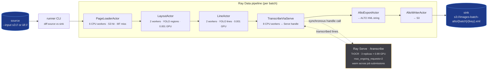
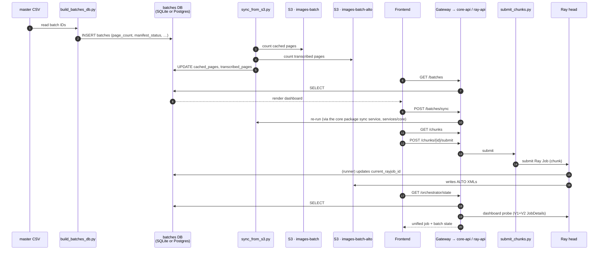
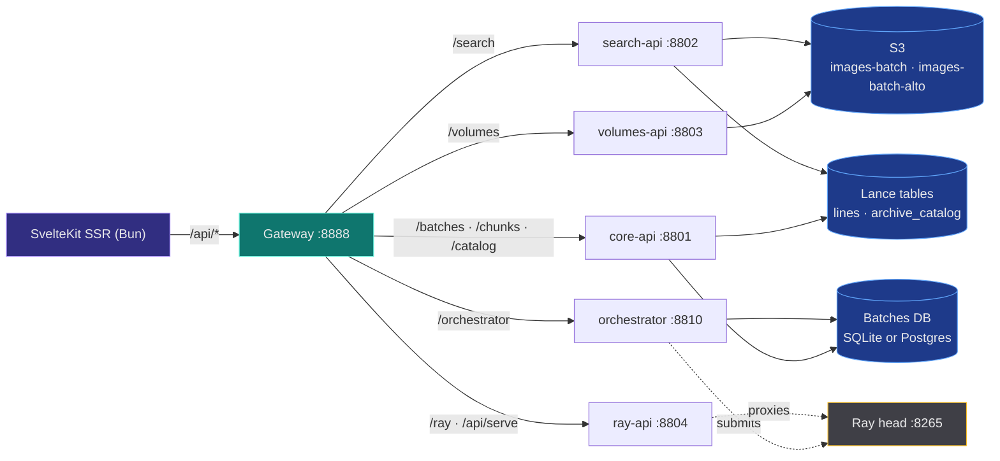
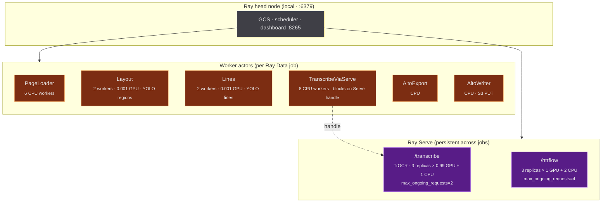

# rask — system overview (as-is)

!!! warning "P7a (2026-07-27): the batches/orchestrator plane described below is DELETED"
    The compute-plane cutover (`lance-ns-merge.md` P7a) removed the orchestrator loop + entrypoint
    (`:8810`), the `batches` table + Alembic lineage, S3-sync, chunk submission, and the prefetch lane.
    Ingestion is now the medallion producer's `POST /ingest-iiif` (IIIF → raw page-image Lance dataset,
    ONE raw-write OpenLineage event) and HTR runs as event-driven cascade compute on the unified Ray
    cluster. Sections referring to batches/chunks/orchestrator are kept as historical context until the
    P8 doc re-draw.

Snapshot of the **current** architecture across runner, Ray, backend, frontend
and storage. No proposals here — see siblings (`frontend-microfrontends.md`,
`deployment.md`) for direction.

## One-paragraph summary

`rask` is a distributed image-to-ALTO-XML pipeline for the Swedish National
Archives. A **Python CLI runner** submits **Ray Data** jobs that fan
**handwritten-text-recognition** (HTR) work across a **local Ray cluster**
with model weights kept resident in **Ray Serve** (TrOCR on `/transcribe`,
full HTRflow pipeline on `/htrflow`). Images come from **IIIF** or
pre-staged **S3** buckets; output ALTO XML lands back in **S3**. The HTTP
backend is a fleet of FastAPI services behind a **gateway** on `:8888`: a
**core-api** for batch/chunk/catalog state (`:8801`), an **orchestrator**
service that runs the submission loop (`:8810`), and three stateless services —
**volumes-api** (`:8803`), **search-api** (`:8802`), **ray-api** (`:8804`).
The frontend is **7 SvelteKit 2 + Svelte 5 SSR apps** (svelte-adapter-bun, Bun
servers) — a catch-all (`frontend`, owning `/`) plus six per-domain
microfrontends (overview/compute/discover/storage/train/studio) composed by the
Turborepo microfrontends proxy on `:3024` in dev (the k3s Ingress in prod) —
consuming all of these via the gateway for inspection, batch dashboard and chunk
submission. Batch-tracking state lives in a small
relational DB behind a backend-agnostic ORM — **SQLite for dev**
(`.cache/batches.db`), **Postgres for prod** — selected by `DATABASE_URL`.
Full-text search over transcribed lines + an archival catalog index live in
optional **Lance** tables on S3.

## Top-level component map

```mermaid
flowchart TB
    subgraph user["User"]
        browser["Browser"]
    end

    subgraph frontend["Frontend · 7 SvelteKit SSR (Bun) microfrontends · :3024 proxy"]
        spa["frontend/microfrontends/home<br/><sub>catch-all · platform home /</sub>"]
        domainfe["6 domain apps<br/><sub>overview · compute · discover<br/>storage · train · studio</sub>"]
    end

    subgraph backend["Backend · FastAPI fleet"]
        gw["services/gateway<br/><sub>gateway :8888</sub>"]
        core["services/core_api<br/><sub>core-api :8801</sub>"]
        orch["services/orchestrator<br/><sub>orchestrator :8810</sub>"]
        vols["services/volumes_api<br/><sub>volumes-api :8803</sub>"]
        srch["services/search_api<br/><sub>search-api :8802</sub>"]
        rayapi["services/ray_api<br/><sub>ray-api :8804</sub>"]
    end

    subgraph runner["Runner · Python CLI"]
        cli["runners/htr<br/><sub>Typer CLI, Ray Data jobs</sub>"]
        scripts["scripts/<br/><sub>build/sync/chunk/submit/index</sub>"]
    end

    subgraph ray["Local Ray cluster (Makefile-managed)"]
        head["Ray head :6379<br/>dashboard :8265"]
        workers["Worker actors<br/><sub>PageLoader · Layout · Lines · TranscribeViaServe</sub>"]
        serve["Ray Serve<br/><sub>/transcribe (TrOCR)<br/>/htrflow (full pipe)</sub>"]
    end

    subgraph storage["Storage"]
        s3in[("S3 · images-batch")]
        s3out[("S3 · images-batch-alto")]
        relational[(".cache/batches.db (SQLite)<br/>or Postgres via DATABASE_URL")]
        lance[("Lance tables on S3<br/><sub>lines · archive_catalog<br/>optional</sub>")]
        iiif[("IIIF<br/><sub>Riksarkivet</sub>")]
    end

    subgraph libs["Library code"]
        htr["runners/htr<br/><sub>Ray actors, schemas</sub>"]
        storagepkg["packages/storage<br/><sub>FS/S3/IIIF abstractions</sub>"]
        servicekit["packages/service-kit<br/><sub>make_service_app, Settings, middleware</sub>"]
        raykit["packages/ray-kit<br/><sub>Ray Job SDK + dashboard wrapper</sub>"]
        complib["packages/ui<br/><sub>Svelte 5 + Tailwind + Storybook</sub>"]
    end

    browser --> spa
    spa -->|"/api/*"| gw
    gw --> core
    gw --> srch
    gw --> vols
    gw --> rayapi
    gw --> orch

    core -->|read/write rows| relational
    core -->|catalog| lance
    srch -->|search| lance
    srch -->|thumbs| s3in
    vols -->|read images| s3in
    vols -->|read ALTO| s3out
    rayapi -.->|"/api/ray/* · /api/serve/* proxy"| head
    orch -.->|submit job| head

    cli --> head
    scripts --> head
    scripts --> relational
    scripts --> lance

    head --> workers
    head --> serve
    workers -->|read| s3in
    workers -->|read on miss| iiif
    workers -->|TrOCR call| serve
    workers -->|write ALTO| s3out

    cli -.imports.-> htr
    cli -.imports.-> storagepkg
    workers -.imports.-> htr
    core -.imports.-> storagepkg
    core -.imports.-> servicekit
    vols -.imports.-> storagepkg
    vols -.imports.-> servicekit
    srch -.imports.-> storagepkg
    srch -.imports.-> servicekit
    rayapi -.imports.-> raykit
    rayapi -.imports.-> servicekit
    orch -.imports.-> servicekit
    orch -.imports.-> raykit
    spa -.imports.-> complib

    classDef user fill:#1e293b,stroke:#94a3b8,color:#e9e9ea
    classDef fe fill:#312e81,stroke:#a78bfa,color:#e9e9ea
    classDef be fill:#0f766e,stroke:#5eead4,color:#e9e9ea
    classDef run fill:#7c2d12,stroke:#fdba74,color:#e9e9ea
    classDef rayc fill:#3f3f46,stroke:#fbbf24,color:#e9e9ea
    classDef store fill:#1e3a8a,stroke:#60a5fa,color:#e9e9ea
    classDef lib fill:#581c87,stroke:#c084fc,color:#e9e9ea

    class browser user
    class spa fe
    class gw,core,orch,vols,srch,rayapi be
    class cli,scripts run
    class head,workers,serve rayc
    class s3in,s3out,relational,lance,iiif store
    class htr,storagepkg,servicekit,raykit,complib lib
```

## What lives where

| Path                                    | Type          | Purpose                                                              |
| --------------------------------------- | ------------- | -------------------------------------------------------------------- |
| `frontend/microfrontends/home/`             | SvelteKit SSR (Bun) | Catch-all app: platform home `/`, project picker; package `home` |
| `frontend/microfrontends/{overview,compute,discover,storage,train,studio}/` | SvelteKit SSR (Bun) | Six per-domain microfrontends, each pinned to `/default/<domain>`, all rendering the shared `@rask/ui/shell` sidebar |
| `runners/htr/`               | Python CLI    | Submits Ray Data jobs; ships Ray Serve deployments                   |
| `services/gateway/`          | FastAPI       | Reverse proxy on `:8888`; path-routes `/api/*` to per-domain services |
| `services/core/`             | Python (domain package)| Domain package: DB, models, repositories, domain services, Alembic; shared by core-api + orchestrator |
| `services/core_api/`         | FastAPI       | Thin entrypoint `:8801` — health + batches + chunks + catalog        |
| `services/orchestrator/`     | FastAPI       | Thin entrypoint `:8810` — health + orchestrator loop (on)            |
| `services/volumes_api/`      | FastAPI       | S3/IIIF image + ALTO proxy on `:8803`; no DB                         |
| `services/search_api/`       | FastAPI       | Lance `lines` FTS + S3 thumbnails on `:8802`; no DB                  |
| `services/ray_api/`          | FastAPI       | Ray dashboard introspection + `/api/serve/*` proxy on `:8804`; no DB |
| `scripts/`                   | Python        | One-shot tools: `build_batches_db`, `harvest_ead`, `index_alto`, `index_catalog`, … |
| `runners/htr/`                         | Python lib    | Ray actors (PageLoader, Layout, Lines, Transcribe, AltoExport)       |
| `packages/storage/`                     | Python lib    | `FSSource/Sink`, `S3Source/Sink`, `IIIFCachedSource`                 |
| `packages/service-kit/`                 | Python lib    | Platform library: `make_service_app`, `Settings`, middleware, DI lifespan |
| `packages/ray-kit/`                     | Python lib    | Ray Job SDK + dashboard wrapper; shared by ray-api and core orchestrator |
| `packages/ui/`               | TS / Svelte   | Shared Svelte 5 + Bits UI + Tailwind 4 component library w/ Storybook; `@rask/ui/shell` exports the shared `AppShell`/`AppSidebar` |
| `packages/api/`              | TS            | Shared API client + types (`@rask/api`), split into ray/batches/search/volumes/types modules |
| `.cache/batches.db`                     | SQLite        | Default per-batch progress (dev; not committed)                      |
| `.docker/*.dockerfile`                  | Docker        | Image definitions for `runner` (CUDA) and all 7 SvelteKit apps (one parametrized `frontend.dockerfile`, `--build-arg APP=`); see deployment.md for backend images |
| `chart/`                                | Helm          | The single deploy artifact for local k3s **and** prod (in-cluster Postgres/MinIO/KubeRay gated by values toggles) |
| `Makefile`                              | bash          | All deploy/dev orchestration (k3s + Helm; no docker-compose)         |

## Data flow — image → ALTO XML

The runner is the engine. Submits one Ray Data pipeline per invocation, then
blocks until `.materialize()` returns.

**Pool sizing** uses `compute=ActorPoolStrategy(size=N)` (autoscaler off) —
empirically `concurrency=(N, N)` left the autoscaler in play. The GPU-heavy
transcription step is decoupled: `TranscribeViaServe` runs as 8 CPU map
workers, each blocking on a Ray Serve handle to the 3 GPU-resident TrOCR
replicas.

**Alternate path:** the `htrflow` pipeline collapses Layout+Line+Transcribe+
Alto into a single Ray Serve deployment (`/htrflow`, 3 replicas × 1 GPU + 2
CPU, `max_ongoing_requests=4`). Used when actor fan-out isn't worth it for a
given batch shape.

## Batch lifecycle — CSV → DB → Ray job → S3

How a batch becomes a queued, then submitted, then transcribed unit. The
"DB" here is `.cache/batches.db` (SQLite) in dev or Postgres in prod — the
ORM (SQLModel + SQLAlchemy async) is the same either way.

## Frontend ↔ Backend ↔ Storage

What the frontend actually fetches. The gateway (`/api/*`) longest-prefix-routes to
per-domain services; `RASK_API_PREFIX` (default `/api/v1`) controls the prefix
used by core-api.

**Middleware:** `RequestIDMiddleware`, `TimingMiddleware`, CORS. **Auth:**
none — the fleet assumes localhost or trusted network.

**Lance is optional.** If HCP S3 credentials are absent the search and
catalog endpoints surface gracefully; nothing in the core image → ALTO
pipeline depends on Lance. Indexing is driven by scripts
(`make search-index`, `make catalog-index`, `make harvest-ead`).

**Orchestrator endpoint** (`/orchestrator/state`) is a pure-derivation view
that joins Ray job state (bridging Ray's V1 `JobInfo` and V2 `JobDetails`)
with batches-DB rows, so the frontend can poll one URL instead of fanning out.

## Ray cluster topology

What `make ray-up` actually starts and what `make serve-up` deploys onto it.

**GPU sizing** is hardcoded in
`runners/htr/src/runner/pipeline.py` and the two Serve modules
(`runner/transcribe_service.py`, `runner/htrflow_service.py`). The numbers
target a **3-GPU node**: 3 TrOCR replicas at 0.99 GPU each fill the GPUs,
while Layout/Lines actors hold 0.001 GPU slots just to land them on the
GPU node. Earlier attempts at 6 transcribe replicas OOM'd host RAM
(6 × ~4 GB TrOCR weights).

**Remote KubeRay?** The CLI accepts `--address ray://dev-kuberay.ra.se:10001`,
suggesting an out-of-repo cluster exists. The repo's own Helm chart (`chart/`)
can stand up an in-cluster KubeRay (`ray.enabled`), but no manifest for that
external production cluster lives here.

## Container images

Production-shaped image definitions live at `.docker/`; orchestration is the
Helm chart in `chart/` (the single deploy artifact for local k3s and prod) —
there is no docker-compose. `.dockerignore` and `.hadolint.yaml` sit alongside
the dockerfiles; the build context is the repo root.

| Image      | Dockerfile                     | Base                           | Notes                                |
| ---------- | ------------------------------ | ------------------------------ | ------------------------------------ |
| `runner`   | `.docker/runner.dockerfile`    | `nvidia/cuda:12.4-runtime`     | uv install, GPU client for Ray jobs  |
| `frontend` + 6 domain MFEs | `.docker/frontend.dockerfile` (`--build-arg APP=<app>`) | Bun build → `oven/bun` runtime (SSR server) | one parametrized Dockerfile builds all 7 SvelteKit apps; `bun ./build/index.js` |

## Stack at a glance

| Concern             | Choice                                                                |
| ------------------- | --------------------------------------------------------------------- |
| Distributed compute | Ray Data + Ray Serve                                                  |
| Backend HTTP        | FastAPI fleet: gateway + core-api + orchestrator + volumes-api + search-api + ray-api |
| ORM                 | SQLModel + SQLAlchemy async (aiosqlite or asyncpg)                    |
| Relational DB       | SQLite (dev, `.cache/batches.db`) or Postgres (prod, `DATABASE_URL`)  |
| Search / catalog    | Lance tables on S3 (optional; any S3-agnostic backend)                |
| Frontend            | SvelteKit (SSR, svelte-adapter-bun) + `packages/ui`; client API helpers in `packages/api` (`@rask/api`) |
| Object storage      | S3 via `packages/storage` (S3-agnostic: MinIO/rustfs, env-swap only) — two buckets: `images-batch`, `*-alto` |
| Source              | IIIF (Riksarkivet) with S3 read-through cache                         |
| Models              | YOLO (regions, lines), TrOCR (transcription)                          |
| Python              | uv + Ruff + ty (3.13)                                                 |
| JS / TS             | Bun + Vite + ESLint + Prettier (Svelte 5)                             |
| Container images    | `.docker/*.dockerfile` (one parametrized `frontend.dockerfile` for all 7 apps) |
| Deploy orchestration| Helm chart in `chart/` (single artifact for local k3s + prod); `Makefile` drives k3s/Helm |

## What's deliberately NOT here

- **No queue** between the orchestrator and Ray. The orchestrator submits Ray
  Jobs synchronously via the Ray Job SDK. (NATS JetStream is the roadmap replacement.)
- **No event bus.** Components communicate via S3 keys, DB rows, and
  Ray's own job/actor RPCs.
- **No auth** on any service. Localhost / trusted-network only.
- **No docker-compose.** The Helm chart in `chart/` is the single deploy
  artifact for both local k3s and prod (image definitions in `.docker/` feed it).
- **No CI manifests** for cluster deployment. Remote Ray cluster is
  managed outside this repo.
- **No Redis, no MySQL.** The relational tier is SQLite or Postgres only.
