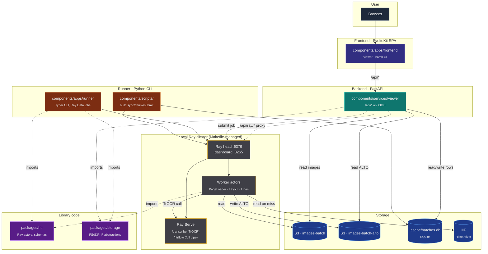
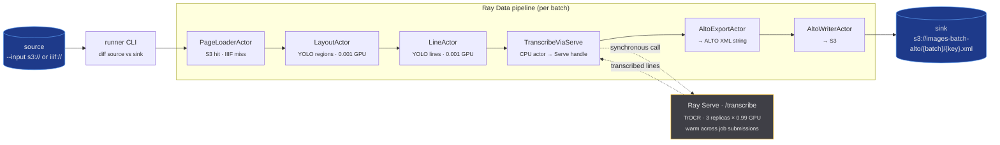
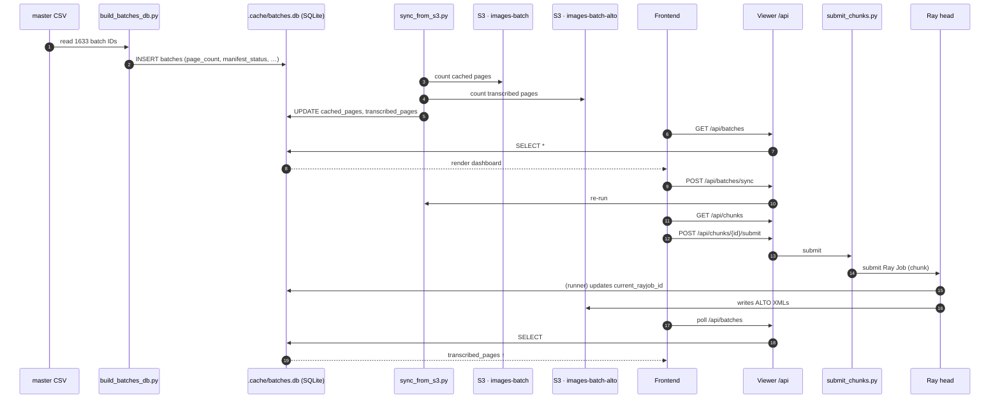
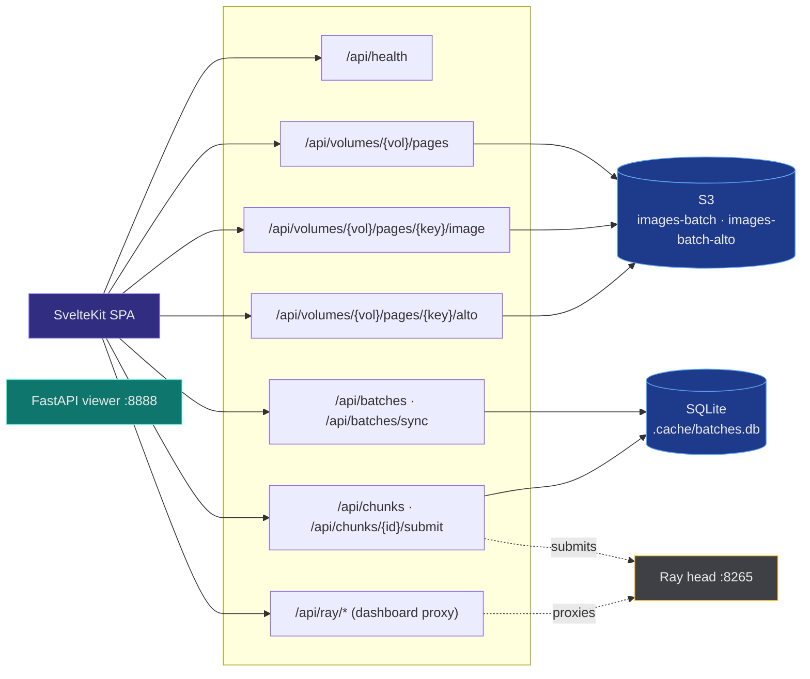
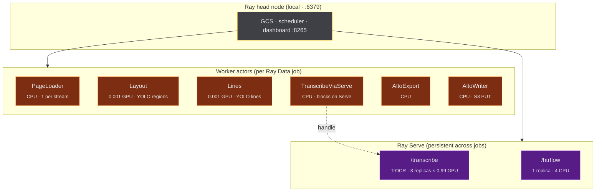

# rask — system overview (as-is)

Snapshot of the **current** architecture across runner, Ray, backend, frontend
and storage. No proposals here — see siblings (`frontend-monorepo.md`) for
direction.

## One-paragraph summary

`rask` is a distributed image-to-ALTO-XML pipeline for the Swedish National
Archives. A **Python CLI runner** submits **Ray Data** jobs that fan
**handwritten-text-recognition** (HTR) work across a **local Ray cluster**
with warm **TrOCR** weights kept resident in **Ray Serve**. Images come from
**IIIF** or pre-staged **S3** buckets; output ALTO XML lands back in **S3**.
A **FastAPI viewer service** exposes `/api/*` endpoints that a **SvelteKit
SPA** consumes for inspection and chunk-submission. Job-tracking state lives
in a tiny **SQLite** file (`.cache/batches.db`); there is **no Postgres**.

## Top-level component map

## What lives where

| Path                                | Type          | Purpose                                                        |
| ----------------------------------- | ------------- | -------------------------------------------------------------- |
| `components/apps/frontend/`         | SvelteKit SPA | Browser UI: page viewer, batch dashboard, Ray-dashboard proxy  |
| `components/apps/runner/`           | Python CLI    | Submits Ray Data jobs; ships Ray Serve deployments             |
| `components/services/viewer/`       | FastAPI       | Only HTTP backend; `/api/*` on `:8888`; no auth                |
| `components/scripts/`               | Python        | One-shot tools: `build_batches_db`, `sync_from_s3`, `chunk_*`  |
| `packages/htr/`                     | Python lib    | Ray actors (PageLoader, Layout, Lines, Transcribe, AltoExport) |
| `packages/storage/`                 | Python lib    | `FSSource/Sink`, `S3Source/Sink`, `IIIFCachedSource`           |
| `packages/component-lib/`           | TS / Svelte   | (Future) shared UI library — see `frontend-monorepo.md`        |
| `.cache/batches.db`                 | SQLite        | Per-batch progress tracking (built locally, not committed)     |
| `Makefile`                          | bash          | All deploy/dev orchestration (no docker-compose, no k8s yaml)  |

## Data flow — image → ALTO XML

The runner is the engine. Submits one Ray Data pipeline per invocation, then
blocks until `.materialize()` returns.

**Alternate path:** `htrflow` pipeline collapses Layout+Line+Transcribe+Alto
into a single Ray Serve deployment (`/htrflow`, 1 replica, CPU-only). Used
when GPU isn't worth the actor-fan-out overhead for a given batch shape.

## Batch lifecycle — CSV → SQLite → Ray job → S3

How a batch becomes a queued, then submitted, then transcribed unit.

## Frontend ↔ Backend ↔ Storage

What the SPA actually fetches.

**Auth:** none. `viewer` has no middleware. Assumes localhost or trusted
network.

## Ray cluster topology

What `make ray-up` actually starts and what `make serve-up` deploys onto it.

**GPU sizing** is hardcoded in
`components/apps/runner/src/runner/pipeline.py` — assumes a **3-GPU node**:
3 Serve TrOCR replicas (≈ 0.99 GPU each) + ~6 layout/lines actors at
0.001 GPU. Fits one well-provisioned box.

**Remote KubeRay?** The CLI accepts `--address ray://dev-kuberay.ra.se:10001`,
suggesting an out-of-repo cluster exists. No Helm chart or K8s manifest lives
in this repo.

## Stack at a glance

| Concern             | Choice                                            |
| ------------------- | ------------------------------------------------- |
| Distributed compute | Ray Data + Ray Serve                              |
| Backend HTTP        | FastAPI (single service)                          |
| Frontend            | SvelteKit (SPA, adapter-static)                   |
| Object storage      | S3 (boto3) — two buckets: images-batch, *-alto    |
| Job-tracking state  | SQLite (`.cache/batches.db`, not committed)       |
| Source              | IIIF (Riksarkivet) with S3 read-through cache     |
| Models              | YOLO (regions, lines), TrOCR (transcription)      |
| Python              | uv + Ruff + ty (3.13)                             |
| JS / TS             | Bun + Vite + ESLint + Prettier (Svelte 5)         |
| Rust                | Cargo workspace (small support crates)            |
| Deploy artefacts    | None checked in — `Makefile` is the only runbook  |

## What's deliberately NOT here

- **No Postgres**, no MySQL, no Redis. State is SQLite + S3.
- **No docker-compose**, no Helm chart, no Kubernetes manifests in the repo.
- **No auth** on the viewer service. Localhost / trusted-network only.
- **No CI manifests** for cluster deployment. Remote Ray cluster is
  managed outside this repo.
- **No queue** between viewer and Ray. The viewer's `/api/chunks/{id}/submit`
  calls the Python script which submits a Ray Job synchronously.
- **No event bus.** Components communicate via S3 keys + SQLite rows + Ray's
  own job/actor RPCs.
