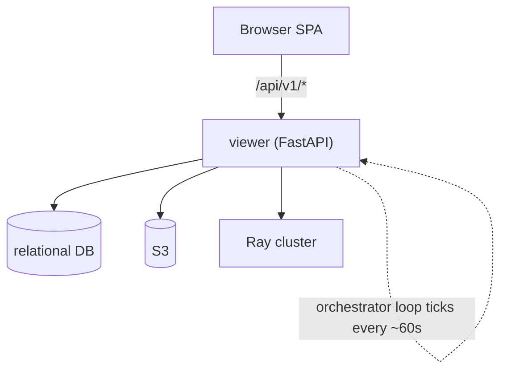
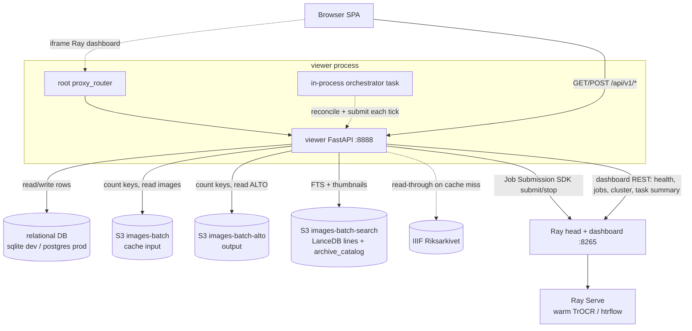
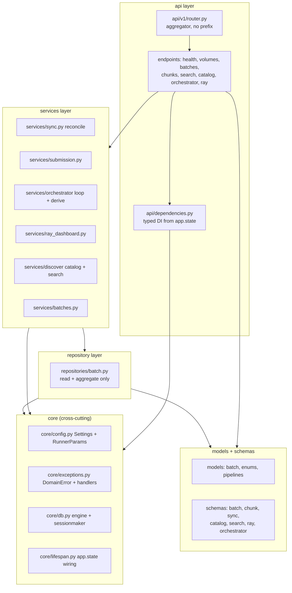
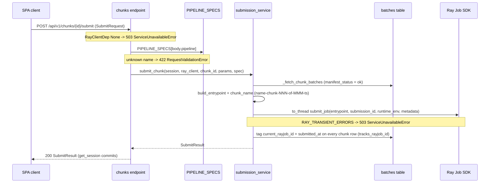
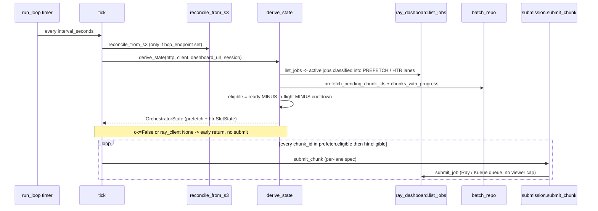
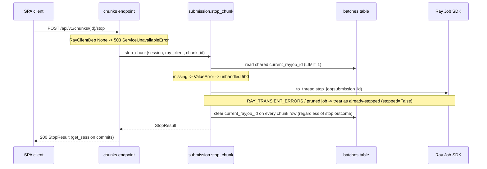
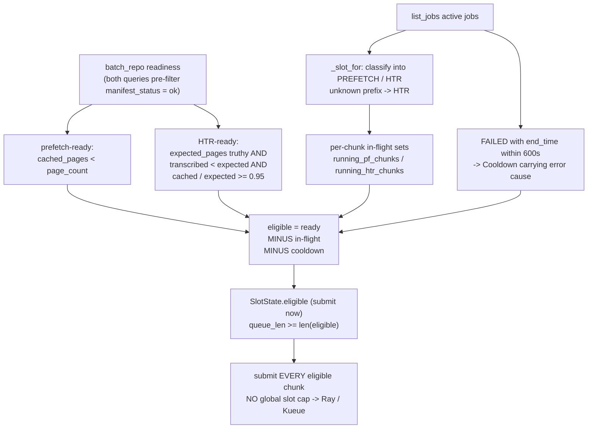
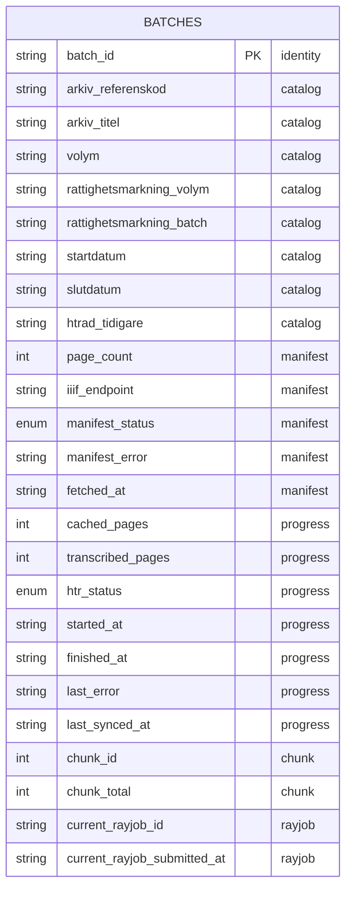
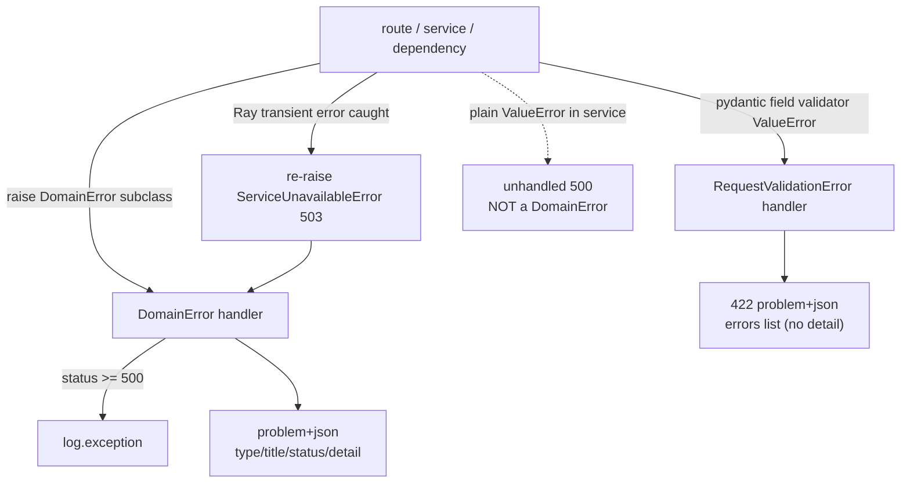

# rask — viewer service design (as-is)

Authoritative design document for the **viewer** service (`components/services/viewer`). For where the viewer sits in the wider pipeline (runner, Ray, storage, frontend) see the sibling [`system-overview.md`](./system-overview.md). This document goes one layer deeper: the viewer's internal layering, its subsystems, the orchestrator decision model, the persistence and error-handling contracts, and the non-obvious facts a new engineer needs before touching it.

> **Path convention.** Every code path below is relative to the viewer package root, `components/services/viewer/src/viewer/` — so `services/submission.py` means `components/services/viewer/src/viewer/services/submission.py`. The only exceptions, always written out in full, are the Alembic tree (`components/services/viewer/alembic/...`) and the shared storage package (`packages/storage/...`).

---

## Mental model in 60 seconds

The viewer is the only HTTP backend in `rask`. The browser SPA talks to it; it reads and writes one relational DB, counts objects in S3, talks to Ray, and runs **one background loop inside the same process** that feeds work to Ray on a timer. Heavy HTR work runs on Ray, not here — the viewer only **submits, tags, and reports**. A unit of HTR work is a *chunk* (a group of *batches*, where a batch is one volume's pages). The loop wakes up every minute, recounts what S3 holds, figures out which chunks are ready in each of its two work streams — the **prefetch lane** (cache images) and the **htr lane** (transcribe) — and submits them.

*Takeaway: the viewer is the only backend — it serves the SPA, reads/writes the DB, counts S3 keys, talks to Ray, and runs one in-process loop that submits work on a timer.*

---

## Reader's guide

| If you want to… | …read |
|---|---|
| Build intuition before any detail | [Mental model](#mental-model-in-60-seconds) + [How it works end to end](#how-it-works-end-to-end) |
| Look up a term | [Key terms](#key-terms) |
| See every external dependency | [§2 System context](#2-system-context) |
| Understand the layering / where code lives | [§3 Internal architecture](#3-internal-architecture) |
| Dig into any of the seven subsystems (§4.1–4.7) | [§4 Components in depth](#4-components-in-depth) |
| Trace a specific request or the tick | [§5 Key information flows](#5-key-information-flows) |
| Understand *why* there is no concurrency cap | [§6 Orchestrator decision model](#6-orchestrator-decision-model) |
| Reason about the DB schema and dev-vs-prod | [§7 State surface](#7-state-surface) |
| Predict what status code an error produces | [§8 Error handling](#8-error-handling) |
| Configure / deploy the service | [§9 Configuration](#9-configuration) |
| Avoid footguns before touching the code | [§10 Gotchas](#10-gotchas-and-non-obvious-facts) |

Newcomers: read top-to-bottom through §5. Operators in a hurry: §6, §9, §10.

---

## Key terms

| Term | One-line meaning |
|---|---|
| **batch** | One volume's pages; the unit catalog/manifest metadata attaches to. One row in the `batches` table. |
| **chunk** | A group of batches (same `chunk_id`) submitted to Ray as a single job. The unit the orchestrator submits. |
| **lane** | One of the two work streams the orchestrator manages: **prefetch** (cache images from IIIF→S3) and **htr** (run HTR→ALTO). Each lane has its own pipeline and eligibility rule. |
| **slot** (`SlotState`) | The derived per-lane snapshot: which chunks are `running`, which are `eligible`, and `queue_len`. Despite the name, it is *not* a concurrency limit. |
| **reconcile** | Recount S3 keys per batch and update each row's progress + `htr_status`. Done by `reconcile_from_s3`, idempotent. |
| **eligibility** | The per-lane set of chunk ids the loop may submit *right now*: `ready − in-flight − cooldown`. |
| **in-flight** | The set of chunk ids that currently have an active (RUNNING/PENDING) Ray job in that lane. Subtracted from eligibility. |
| **cooldown** | A 600s suppression after a chunk's job FAILED, so the loop doesn't immediately re-submit a failing chunk. Carries the failure cause. |
| **pipeline / `PIPELINE_SPECS`** | The registry (`models/pipelines.py`) of named runner pipelines. The four registered names are **`prefetch`**, **`htr`**, **`htrflow`**, **`fake`**. A spec's `name` is both the runner `--pipeline` value and the `submission_id` prefix. |
| **submission_id** | The Ray job id the viewer assigns: `<name>-chunk-NNN-of-MMM-<ts>`. Its prefix is parsed back to recover the pipeline (no DB linkage). |
| **orchestrator tick** | One iteration of the background loop: reconcile → derive eligibility → submit every eligible chunk. Runs every `RASK_ORCHESTRATOR_INTERVAL_SECONDS`. |
| **`hcp_endpoint` (`HCP_ENDPOINT`)** | The S3 (Hitachi Content Platform) endpoint env var. When **unset, S3 is not configured** — reconcile and `/batches/sync` short-circuit. Used throughout as the "is S3 wired up?" gate. See [§9](#9-configuration). |
| **tier** | A batch-readiness level, used three (nested) ways: the `BrowseTier` query param (`listed`/`cached`/`transcribed`, default `cached`); the readiness annotations the SPA shows on search hits; and the `listed/cached/transcribed` boolean sets in §4.6, which nest **`transcribed ⊆ cached ⊆ listed`**. |
| **Kueue** | A Kubernetes batch-queueing layer present only under the remote KubeRay deployment. It is where uncapped viewer submissions pile up; "Ray/Kueue throttles" means the cluster queue (not the viewer) bounds concurrency. |
| **`manifest_status` vs `htr_status`** | Two enum columns. `manifest_status` (e.g. `ok`) is written **upstream** by manifest harvest and gates chunk membership. `htr_status` (`pending`/`cached`/`partial`/`done`/`verification_failed`) is written by **reconcile** and tracks HTR progress. See the contrast in [§7](#manifest_status-vs-htr_status). |

---

## How it works end to end

### Life of a batch

1. **Harvested (upstream).** A separate manifest-harvest path (not the viewer) inserts the batch row and sets `manifest_status` and `page_count`. The viewer never sets these. Only rows with `manifest_status='ok'` ever count toward a chunk.
2. **Prefetch.** On each tick the orchestrator sees the batch's chunk is *prefetch-ready* (`cached_pages < page_count`), submits a prefetch Ray job, and that job copies page images into the `images-batch` cache bucket. `reconcile_from_s3` later counts those `.jpg` keys and bumps `cached_pages`; once any are cached, `htr_status` advances toward `cached`.
3. **Reaches the HTR threshold.** When the chunk's cache fraction crosses **0.95** (`cached/expected ≥ 0.95`) and it still has untranscribed pages, it becomes *HTR-ready*.
4. **HTR submitted.** The next tick submits an HTR Ray job for the chunk. The job runs `PageLoader→Layout→Lines→Transcribe→AltoExport→AltoWriter` on Ray and writes ALTO XML into the `images-batch-alto` bucket.
5. **Reconciled to done.** A later reconcile counts the `.xml` keys, bumps `transcribed_pages`, and `_classify` flips `htr_status` to `done` once everything is transcribed, stamping `finished_at`.

Throughout, the SPA reads progress over `/api/v1/*`, and full-text/catalog search reads the LanceDB tables (decorated with these same DB tiers).

### What one orchestrator tick does

The loop wakes every ~60s and runs three phases in order:

1. **Reconcile** — recount S3 keys per batch and write progress (only if `hcp_endpoint` is set).
2. **Derive** — pure, read-only: ask Ray which jobs are active, classify them into the two lanes, compute each lane's `eligible = ready − in-flight − cooldown`.
3. **Submit-all-eligible** — submit one Ray job per eligible chunk, prefetch lane then HTR lane. There is **no viewer-side cap**: it submits *every* eligible chunk and lets Ray/Kueue queue the overflow.

The sequence diagrams in [§5](#5-key-information-flows) formalize exactly this.

---

## 1. Overview & purpose

**The viewer is the only HTTP backend in rask: a FastAPI app that serves the SPA, reverse-proxies the Ray dashboard, and runs an in-process orchestrator that feeds chunks to Ray.** Concretely it:

- serves the SvelteKit SPA's `/api/v1/*` calls (batch dashboard, page viewer, full-text and catalog search, chunk submission);
- reverse-proxies the Ray dashboard so it can be embedded in an iframe;
- **hosts the in-process orchestrator** — a lifespan-managed `asyncio.Task` that periodically reconciles S3 and submits eligible chunks to Ray.

What the viewer is **not**:

- **Not authenticated.** No security middleware — only optional CORS (when `cors_origins` is set), a request-ID tagger, and timing middleware. It assumes **localhost / trusted network**.
- **Not a long-lived job engine.** Heavy work runs on Ray; the viewer only submits, tags, and reports. Stopping a chunk halts the periodic tick — already-submitted Ray jobs keep running on the cluster.
- **Not the schema owner at runtime.** It never calls `SQLModel.metadata.create_all`; Alembic owns all schema evolution.

> **Note (transitional):** the in-process orchestrator is explicitly a stopgap — pending replacement by a NATS JetStream consumer once `python-infrastructure` lands.

---

## 2. System context

**The viewer fans out to five external surfaces; everything else (the orchestrator, the dashboard proxy) lives inside the viewer process.** The five surfaces are:

- **the SPA frontend** — serves `/api/v1/*` and the built static assets;
- **the relational DB** — sqlite in dev, postgres in prod;
- **three S3 buckets** — `images-batch` (cache input), `images-batch-alto` (ALTO output), and `images-batch-search` (LanceDB `lines` + `archive_catalog` tables);
- **the IIIF source** (Riksarkivet) — read through the storage package on cache miss;
- **the Ray cluster** — Job Submission SDK + dashboard REST + Ray Serve (Serve reached only indirectly, through the jobs the viewer submits).

*Takeaway: five external surfaces cross the network; the orchestrator and proxy are internal to the viewer process, not separate services.*

The viewer never imports `boto3`/`botocore` directly — all S3 access goes through `packages/storage` (`storage.s3_client`, `iter_keys`, `build_source`). LanceDB tables live under `s3://<search_bucket>` and are opened once at startup.

---

## 3. Internal architecture

**The viewer enforces strict one-way layering: endpoints → services → repositories → models/schemas, with a cross-cutting core (config/exceptions/db/lifespan).** Endpoints do no business logic. They validate inputs at the boundary, inject resources via typed `Annotated[..., Depends(...)]` aliases, and delegate downward.

*Takeaway: dependencies flow one way only — endpoints → services → repositories → models; core is cross-cutting; nothing calls upward.*

**Typed DI aliases (`api/dependencies.py`) are the only way endpoints reach resources.** They are `SettingsDep`, `HttpDep`, `S3Dep`, `LinesTblDep`, `CatalogTblDep`, `RayClientDep`, and `SessionDep`. Each pulls a resource off `request.app.state` that lifespan populated — **never** module globals. `get_session` is the per-request unit-of-work: it yields an `AsyncSession`, commits on success, rolls back and re-raises on any exception.

---

## 4. Components in depth

Each subsystem below leads with a one-line summary, a short why/how paragraph, then compact tables for files / inputs / outputs and prose only where behavior is subtle. The orchestrator is the conceptual heart: see also [§5.2](#52-orchestrator-tick-reconcile-derive_state-submit-all-eligible) for its tick sequence and [§6](#6-orchestrator-decision-model) for the eligibility math.

### 4.1 HTTP entry layer (routers, DI, endpoint surface)

**In one line: aggregate every per-domain router into one `api_router`, mount it under `/api/v1`, and translate missing/invalid resources into domain exceptions at the boundary.**

The aggregator (`api/v1/router.py`) adds **no prefix** — each endpoint module owns its full prefix (e.g. `prefix="/batches"`). `main.py` includes `api_router` with `prefix=settings.api_prefix` exactly once, mounts `ray.proxy_router` at the root, and conditionally mounts the SPA build + `spa.router` catch-all. Endpoints guard inputs here (query bounds, path-traversal, pipeline-name validation) so services receive clean data.

| At a glance | |
|---|---|
| **Key files** | `api/v1/router.py` (aggregator, no prefix); `main.py` (single include + proxy + SPA mount); endpoint modules under `api/v1/endpoints/`: `health.py`, `volumes.py`, `batches.py`, `chunks.py`, `search.py`, `catalog.py`, `orchestrator.py`, `ray.py` — plus `spa.py`, which is a sibling file but is included by `main.py` directly, **not** by the aggregator |
| **Inputs** | HTTP requests under `settings.api_prefix`. Path params `vol`, `key:path`, `batch_id: str`, `chunk_id: int`, `thumb_path:path`, `full_path:path`. Validated query params `q` (min 1 / max 500), `limit` (ge 1 / le 500, or le 2000 for browse), `offset` (ge 0), `status: HtrStatus = DONE`, `tier: BrowseTier = CACHED`. JSON body `SubmitRequest{pipeline: str = DEFAULT_PIPELINE}` for chunk submit. DI-injected resources from `app.state`. |
| **Outputs** | Pydantic response models (`Health`, `BatchListResponse`, `RandomBatchResponse`, `CatalogHit`, `ChunkListResponse`, `SubmitResult`, `StopResult`, `SearchResponse`, `OrchestratorState`, `RayHealth`) as JSON; plus raw `Response`/`FileResponse` for image bytes, ALTO XML (`application/xml`), thumbnails (`image/jpeg`, `Cache-Control` 24h), opaque proxied Ray responses, and the SPA `index.html`. |
| **State touched** | Thin / mostly stateless. `get_session` opens/commits the per-request `AsyncSession` (writes happen here for `/batches/sync` and chunk submit/stop). `endpoints/orchestrator.py` mutates `app.state.orchestrator_task` directly. Everything else is read-only injection. |

**Endpoint surface — the easy-to-miss batches routes.** Two read-side routes hide alongside the obvious ones:

| Method | Path | Response model | Notable params / errors |
|---|---|---|---|
| `GET` | `/batches/` | `BatchListResponse` | collection list |
| `GET` | `/batches/{batch_id}` | `BatchPublic` | single read |
| `POST` | `/batches/sync` | `SyncResponse` | 503 if `hcp_endpoint` unset |
| `GET` | `/batches/random` | `RandomBatchResponse{batch_id, status}` | `status: HtrStatus = DONE`; picks a random row in that tier |
| `GET` | `/batches/{batch_id}/catalog` | `CatalogHit` | single LanceDB catalog row joined via `bild_id == batch_id`; 404 `NotFoundError` if none. Per-batch counterpart to the bulk `by_bild_ids` lookups. |

**Error handling.** Endpoints raise `DomainError` subclasses, rendered centrally as `application/problem+json`: `NotFoundError` (404) for a missing image/ALTO/catalog/thumb/batch; `ValidationError` (400) for the volumes path-traversal guard; `ServiceUnavailableError` (503) when S3 is unconfigured, `HCP_ENDPOINT` is missing on `/batches/sync`, or the Ray client is `None` on chunk submit/stop. `RequestValidationError` becomes a 422. `volumes.get_image`/`get_alto` deliberately catch broad `Exception` from `Source.read` and re-raise as `NotFoundError` (documented TODO: the storage package lacks a typed `NotFoundError`, and the viewer rule forbids reaching into botocore).

### 4.2 App lifecycle + Ray dashboard plumbing

**In one line: `create_app()` wires the app and mounts routers; `make_lifespan` builds every shared resource onto `app.state` at startup and tears it down at shutdown.**

`create_app()` (`main.py`) loads `.env`, validates `Settings`, fail-fast-validates that `htr_pipeline`/`prefetch_pipeline` are registered in `PIPELINE_SPECS`, registers exception handlers + middleware, and mounts routers. It also conditionally serves the built SPA: when `settings.resolved_spa_build` is a directory, it mounts the static assets at `/_app` (`StaticFiles(directory=build / "_app")`) and includes `spa.router`'s `index.html` catch-all. `make_lifespan(settings)` (`core/lifespan.py`) owns the resource lifecycle. `services/ray_dashboard.py` wraps the Ray Job Submission SDK and the raw dashboard REST plus a transparent reverse proxy.

| At a glance | |
|---|---|
| **Key files** | `main.py`, `core/lifespan.py`, `services/ray_dashboard.py`, `api/v1/endpoints/ray.py`, `api/v1/endpoints/health.py`, `core/db.py`, `schemas/ray.py` |
| **Inputs** | Environment + `.env` via pydantic-settings; CLI args `--input/--output/--host/--port/--reload` in `main()`; at runtime, httpx requests to `/api/v1/ray/*` and `/api/v1/health`, iframe requests to the root proxy paths, and the dashboard's own HTTP API at `settings.ray_dashboard_url`. |
| **Outputs** | `RayHealth`, `RayJobsPayload`, `RayClusterPayload`, `Health`, and a raw proxy `Response` (502 on connection failure). Side effects: spawns/cancels the orchestrator task; opens/closes httpx, LanceDB, and the SQLAlchemy async engine. |
| **State touched** | `app.state` is the central mutable surface, all set in lifespan: `settings`, `http`, `s3` (or `None`), `lance_db`/`lines_tbl`/`catalog_tbl` (or `None`), `ray_client` (cached once at boot, may be `None`), `db_engine`, `db_sessionmaker`, `orchestrator_task` (or `None`). `request.state.request_id` is set by the request-ID middleware. |

**Error handling.** `build_client` catches `RAY_TRANSIENT_ERRORS` and returns `None`, so an unreachable Ray makes the app **boot offline** instead of crashing. `health`/`list_jobs` catch the same union and return `ok=False` payloads with the error truncated to 400 chars. `cluster_status` swallows the inner `/nodes` failure so aggregate totals still return. `proxy` returns a 502 `ProxyResponse` on `httpx.HTTPError`. On shutdown the orchestrator is cancelled **first**, so the loop can't call into a closing httpx client or a disposed engine.

### 4.3 Orchestrator (periodic tick and state derivation)

*A 60s loop that reconciles S3, derives per-lane eligibility, and submits every eligible chunk.*

**In one line: `run_loop` calls `tick()` on a timer, and each tick reconciles → derives → submits every eligible chunk in both lanes.**

`tick()` runs `reconcile_from_s3` (only if `hcp_endpoint` is set) → `derive_state` → submit **every** chunk id in `state.prefetch.eligible` and `state.htr.eligible` via `submission.submit_chunk`. The interval is `settings.orchestrator_interval_seconds` (default 60s, min 10s). `derive_state` is a pure, read-only derivation shared between the loop and `GET /orchestrator/state` — so the dashboard and the loop always agree on what is eligible. See [§5.2](#52-orchestrator-tick-reconcile-derive_state-submit-all-eligible) for the tick sequence and [§6](#6-orchestrator-decision-model) for the eligibility math.

| At a glance | |
|---|---|
| **Key files** | `services/orchestrator/loop.py` (`tick` + `run_loop`); `services/orchestrator/derive.py` (lane classification, in-flight sets, cooldown, per-stage telemetry, eligibility math); `schemas/orchestrator.py` (`StageStat`, `SlimJob`, `SlotState`, `Cooldown`, `OrchestratorState`, `OrchestratorControlResponse`); `api/v1/endpoints/orchestrator.py`; `models/pipelines.py`; `repositories/batch.py` |
| **Inputs** | `derive_state` takes an `httpx.AsyncClient`, an optional `JobSubmissionClient`, `settings.ray_dashboard_url`, and an `AsyncSession`. From Ray: `ray_dashboard.list_jobs` → `RayJobsPayload.jobs`, per-job `/api/v0/tasks/summarize` JSON, and `JobSubmissionClient.get_job_info(...).job_id`. From the DB: `batch_repo.prefetch_pending_chunk_ids` and `batch_repo.chunks_with_progress` (`ChunkProgress`: chunk_id, expected_pages, cached_pages, transcribed_pages over `manifest_status='ok'` rows). |
| **Outputs** | `OrchestratorState(ok, error, prefetch, htr, cooldowns, ready_threshold=0.95, cooldown_secs=600)`. (`derive_state` never sets `running` — it stays `False`; the `GET /orchestrator/state` endpoint fills it from `is_orchestrator_running(...)` afterward.) Each `SlotState` has `running: list[SlimJob]`, `eligible: list[int]`, and `queue_len`. The loop's real output is side effects: one `submit_chunk` Ray job per eligible chunk per lane. |
| **State touched** | `derive_state` is read-only; the write happens inside `submission.submit_chunk` (tags `current_rayjob_id`). `tick()` also triggers `reconcile_from_s3` writes before deriving. Process state: `app.state.orchestrator_task`. **No global slot/concurrency counter exists.** |

**Error handling.** `derive_state` returns `ok=False` if `list_jobs` fails, and `tick()` then early-returns without submitting (it also early-returns if `ray_client` is `None` or either slot is `None`). `_driver_job_id` catches `RAY_TRANSIENT_ERRORS` → `None` (no stages). `_task_summary_for_job` catches `httpx.HTTPError` → `[]` (telemetry degrades gracefully). `run_loop` wraps each tick in `try/except Exception` with `log.exception` and continues; only `CancelledError` breaks it. A `ServiceUnavailableError` from one bad submit propagates to `tick` and aborts the rest of that tick's submissions.

### 4.4 Job submission and pipeline registry

**In one line: build the `runner` Ray Data entrypoint for one chunk, submit it off-thread via the Ray Job SDK, and tag/clear `current_rayjob_id` on the chunk's Batch rows.**

Pipeline identity is owned by `PIPELINE_SPECS`, whose four registered names are **`prefetch`**, **`htr`** (the default), **`htrflow`**, and **`fake`**. A spec's `name` doubles as the runner `--pipeline` value **and** the `submission_id` prefix — there is no DB linkage, so the string is parsed back to recover the pipeline. The built entrypoint must stay byte-identical to the runner CLI in `components/apps/runner/src/runner/main.py`.

| At a glance | |
|---|---|
| **Key files** | `services/submission.py` (`chunk_name`, `build_entrypoint`, `_fetch_chunk_batches`, `submit_chunk`, `stop_chunk`); `models/pipelines.py` (`Slot` StrEnum, `PipelineSpec`, `PIPELINE_SPECS`, `DEFAULT_PIPELINE`, `spec_for_submission_id`, `_validate_registry`); `core/config.py` (`RunnerParams`, `Settings.runner_params()`); `api/v1/endpoints/chunks.py`; `schemas/chunk.py`; `models/batch.py`; `models/enums.py` |
| **Inputs** | `chunk_id` path param + `SubmitRequest{pipeline}` body; injected `SessionDep`, `SettingsDep`, `RayClientDep`. Chunk membership reads `batches` rows where `chunk_id` matches **and** `manifest_status='ok'`, ordered by `batch_id`. Env passthrough is filtered to keys starting with `AWS_`, `HCP_`, `IIIF_`, `RASK_`. |
| **Outputs** | `SubmitResult{chunk_id, chunk_total, pipeline, submission_id, batches}` and `StopResult{chunk_id, stopped_submission_id, stopped}`. Ray side effect: a job with submission_id `<name>-chunk-NNN-of-MMM-<ts>`, `runtime_env{working_dir, env_vars}`, and `metadata{chunk_id, chunk_total, batches}`. |
| **State touched** | DB writes to the `batches` table only. For specs with `tracks_rayjob_id=True` (all four current specs), `submit_chunk` sets `current_rayjob_id` + `current_rayjob_submitted_at` on every row of the chunk and commits; `stop_chunk` clears both back to `None` regardless of stop outcome. |

**Error handling.** `RayClientDep is None` → `ServiceUnavailableError` (503). An unknown pipeline name → 422 via the `RequestValidationError` handler (**not** the domain path). The Ray submit is wrapped in `to_thread` and `except RAY_TRANSIENT_ERRORS` → re-raised as `ServiceUnavailableError`. **Footgun:** a plain `ValueError` (e.g. `'no batches found'`, `'no running job'`) is **not** a `DomainError`, so it surfaces as an unhandled 500.

### 4.5 S3 reconcile + image/ALTO serving

**In one line: derive per-batch HTR progress by counting objects across the cache and ALTO buckets, and stream individual page images/ALTO XML through the storage package.**

`reconcile_from_s3` counts keys per `<batch_id>/` prefix and writes progress; it picks the concrete `Source` impl purely from the configured URI scheme via `storage.build_source`. `_classify` then maps `(expected, cached, transcribed)` to an `HtrStatus`. Reconcile does **not** set `manifest_status`/`page_count` — those come from the separate upstream manifest-harvest path (see [§7](#manifest_status-vs-htr_status)).

| At a glance | |
|---|---|
| **Key files** | `services/sync.py` (`reconcile_from_s3`, `_count_per_batch`, `_classify`); `api/v1/endpoints/batches.py` (`POST /batches/sync` + batch reads); `api/v1/endpoints/volumes.py` (page listing, image/ALTO streaming, `_require_under_volume` guard); `schemas/sync.py`; `models/enums.py` (`HtrStatus`); `models/batch.py`; plus `packages/storage/src/storage/uri.py`, `packages/storage/src/storage/s3.py`, `packages/storage/src/storage/client.py` |
| **Inputs** | Every `Batch` row + two S3 bucket listings (cache keys ending `.jpg`, output keys ending `.xml`) from `s3_client(endpoint=hcp_endpoint)`. Volumes endpoints take `vol` + `key:path` and the `settings.viewer_input`/`viewer_output` URIs. |
| **Outputs** | `reconcile_from_s3` returns `SyncResult` and commits mutated rows; `POST /batches/sync` returns `SyncResponse` (full post-sync snapshot). `GET /volumes/{vol}/pages` returns `list[PageEntry]{key, hasAlto}`; `/image` and `/alto` return raw byte `Response`s. |
| **State touched** | Mutates `batches`: per row always sets `cached_pages`, `transcribed_pages`, `htr_status`, `last_synced_at`; sets `started_at` once when cached>0, and `finished_at` once when status becomes DONE. Single commit only if rows exist. |

**`_classify` priority ladder.** It maps `(expected, cached, transcribed)` to `HtrStatus` with the priority **DONE > PARTIAL (any transcript) > CACHED (full cache) > PARTIAL (partial cache) > PENDING**.

**Error handling.** `POST /batches/sync` raises `ServiceUnavailableError` (503) when `hcp_endpoint` is unset. `get_image`/`get_alto` catch any exception from `Source.read` and re-raise as `NotFoundError` (404). `_require_under_volume` raises `ValidationError` (400). `reconcile` itself has **no try/except** — a transient S3 failure aborts the pass, and because reconcile is idempotent, a later tick recovers.

### 4.6 Catalog + full-text search (read-side discovery)

**In one line: two stateless, read-only sub-routers run full-text and bulk queries against LanceDB, decorating results with batch-status tiers from the relational DB — never mutating pipeline state.**

Both sub-routers query LanceDB tables in the search bucket and annotate hits with `listed/cached/transcribed` tier booleans computed from the relational `Batch` table. They never write either store.

| At a glance | |
|---|---|
| **Key files** | `services/discover/catalog.py` (FTS over `archive_catalog`, browse-by-tier, the bulk `by_bild_ids` lookup **and** the single-row `by_bild_id` helper backing `GET /batches/{id}/catalog`); `services/discover/search.py` (FTS over `lines`, thumbnail proxy); `api/v1/endpoints/catalog.py`; `api/v1/endpoints/search.py`; `schemas/catalog.py`; `schemas/search.py`; `services/batches.py` (`local_batch_status` → `BatchStatusSets`); `schemas/batch.py` (`BatchStatusSets`); `repositories/batch.py` (`count_at_tier`/`browse_at_tier`/`by_ids`) |
| **Inputs** | Validated query params (`q`, `limit`, `offset`, `tier`); LanceDB tables `archive_catalog` and `lines` under `s3://<search_bucket>` (opened in lifespan); the relational `Batch` table for status tiers; the search bucket for thumbnail JPEGs under `thumbs/`. |
| **Outputs** | `CatalogSearchResponse`/`CatalogBrowseResponse` (hits as `CatalogHit` with `listed/cached/transcribed` booleans); a bare `CatalogHit` from `by_bild_id` (consumed by `GET /batches/{id}/catalog`); `SearchResponse` (hits as `SearchHit` = `LineRow` + `thumb_url` + optional nested catalog); `CatalogStats`/`SearchStats`; raw `/thumb` JPEG bytes. |
| **State touched** | Read-only. Queries LanceDB and the relational `Batch` table; never writes either. `get_session` commits on success, but discovery issues only SELECTs so the commit is a no-op. LanceDB `AsyncTable` handles are process-global on `app.state`. |

**Tier booleans and the two lookups.** The `listed/cached/transcribed` booleans come from `services.batches.local_batch_status`, which returns `BatchStatusSets{listed, cached, transcribed}` of `batch_id` sets for a given list of `bild_id`s — **strictly nested:** `transcribed ⊆ cached ⊆ listed`. `by_bild_ids` is the bulk LanceDB scan that hydrates browse; `by_bild_id` is the single-row `col("bild_id").eq(...)` lookup.

**Error handling.** Graceful degradation: if a table failed to open it is `None` on `app.state`, and every service entry guards `if tbl is None` and returns empty hits or `{available: false, rows: 0}`. Lance queries take an explicit per-call timeout. `_validate_bild_ids` regex-guards bulk lookups (`^[A-Za-z0-9._-]+$`) and raises `ValidationError` (400) because the IN-clause is string-interpolated (an injection guard). `fetch_thumb` enforces the `thumbs/` prefix and swallows all exceptions to `None`, which the endpoint turns into `NotFoundError` (404).

### 4.7 Persistence layer (Batch SQLModel + repositories + Alembic)

**In one line: a single denormalized `batches` table whose StrEnum columns round-trip identically on sqlite and postgres, fronted by async read/aggregate repositories, with schema owned exclusively by Alembic.**

One async engine is selected purely by `DATABASE_URL`. Repositories return named Pydantic schemas, not raw tuples. There is **no** `SQLModel.metadata.create_all` anywhere — Alembic owns every schema change.

| At a glance | |
|---|---|
| **Key files** | `models/batch.py` (`Batch`/`BatchBase`/`BatchPublic`, `_str_enum_col`, `metadata.naming_convention`); `models/enums.py` (`HtrStatus`, `ManifestStatus`, `BrowseTier`, `RayStage`, `TaskState`); `repositories/batch.py` (all async queries); `schemas/chunk.py`; `schemas/batch.py`; `core/config.py` (`resolved_database_url`); `core/db.py` (`make_engine`, `make_sessionmaker`); `api/dependencies.py` (`get_session`); plus `components/services/viewer/alembic/env.py` and `components/services/viewer/alembic/versions/d9006d8e6298_create_batches_table.py` |
| **Inputs** | An `AsyncSession` plus query params (`batch_id`, `batch_ids`, `status`, `tier`, `limit`/`offset`). Writes (in services, not the repo) set `Batch.htr_status`, `Batch.current_rayjob_id`, etc. |
| **Outputs** | Single-row reads return `Batch` instances; aggregates return named schemas (`StatusCounts`, `BatchAccessibleSummary`, `Chunk`, `ChunkProgress`, `BrowseRow`, `list[int]`, `int`, `str | None`). |
| **State touched** | The `batches` table (PK `batch_id`). On postgres, two native ENUM types `manifeststatus` and `htrstatus` are also created. Engine + sessionmaker on `app.state`. |

**Error handling.** Repositories never catch exceptions; the transaction boundary is `get_session` (commit on success, rollback + re-raise on exception, so a failing request never half-commits). NULL aggregates are guarded with `func.coalesce(..., 0)`; NULL statuses bucket under `"unknown"`.

---

### Error handling at a glance

| Subsystem | What it catches / raises | Result |
|---|---|---|
| 4.1 HTTP entry | `DomainError` subclasses; broad `Exception` on image/ALTO read | 404 / 400 / 503 problem+json; image read → 404 |
| 4.2 Lifecycle + Ray | `RAY_TRANSIENT_ERRORS` → `None`; `httpx.HTTPError` on proxy | boot offline; `ok=False` payloads; 502 on proxy |
| 4.3 Orchestrator | `list_jobs` fail → `ok=False`; tick early-return; per-tick `try/except` | no submits that tick; loop continues |
| 4.4 Submission | `RayClientDep None`; `RAY_TRANSIENT_ERRORS`; plain `ValueError` | 503; 503; **unhandled 500** |
| 4.5 Reconcile/serve | broad `Exception` on `Source.read`; path guard; no try/except in reconcile | 404; 400; aborted pass, recovered next tick |
| 4.6 Discover | `tbl is None` guards; bild-id regex; thumb swallow | empty hits / `available:false`; 400; 404 |
| 4.7 Persistence | none in repo; `get_session` is the boundary | rollback + re-raise on failure |

---

## 5. Key information flows

The three diagrams below formalize the narrative in [How it works end to end](#how-it-works-end-to-end). Solid arrows are calls; notes flag the error/early-return paths.

### 5.1 Manual chunk submit — `POST /chunks/{id}/submit`

*Takeaway: manual submit has no eligibility guard — it always tries Ray (owned by [§4.4](#44-job-submission-and-pipeline-registry)).*

### 5.2 Orchestrator tick (reconcile, derive_state, submit-all-eligible)

This is the conceptual heart. Watch for the three phases: **reconcile → derive → submit-all-eligible**.

*Takeaway: the tick reconciles, derives eligibility, then submits every eligible chunk (owned by [§4.3](#43-orchestrator-periodic-tick-and-state-derivation); math in [§6](#6-orchestrator-decision-model)).*

### 5.3 Stop a chunk — `POST /chunks/{id}/stop`

*Takeaway: stop always clears the rayjob tag even if Ray already pruned the job (owned by [§4.4](#44-job-submission-and-pipeline-registry)).*

---

## 6. Orchestrator decision model

**`derive_state` computes per-lane eligibility as a set difference, and there is no global slot cap — concurrency is delegated entirely to Ray/Kueue queue overflow.** The **per-chunk in-flight set** (built from active RUNNING/PENDING jobs) plus the **600s failure cooldown** are the only re-submit guards. The manual `POST /chunks/{id}/submit` endpoint has **no guard at all**; only the auto-loop consults eligibility.

*Takeaway: eligible = ready − in-flight − cooldown; there is no global cap — Ray/Kueue is the only throttle.*

**Per-lane math:** `eligible = ready − per-chunk-in-flight − failure-cooldown`. A chunk with `expected_pages == 0` is never HTR-eligible (this avoids a ZeroDivision and re-submitting done chunks). `htrflow`/`fake` specs carry `stages=()`, so HTR-lane jobs of those pipelines show **no** per-stage bars rather than wrong ones.

---

## 7. State surface

**One async engine is selected at runtime purely by `DATABASE_URL`.** Explicit `DATABASE_URL` wins (`postgresql+asyncpg://…` for prod). Otherwise the engine falls back to `sqlite+aiosqlite` at `resolved_batches_db` (`.cache/batches.db` for dev), via `Settings.resolved_database_url`. `make_engine` adds pool/pre_ping/recycle/timeout knobs **only** for server DBs; sqlite skips pooling.

**Alembic owns the schema exclusively.** There is **no `SQLModel.metadata.create_all`** anywhere in startup/lifespan — dev/CI must run `make pg-migrate` (or `dagger call migrate-up`).

Three S3 buckets back the pipeline:

| Bucket (default name) | Role | Keys |
|---|---|---|
| `images-batch` | cache input | `.jpg` |
| `images-batch-alto` | ALTO output | `.xml` |
| `images-batch-search` | LanceDB `lines` + `archive_catalog` | LanceDB tables |

Ray Serve keeps TrOCR/htrflow weights **warm across job submissions** — the viewer never deploys Serve; it only submits jobs whose actors call the warm handle.

The `batches` table is a single denormalized table. The six concerns its 25 columns fall into:

| Concern | Columns |
|---|---|
| identity | `batch_id` (PK) |
| catalog metadata | `arkiv_referenskod`, `arkiv_titel`, `volym`, `rattighetsmarkning_volym`, `rattighetsmarkning_batch`, `startdatum`, `slutdatum`, `htrad_tidigare` |
| manifest (upstream) | `page_count`, `iiif_endpoint`, `manifest_status`, `manifest_error`, `fetched_at` |
| HTR progress | `cached_pages`, `transcribed_pages`, `htr_status`, `started_at`, `finished_at`, `last_error`, `last_synced_at` |
| chunk | `chunk_id`, `chunk_total` |
| rayjob tracking | `current_rayjob_id`, `current_rayjob_submitted_at` |

*Takeaway: one denormalized table; the two enum columns round-trip identically on sqlite and postgres.*

**`_str_enum_col` round-trip.** The `SAEnum(values_callable=...)` trick persists the lowercase enum **value**, so statuses round-trip identically against a postgres native ENUM and a sqlite VARCHAR.

### `manifest_status` vs `htr_status`

These two enum columns are the data model's core and are constantly contrasted. They differ in values, owner, and what they gate:

| | `manifest_status` | `htr_status` |
|---|---|---|
| **Type** | `ManifestStatus` ENUM | `HtrStatus` ENUM |
| **Values** | e.g. `ok` | `pending` / `cached` / `partial` / `done` / `verification_failed` |
| **Who writes it** | the **upstream manifest-harvest** path (not the viewer) | the viewer's `reconcile_from_s3` / `_classify` |
| **What it gates** | chunk membership — only `manifest_status='ok'` rows count toward a chunk, and both orchestrator readiness queries (`prefetch_pending_chunk_ids`, `chunks_with_progress`) pre-filter to those rows | HTR progress / readiness tiers shown in the SPA |

---

## 8. Error handling

**Routes and services raise `DomainError` subclasses — never `HTTPException` — so the wire shape changes in exactly one place.** The registered handlers in `core/exceptions.py` render two distinct shapes:

- **`DomainError`** → RFC 9457 `application/problem+json`: `{type: "about:blank#<classname-lowercased>", title, status, detail}`. Subclasses: `NotFoundError` (404), `ValidationError` (400), `ServiceUnavailableError` (503), base `DomainError` (500). `log.exception` fires **only** for status ≥ 500 — 503 and all 4xx return silently.
- **`RequestValidationError`** → 422 with a structured list: `{type: "about:blank#validation", title: "Validation Error", status: 422, errors: [{field, message, type}]}`. Note this shape carries `errors`, not `detail`.

**Ray transient errors are mapped at the boundary.** The `RAY_TRANSIENT_ERRORS` tuple (`RuntimeError`, `ConnectionError`, `requests.exceptions.RequestException`, ray `AuthenticationError`) is caught in `submit_chunk`/`stop_chunk` and re-raised as `ServiceUnavailableError` (503).

*Takeaway: one DomainError path and one 422 path are handled; a plain `ValueError` (dotted) is NOT a DomainError and leaks as a 500.*

> **Footgun (asymmetry to remember):** an unknown pipeline name in `SubmitRequest` goes through the **422** `RequestValidationError` path, not the 400 domain `ValidationError` path. And a plain `ValueError` raised inside a service (e.g. `'no batches found'`, `'no running job'`) is **not** a `DomainError`, so it escapes as an unhandled 500.

---

## 9. Configuration

**All config is a single `Settings(BaseSettings)` in `core/config.py`** (`env_file='.env'`, `extra='ignore'`, `case_sensitive=False`), read once via `Settings.model_validate({})` in `create_app` and threaded through DI.

**Env vars (selected).**

| Alias | Field | Default / bound |
|---|---|---|
| `RASK_VIEWER_INPUT` | `viewer_input` | **required** |
| `RASK_VIEWER_OUTPUT` | `viewer_output` | **required** |
| `RASK_API_PREFIX` | `api_prefix` | `/api/v1` |
| `RASK_CORS_ORIGINS` | `cors_origins` | `[]` |
| `HCP_ENDPOINT` / `AWS_ACCESS_KEY_ID` / `AWS_SECRET_ACCESS_KEY` | S3 endpoint + creds | `None` (unset) |
| `AWS_REGION` | `aws_region` | `us-east-1` |
| `RASK_SEARCH_BUCKET` / `RASK_CACHE_BUCKET` / `RASK_OUTPUT_BUCKET` | buckets | `images-batch-search` / `images-batch` / `images-batch-alto` |
| `RASK_IIIF_URL` | `iiif_url` | `https://iiifintern-ai.ra.se` |
| `RASK_LINES_TABLE` / `RASK_CATALOG_TABLE` | Lance tables | `lines` / `archive_catalog` |
| `RAY_DASHBOARD_URL` | `ray_dashboard_url` | `http://localhost:8265` |
| `DATABASE_URL` / `RASK_BATCHES_DB` | DB | sqlite at `.cache/batches.db` |
| `RASK_SPA_BUILD` | `spa_build_dir` | `<repo_root>/components/apps/frontend/build` (via `resolved_spa_build`) |
| `DB_POOL_SIZE` / `DB_MAX_OVERFLOW` / `DB_POOL_RECYCLE_SECONDS` / `DB_POOL_TIMEOUT_SECONDS` / `DB_QUERY_TIMEOUT_SECONDS` | pool | 10 / 20 / 1800 / 30 / 60 |
| `RASK_LANCE_QUERY_TIMEOUT_SECONDS` | Lance timeout | 30 |
| `RASK_ORCHESTRATOR_AUTOSTART` | `orchestrator_autostart` | `False` |
| `RASK_ORCHESTRATOR_INTERVAL_SECONDS` | interval | 60 (ge 10) |
| `RASK_HTR_PIPELINE` / `RASK_PREFETCH_PIPELINE` | lane pipelines | `htr` / `prefetch` |

`http_timeout` (15.0) and `repo_root` (`Path(__file__).resolve().parents[6]`) have **no env alias**.

> **Footgun (LanceDB disabled silently):** `lance_storage_options()` returns `None` — disabling LanceDB entirely — unless **all three** of `hcp_endpoint`, `aws_access_key_id`, `aws_secret_access_key` are set.

> **Footgun (typos swallowed):** `extra='ignore'` means a misspelled `RASK_*` env name is silently dropped — no error. (Cross-reference: [§10.6](#106-persistence-and-config).)

**RunnerParams.** `Settings.runner_params()` builds a frozen `RunnerParams(repo_root, cache_bucket, output, iiif_url)`, centralizing the `s3://<output_bucket>` prefix.

> **Note (scheme asymmetry):** `output` is `s3://<output_bucket>` (with scheme) while `cache_bucket` is a **bare bucket name** (no scheme) — matching the runner CLI's expectations.

**Startup validation.** `create_app` calls `_validate_pipeline_settings`, which raises a plain `ValueError` (crashing boot) if `settings.htr_pipeline` or `settings.prefetch_pipeline` is not a key in `PIPELINE_SPECS`. Separately, `pipelines._validate_registry()` runs at import (names non-empty, unique, equal to their key, `DEFAULT_PIPELINE` registered).

---

## 10. Gotchas and non-obvious facts

Every gotcha from the codebase is preserved below, grouped by theme and ordered by blast radius. Items tagged **Footgun:** can break production or double-submit work; untagged items are merely surprising design facts. The highest-impact few:

> **Footgun:** the viewer **boots offline** if Ray is down at boot (§10.2); manual submit has **no double-submit guard** (§10.3); the **`submission_id` prefix is load-bearing** with no DB linkage (§10.3); `build_entrypoint` must stay **byte-identical** to the runner CLI (§10.3); the discover **`thumb_url` omits `/v1` and 404s** (§10.5).

### 10.1 HTTP routing & surface

- **Router prefixes.** Each endpoint module owns its **full** prefix; `router.py` adds none, and `main.py` applies `settings.api_prefix` once at include time. Real paths are e.g. `/api/v1/batches/` (with the trailing slash — collection routes are declared as `"/"`), not `/batches`.
- **Two routers in `ray.py`.** `router` (normalized `/ray/*`, in OpenAPI) and `proxy_router` (root-mounted, no API prefix, `include_in_schema=False`) reverse-proxy Ray's own hardcoded dashboard URLs. The proxy strips hop-by-hop + frame-busting headers (`x-frame-options`, `content-security-policy`) both ways so the dashboard can embed same-origin.
- **Route ordering.** `spa.router`'s `GET /{full_path:path}` catch-all is added **last** so it only catches unmatched paths, always falling back to `index.html`.

### 10.2 Ray client lifecycle & telemetry coupling

- **Footgun — Ray client is built once at boot.** It is cached on `app.state.ray_client` and **not** rebuilt by the request-path deps. If Ray is down at boot, `RayClientDep` stays `None` for the process lifetime, and `/ray/*` + chunk submission report offline until restart. **Only the orchestrator loop re-attempts `build_client` each tick** while its local client is `None`.
- **`RayHealth.client_ray_version` is the VIEWER's `ray.__version__`**, not the cluster's — a deliberate name to avoid implying it's the cluster version under KubeRay client/server skew.
- **`RayJob` mirrors Ray's Pydantic-V1 `JobDetails`** (`d.dict()`, not `model_dump()`, `extra='allow'`). `driver_exit_code`/`error_type`/`message` are surfaced specifically to expose **exit 137 (SIGKILL / host-RAM OOM)**, the dominant silent HTR failure.
- **Per-stage telemetry is string-coupled to Ray.** It queries task names of the exact form `MapWorker(MapBatches(<RayStage>)).submit` and reads external-API `state_counts` strings (`TaskState`, not a Ray public enum); a Ray-side rename silently zeroes the bars. `start_time` is kept in **milliseconds** in `SlimJob` (the frontend's `fmtRuntime` expects ms).
- **Orchestrator state is process-local.** Stop only halts the periodic tick; already-submitted Ray jobs keep running, and the loop dies on viewer restart — the transitional pattern pending NATS JetStream.

### 10.3 Concurrency & submission safety

- **Footgun — no global concurrency cap.** Concurrency is Ray/Kueue's job. The per-chunk in-flight set + 600s cooldown are the only auto-loop guards; manual submit has none and **can double-submit a running chunk**.
- **`tick()` submits every eligible id each tick.** If Ray is slow to report a just-submitted job as active within one interval, the same chunk could in principle be re-submitted — eligibility relies on `list_jobs` reflecting the new job.
- **Lane classification defaults unknown ids to HTR.** An out-of-band job with a weird submission_id silently counts against the HTR lane's in-flight set. Cooldowns are re-derived from `Cooldown.submission_id` (the authoritative source), not `Cooldown.pipeline`.
- **Footgun — the `submission_id` prefix is load-bearing.** It carries no DB linkage; `spec_for_submission_id` parses it (longest-match) so `_slot_for`/`_stages_for` work purely off the string. The trailing UTC timestamp suffix exists because Ray's REST API rejects duplicate submission_ids even for completed jobs — without it, stop+resubmit would fail.
- **Footgun — `build_entrypoint` must stay byte-identical** to the runner CLI; it is a hand-built string, not Ray `runtime_env` serialization. `extra_args` is empty for all four current specs.
- **All four specs set `tracks_rayjob_id=True`, including prefetch** — a deliberate fix for the "prefetch-stop bug" where prefetch was excluded and `stop_chunk` raised `'no running job'`.
- **All batches in a chunk share ONE `current_rayjob_id`**; `stop_chunk` reads it `LIMIT 1`. There is no per-batch job tracking. Chunk membership excludes any row whose `manifest_status != 'ok'`.

### 10.4 S3 reconcile & classification

- **Reconcile counts keys, not pairs.** Progress is inferred by counting objects per `<batch_id>/` prefix; `transcribed_pages` can diverge from `cached_pages` with no per-page correspondence check.
- **`_classify` and unknown `page_count`.** With `page_count` unknown, any cache counts as full cache (jumps straight to CACHED) and a fully transcribed batch only reaches PARTIAL, never DONE — so `finished_at` is never stamped without a known `page_count`. `VERIFICATION_FAILED` is a valid `HtrStatus` value but `_classify` never emits it.
- **`sync.py` docstring is stale.** It mentions boto3, but the code only uses the storage package and never touches boto3 directly.

### 10.5 Search & Lance

- **Footgun — discover `thumb_url` path mismatch.** `search.py` hardcodes `/api/search/thumb/...` but the router is mounted under `settings.api_prefix` (default `/api/v1`), so the real endpoint is `/api/v1/search/thumb/...` — the emitted URL omits `/v1` and **will 404** unless rewritten.
- **`browse()` inverts the join vs `catalog_search()`.** Browse pages batch_ids from the ORM then hydrates from Lance, dropping any batch with no catalog row — so `count` can be less than the ORM tier `total`. `catalog_search()` goes Lance-first, then annotates from the ORM.
- **Lance projection follows Pydantic field order.** `_CATALOG_COLS = list(CatalogRow.model_fields)` etc. — reordering/renaming a schema field silently changes the Lance SELECT. `bild_id` IS the `batch_id` join key (implicit, no FK). `nearest_to_text` is the FTS path (BM25-style), not vector similarity. `SearchHit.catalog` is reserved and never populated by `search_lines`.

### 10.6 Persistence and config

- **`naming_convention` MUST be set before any `table=True` class** (it is, at the top of `models/batch.py`), or Alembic autogenerates anonymous constraint names and rollbacks break.
- **`chunks_summary` is three queries by design** — sqlmodel's typed `select()` overloads cap at four columns, so the 7-field `Chunk` is reassembled in Python.
- **`alembic/env.py` resolves the DB URL itself** (DATABASE_URL else RASK_BATCHES_DB else `.cache/batches.db`) rather than importing `Settings`, deliberately avoiding `Settings`' mandatory `RASK_VIEWER_INPUT/OUTPUT` at construction. `render_as_batch=True` + `compare_type=True` make migrations work under sqlite's limited ALTER while detecting type changes.
- **`expire_on_commit=False`** on the sessionmaker means ORM objects stay usable after the dependency commits, so response serialization doesn't trigger lazy reloads on a closed session.
- **`extra='ignore'` on `Settings`** means typos in `RASK_*` env names are silently dropped (see also [§9](#9-configuration)). `resolved_database_url` is the only thing `db.py` keys off of, so the bounds-checked `DB_POOL_*` vars are inert in sqlite/dev.
