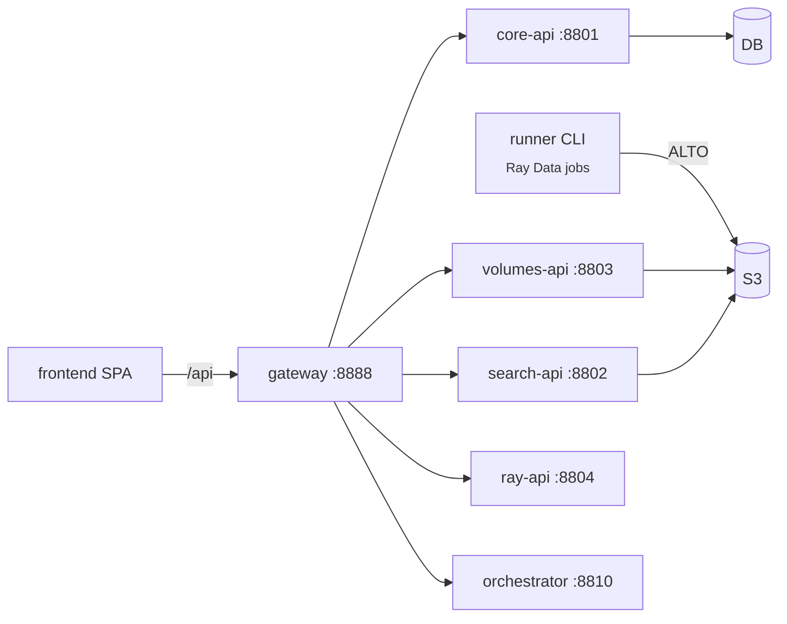

# Apps

`components/apps/` holds the two runnable applications: the **runner** CLI and
the **frontend** SPA.

## Runner — `components/apps/runner`

A Typer CLI (`runner`) that builds **one Ray Data pipeline per invocation**,
triggers execution, and exits. It is the engine the orchestrator submits as a
Ray Job per chunk. See [Projects → Runner](../projects/runner.md) for the
full flag reference and pipeline construction; in brief:

```bash
uv run --project projects/runner runner \
  --cache-bucket images-batch \
  --output s3://images-batch-alto \
  --iiif-url https://iiifintern-ai.ra.se \
  --pipeline htr \
  --batch A0060198
```

- `--input` / `--batch` select the source (`--batch` implies the IIIF
  read-through cache); `--output` the sink; `--pipeline` one of
  `htr` / `htrflow` / `prefetch` / `fake`.
- `--address ray://…:10001` connects to a remote KubeRay cluster; without it the
  runner runs local Ray.
- The runner is **resumable** — it lists existing `.xml` output and processes
  only the diff.

The GPU model deployments (`/transcribe`, `/htrflow`) live in
`runner/transcribe_service.py` and `runner/htrflow_service.py` and are deployed
separately via `deploy_serve.py`; the pipeline actors call them over Serve
handles.

## Frontend — `components/apps/frontend`

A **SvelteKit** SPA (`adapter-static`, fully client-rendered) that consumes the
backend API through the **gateway**. See [UI Components](ui.md) for routes, the
component model, and the dev/proxy setup. In brief:

- Talks to the backend through a single `$lib/api.ts` client over same-origin
  `fetch('/api/...')`; the Vite dev server proxies `/api` to `:8888` (the
  gateway, or the `make viewer` monolith for single-process dev).
- Provides the batch dashboard, document viewer (zoom/pan + ALTO overlay),
  line/catalog search, and a full set of Ray dashboard views (jobs, cluster,
  serve, actors, logs).
- Built with `make viewer-frontend` (dev) or `bun run build` (static).


