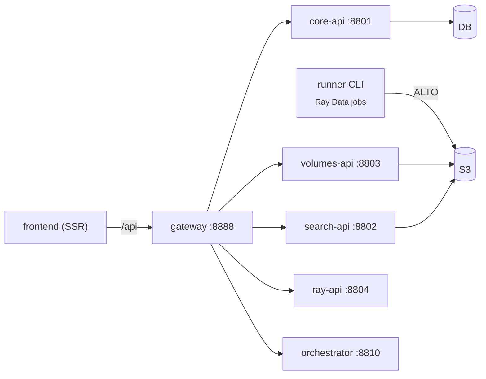

# Apps

`components/apps/` holds the **runner** CLI plus the seven SvelteKit
microfrontends — **frontend** (the `viewer-frontend` catch-all owning `/`)
plus six domain apps (**overview**, **compute**, **discover**, **storage**,
**train**, **studio**) — each an SSR Bun-server app.

## Runner — `components/apps/runner`

A Typer CLI (`runner`) that builds **one Ray Data pipeline per invocation**,
triggers execution, and exits. It is the engine the orchestrator submits as a
Ray Job per chunk. See [Projects → Runner](../projects/runner.md) for the
full flag reference and pipeline construction; in brief:

```bash
uv run --project projects/runner runner \
  --cache-bucket images-batch \
  --output s3://images-batch-alto \
  --iiif-url https://iiifintern-ai.ra.se \
  --pipeline htr \
  --batch A0060198
```

- `--input` / `--batch` select the source (`--batch` implies the IIIF
  read-through cache); `--output` the sink; `--pipeline` one of
  `htr` / `htrflow` / `prefetch` / `fake`.
- `--address ray://…:10001` connects to a remote KubeRay cluster; without it the
  runner runs local Ray.
- The runner is **resumable** — it lists existing `.xml` output and processes
  only the diff.

The GPU model deployments (`/transcribe`, `/htrflow`) live in
`runner/transcribe_service.py` and `runner/htrflow_service.py` and are deployed
separately via `deploy_serve.py`; the pipeline actors call them over Serve
handles.

## Frontend — `components/apps/frontend`

A **SvelteKit 2 + Svelte 5** app rendered SSR via `svelte-adapter-bun` (a real
Bun server) that consumes the backend API through the **gateway**. See [UI Components](ui.md) for routes, the
component model, and the dev setup. In brief:

- Talks to the backend through the shared `@rask/api` package (`packages/api`,
  with `batches`/`ray`/`search`/`volumes`/`gateway`/`types` modules behind a
  single barrel export). Reads run **server-only** via remote `query()`
  functions that call `@rask/api` with `getRequestEvent().fetch`; a per-app
  `src/hooks.server.ts` (`makeGatewayHandleFetch`) routes those SSR `/api/*`
  fetches to the gateway on `:8888` (storage-frontend instead uses an absolute
  `RASK_GATEWAY_URL`).
- The `frontend` catch-all owns `/` (the platform home — a floating GSAP glass
  navbar + project picker). The product surfaces are split across the domain
  apps: the batch dashboard (**overview**), document viewer (zoom/pan + ALTO
  overlay) and line/catalog search (**discover**), and the Ray dashboard views —
  jobs, cluster, serve, actors, logs — (**compute**). Every domain app renders
  the shared `@rask/ui/shell` sidebar.
- Run the catch-all in dev with `make viewer-frontend` (`:5173`); run all seven
  apps behind the Turborepo microfrontends proxy on `:3024` with
  `make dev-frontends`. `bun run build` produces each SSR Bun-server bundle (run
  with `bun ./build/index.js`).


