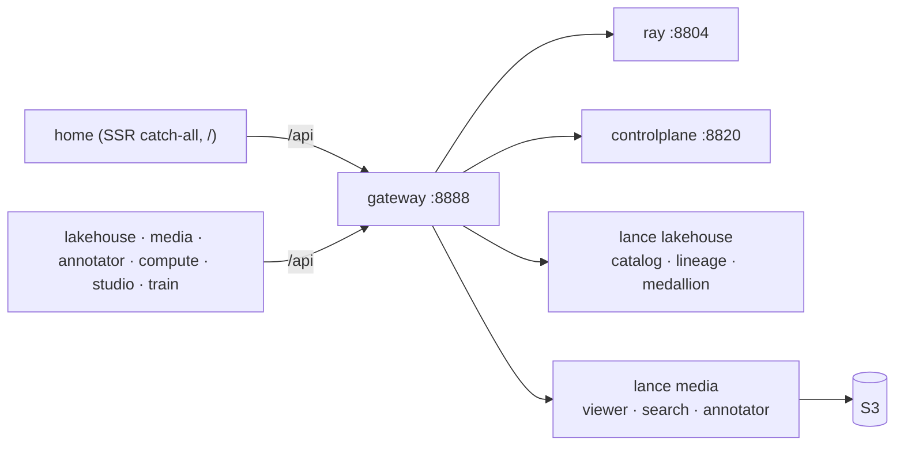

# Frontends

`frontend/microfrontends/` holds the seven SvelteKit microfrontends — **home** (the
catch-all owning `/`) plus six domain apps (**overview**, **compute**, **discover**,
**storage**, **train**, **studio**) — each an SSR Bun-server app
(`svelte-adapter-bun`) that consumes the backend API through the **gateway**.

> The **runner** is not a frontend — it's a CLI under `runners/htr`
> (the Ray Data pipeline engine). See [reference/runner](../reference/runner.md)
> and [Projects → Runner](../projects/runner.md).

## The apps

- **Data layer.** Reads run **server-only** via remote `query()` functions that
  call `@rask/api` (`frontend/packages/api`) with `getRequestEvent().fetch`; a per-app
  `src/hooks.server.ts` (`makeGatewayHandleFetch`) routes those SSR `/api/*`
  fetches to the in-cluster gateway. All four data apps (**overview**, **compute**,
  **discover**, **storage**) carry the **identical** hook — `storage` just parses
  local valibot schemas because the volumes endpoints aren't in `@rask/api` yet.
- **home** (catch-all) owns `/` — the platform home (a floating GSAP glass navbar +
  project picker), no sidebar. The product surfaces are split across the domain
  apps: the batch dashboard (**overview**), document viewer (zoom/pan + ALTO
  overlay) + line/catalog search (**discover**), and the Ray dashboard views —
  jobs, cluster, serve, actors, logs — (**compute**). Every domain app renders the
  shared `@rask/ui/shell` sidebar.
- **Dev.** `make home` (`:5273`) runs the catch-all alone; `make dev-frontends`
  runs all seven behind the Turborepo microfrontends proxy on `:3024`.
  `bun --cwd=frontend run build` produces each SSR Bun-server bundle (run with
  `bun ./build/index.js`).

See [UI Components](ui.md) for routes + the component model, and
[Frontend microfrontends](../architecture/frontend-microfrontends.md) for the
zone composition.

