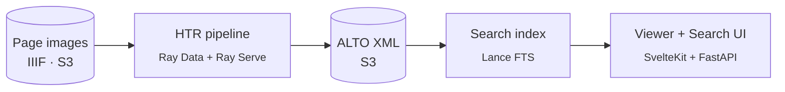

# rask

**rask** is a distributed image-to-ALTO-XML pipeline and search service for the
[Swedish National Archives (Riksarkivet)](https://riksarkivet.se). It runs
handwritten-text recognition (HTR) over archival page images at scale and makes
the resulting transcriptions searchable.

It is a polyglot monorepo — **Rust + Python + Svelte**, managed with
[uv](https://docs.astral.sh/uv/) (Python 3.13) and [Bun](https://bun.sh) — laid
out in three brick layers: reusable **packages**, runnable **components**, and
deployable **projects**.

## What it does

1. A **runner** CLI submits Ray Data jobs that fan HTR work across a Ray cluster,
   with TrOCR model weights kept warm in **Ray Serve**.
2. Transcriptions are written back to S3 as **ALTO XML**.
3. An indexer builds **Lance** full-text tables over the transcribed lines.
4. A **FastAPI viewer** service and **SvelteKit** SPA let you inspect pages,
   drive batches, and search the corpus.

## Where to go next

- **[Getting Started](getting-started/index.md)** — install, run the stack locally, and submit your first batch.
- **[Concepts](getting-started/concepts.md)** — the vocabulary: batches, chunks, pipelines, the orchestrator.
- **[Architecture](architecture/index.md)** — how runner, Ray, the viewer, the SPA, and storage fit together.
- **[Packages](packages/index.md)** / **[Components](components/index.md)** / **[Projects](projects/index.md)** — the monorepo, layer by layer.
- **[API Reference](reference/htr.md)** — auto-generated from source docstrings.

!!! note "Audience"
    These docs describe the system as it is. For deeper design rationale and
    historical decisions, see the in-repo architecture notes linked from the
    [Architecture overview](architecture/index.md).
