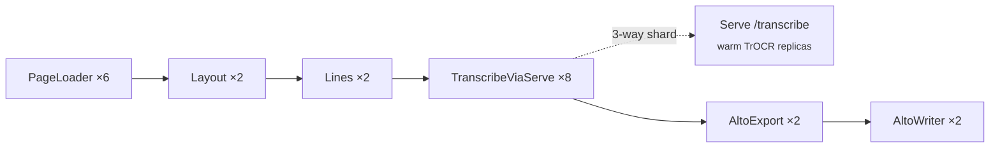

# Runner

`projects/runner` composes the runner CLI (`runner` + `htr` + `storage`, plus
`htrflow` from git) into a single deployable. The runner is **the engine**: each
invocation builds one Ray Data pipeline, runs it to completion, and exits.

→ Symbol docs: **[API reference](../reference/runner.md)**.

## CLI

```bash
uv run --project projects/runner runner --output s3://images-batch-alto \
  --pipeline htr --batch A0060198 --cache-bucket images-batch
```

| Flag | Default | Meaning |
|---|---|---|
| `--output`, `-o` | *(required)* | FS path or `s3://bucket[/prefix]` for ALTO output. |
| `--input`, `-i` | — | FS path or `s3://bucket`. Mutually exclusive with `--batch`. |
| `--batch` | — | IIIF batch ID (repeatable). Implies the read-through cache; requires `--cache-bucket`. |
| `--cache-bucket` | — | S3 bucket used as the IIIF cache (required with `--batch`). |
| `--iiif-url` | `iiifintern-ai.ra.se` | IIIF server base (env `IIIF_URL`). |
| `--pipeline` | `htr` | `htr` / `htrflow` / `prefetch` / `fake`. |
| `--prefix` | `""` | Key prefix scoping both source listing and resume. |
| `--limit`, `-n` | — | Process only the first N keys after the resume diff. |
| `--s3-endpoint` | — | S3/HCP endpoint (env `HCP_ENDPOINT`). |
| `--address` | local | Ray address, e.g. `ray://dev-kuberay.ra.se:10001`. |
| `--profile` / `--torch-profile` | off | Ray Data / torch profiling. |

The runner is **resumable**: it lists existing `.xml` output and processes only
the diff (`--limit` truncates after the diff).

## Pipelines

| Name | Shape | Stages |
|---|---|---|
| `htr` | actor-per-stage | PageLoader → Layout → Lines → TranscribeViaServe → AltoExport → AltoWriter |
| `htrflow` | single Serve deployment | PageLoader → HTRFlowViaServeBytes → AltoWriter |
| `prefetch` | single stage | PrefetchActor (IIIF→S3 cache warm) |
| `fake` | no-GPU smoke | PageLoader → FakeAltoActor → AltoWriter |

**GPU sizing is hardcoded for a 3-GPU node** in `pipeline.py`: Layout/Lines take
token `0.001` GPU fractions; the heavy TrOCR work is decoupled onto a Ray Serve
deployment so weights stay warm across jobs. Pools use `ActorPoolStrategy(size=N)`
with the autoscaler **off** — `concurrency=(N,N)` biased all work to the
first-warm actor and idled the other GPUs. Changing target hardware means editing
this file.



## Serve deployments

`runner/transcribe_service.py` (`TranscribeService`, route `/transcribe`) and
`runner/htrflow_service.py` (`HTRFlowDeployment`, route `/htrflow`) are deployed
separately via `components/scripts/deploy_serve.py` (`make serve-up` /
`serve-up-both`). Replica/GPU sizing is env-driven: `RASK_SERVE_REPLICAS`
(default 2), `RASK_SERVE_GPU_FRAC` (default 0.49), optional
`RASK_SERVE_GPU_RESOURCE` tier pin. Both pipeline-side actors shard each task
three ways to keep all GPU replicas busy.

!!! note "Submitted by the viewer, not by hand"
    In normal operation the viewer's orchestrator builds the
    `uv run --project projects/runner runner …` entrypoint and submits it as a
    Ray Job per chunk. The viewer's `PIPELINE_SPECS` keys are kept byte-identical
    to the runner's `PIPELINES` keys (asserted in the viewer tests).
